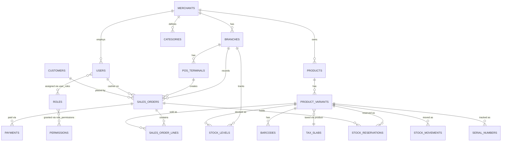

# Phase 0 / Phase 1 — Technical Design: Schema & API Contracts

**Companion file:** `phase0_1_database_schema.sql` (full DDL — tested against a live PostgreSQL 16 instance, including the row-level-security policies, before being handed to you). In this repo, that DDL is `migrations/001_schema.sql` — the two are identical.

---

## 1. Entity Relationship Overview



---

## 2. Key Design Decisions

### 2.1 Multi-tenancy: shared DB + Postgres RLS
Every tenant-scoped table carries `merchant_id`, and Postgres Row-Level Security enforces isolation at the database layer — not just in application code. The Go core sets the tenant context as the *first* statement of every transaction, immediately after validating the JWT — via `set_config()`, not `SET LOCAL ... = $1` directly, because Postgres's `SET` command doesn't accept bind parameters over the extended query protocol (the driver would either reject it or you'd be tempted to string-concatenate the tenant ID in, which is an injection risk for a value that ultimately comes from a JWT claim):

```sql
SELECT set_config('app.tenant_id', $1, true);  -- true = local to this transaction, like SET LOCAL
```

**This was verified against a live Postgres instance**, including the important failure mode: if a request handler ever forgets to set `app.tenant_id`, every RLS-protected query on that connection **errors out** rather than silently returning all tenants' data. That's a deliberate fail-closed property. The Go implementation (`internal/db/db.go`) makes this structurally impossible to skip: a single `DB.WithTenant(ctx, tenantID, fn)` wrapper is the only sanctioned way any handler touches a tenant-scoped table, and a request with no tenant context gets an error, never a row — confirmed with a cross-tenant negative test during implementation, not just asserted.

**A related gap found while implementing the login handler:** the original schema had no way to resolve *which* tenant a login belongs to before querying for the user, since `users.email` is only unique per-merchant, not globally. Fixed by adding `merchants.code` (a short, human-typeable tenant key) — login now resolves the merchant by code first, then runs the user lookup inside that tenant's `WithTenant` context. This is reflected in the current `migrations/001_schema.sql`.

### 2.2 Money as `NUMERIC`, never `FLOAT`
All prices/totals are `NUMERIC(14,2)` — floating point has no place anywhere near GST calculations or ledger entries; rounding drift there is a compliance and trust problem, not a cosmetic one.

### 2.3 Stock reservation: `stock_levels` (aggregate) + `stock_reservations` (individual holds) + `stock_movements` (append-only ledger)
Three tables, not one, because they answer different questions:
- `stock_levels` — "how much is available right now" (the fast read path for the POS scan-to-cart flow)
- `stock_reservations` — "what's currently held in someone's cart," with a hard `expires_at` (15 minutes per the FRD) that a background sweeper job releases
- `stock_movements` — the immutable audit trail of every change, which `stock_levels` is really just a materialized, `version`-guarded cache of

The `version` column on `stock_levels` is your optimistic-locking token: a reservation attempt reads the current version, and the `UPDATE` includes `WHERE version = $read_version`, retrying on conflict rather than blocking. Under real concurrent-cart load this scales far better than row locks.

### 2.4 Sales order lifecycle: `cart → finalized → voided/refunded`
A `sales_orders` row is created the moment a cashier starts a transaction (status `cart`), not just at checkout. This matters for two things in your FRD: bill modification (pre-finalization edits are just updates to a `cart`-status order) and offline resilience (if the POS goes offline mid-sale, the cart already exists locally and syncs once connectivity returns).

### 2.5 Idempotency is designed in from the start, not bolted on
`sales_orders.idempotency_key` (client-generated, unique per merchant) exists specifically because the POS is offline-first: a device might retry a checkout call after a dropped connection without knowing whether the first attempt actually landed. The server treats a duplicate idempotency key as "already done" and returns the original result rather than double-charging or double-decrementing stock. `device_created_at` vs `synced_at` are kept separate so you can always tell the true order of events on the device versus when the server actually heard about it — essential for correct conflict resolution during sync.

### 2.6 Variants over a rigid size/color schema
`product_variants.attribute_combo` is JSONB (`{"Size":"M","Color":"Red"}`) rather than fixed `size`/`color` columns, because your BRS's whole premise is configurable masters across industries — jewelry needs purity/weight, electronics needs wattage/warranty period, sports needs size/color. The `attributes`/`attribute_values` tables define what's configurable per merchant; `attribute_combo` stores the actual combination per SKU. This is the concrete mechanism behind "configuration, not industry-specific code."

---

## 3. API Contracts (Phase 0/1 scope)

**Conventions:**
- Base path: `/api/v1`
- Auth: `Authorization: Bearer <jwt>` on every endpoint except `/auth/login` and `/auth/pin-login`. The JWT carries `merchant_id`, `branch_id` (nullable), `user_id`, and `roles` as claims.
- Error shape (consistent across all endpoints):
```json
{ "error": { "code": "STOCK_UNAVAILABLE", "message": "Requested quantity exceeds available stock", "details": {} } }
```
- All monetary fields are strings in JSON (e.g., `"149.00"`), not floats — mirrors the DB's `NUMERIC` choice and avoids client-side floating-point rounding.

**Error code reference (every code actually in use as of this build — kept in sync with the code, not aspirational):**

| Code | HTTP status | Where | Meaning |
|---|---|---|---|
| `INVALID_REQUEST` | 400 | any handler | Body didn't parse, or a required field was missing/invalid |
| `MISSING_TOKEN` | 401 | any protected endpoint | No `Authorization: Bearer` header present |
| `INVALID_TOKEN` | 401 | any protected endpoint | Token present but invalid, malformed, or expired |
| `INVALID_CREDENTIALS` | 401 | `/auth/login` | Merchant code, email, or password didn't match (never says which, deliberately) |
| `ACCOUNT_INACTIVE` | 403 | `/auth/login` | User row exists but `status != 'active'` |
| `ACCOUNT_LOCKED` | 403 | `/auth/login` | `locked_until` is in the future (lockout *checking* is live; lockout *triggering* on repeated failures is not yet wired — see §4/roadmap) |
| `PRODUCT_NOT_FOUND` | 404 | `GET /products/barcode/{code}` | No barcode row matches |
| `NOT_FOUND` | 404 | sales endpoints, `/dev/set-password` | Order, line, or (merchant_code, email) pair doesn't resolve |
| `ORDER_NOT_EDITABLE` | 409 | add-line, delete-line, discounts, checkout | Order isn't in `cart` status anymore (already finalized/voided) |
| `STOCK_UNAVAILABLE` | 409 | add-line, checkout, `POST /quotations/{id}/convert` | Requested quantity exceeds what's available, or stock changed since the item was added (surfaced, never silently oversold) |
| `PAYMENT_MISMATCH` | 400 | checkout | Sum of `payments[].amount` doesn't cover `grand_total` |
| `DISCOUNT_NOT_AUTHORIZED` | 403 | `POST /sales/orders/{id}/discounts` | Requested discount % exceeds what the presented `authorized_by`/`authorized_pin` permits for their role tier |
| `DEVICE_MISMATCH` | 403 | `POST /auth/pin-login` | Terminal is already device-bound and the presented `device_fingerprint` doesn't match |
| `TERMINAL_UNAVAILABLE` | 403 | `POST /auth/pin-login` | `pos_terminals.status != 'active'` |
| `FORBIDDEN` | 403 | `POST /inventory/adjustments` | Caller's role isn't Branch Manager or Merchant Admin |
| `NEGATIVE_MARGIN` | 409 | `PATCH /pricing/variants/{id}` | New price sells below cost and `override` wasn't set |
| `SEARCH_UNAVAILABLE` | 503 | `GET /products/search`, `POST /search/reindex` | OpenSearch isn't configured (`OPENSEARCH_URL` unset) or is unreachable — every other endpoint keeps working regardless (see §3.7) |
| `BARCODE_EXISTS` | 409 | `POST /products/variants/{id}/barcodes` | The supplied `code` is already assigned to a different variant (`barcodes` table's `UNIQUE (merchant_id, code)`) |
| `NO_BARCODE` | 409 | `GET /products/variants/{id}/label` | The variant has no barcode assigned yet — assign one first |
| `COUPON_CODE_EXISTS` | 409 | `POST /coupons` | The supplied `code` is already in use (`coupons` table's `UNIQUE (merchant_id, code)`) |
| `COUPON_NOT_FOUND` | 404 | `POST /sales/orders/{id}/coupons` | No active coupon with this code |
| `COUPON_NOT_VALID` | 409 | `POST /sales/orders/{id}/coupons` | Outside the coupon's validity window, branch restriction, or channel restriction |
| `COUPON_MIN_PURCHASE_NOT_MET` | 409 | `POST /sales/orders/{id}/coupons` | Order subtotal is below the coupon's `min_purchase_amount` |
| `COUPON_LIMIT_REACHED` | 409 | `POST /sales/orders/{id}/coupons` | Coupon's total or per-customer usage limit is exhausted |
| `COUPON_ALREADY_APPLIED` | 409 | `POST /sales/orders/{id}/coupons` | This order already has a coupon (`coupon_redemptions.sales_order_id` is `UNIQUE`) — one coupon per order |
| `INSUFFICIENT_LOYALTY_POINTS` | 409 | `POST /sales/orders/{id}/loyalty/redeem` | Customer's available (rolling-expiry-aware) point balance is less than the requested redemption |
| `CREDIT_HOLD` | 403 | `POST /sales/orders/{id}/checkout` | A `credit`-method payment was attempted for a customer with `credit_hold = true` |
| `CREDIT_LIMIT_EXCEEDED` | 409 | `POST /sales/orders/{id}/checkout` | A `credit`-method payment would put the customer's outstanding balance over their `credit_limit` |
| `PAYMENT_EXCEEDS_BALANCE` | 409 | `POST /customers/{id}/payments` | Payment amount exceeds the named invoice's remaining outstanding balance |
| `ALREADY_MATCHED` | 409 | bank/payment-gateway statement-line `match` endpoints | The named journal line/payment is already claimed by a different statement/settlement line |
| `NOT_MATCHED` | 409 | `POST /accounting/payment-gateway/settlement/lines/{id}/unmatch` | The settlement line isn't currently matched to anything |
| `ALREADY_RECONCILED` | 409 | `POST /cash-reconciliation` | This branch already has a cash reconciliation for this date |
| `VARIANCE_NOT_AUTHORIZED` | 403 | `POST /cash-reconciliation`, `POST /inventory/reconciliation` | A non-zero variance's `authorized_by`/`authorized_pin` didn't resolve to a Branch Manager/Merchant Admin |
| `SKU_EXISTS` | 409 | `POST /products` | One of the submitted variants' SKUs is already in use (`product_variants` table's `UNIQUE (merchant_id, sku)`) |
| `ATTRIBUTE_REQUIRED` | 400 | `POST /products` | The product's category declares this attribute required and a variant's `attribute_combo` is missing it |
| `ATTRIBUTE_INVALID_VALUE` | 400 | `POST /products` | A `select`-type attribute's value isn't in its controlled value list, or a `number`-type attribute's value doesn't parse as numeric |
| `COLLECTION_NAME_EXISTS` | 409 | `POST /collections` | A collection with this name already exists for this merchant |
| `BATCH_REQUIRED` | 400 | `POST /purchase/grn/{id}/lines` | The variant has `track_batch = true` and `batch_no` was omitted |
| `STOCK_EXPIRED` | 409 | add-line, `POST /quotations/{id}/convert` | The requested quantity exceeds what's available in real, non-expired, batch-tracked stock — distinct from `STOCK_UNAVAILABLE` (stock_levels' own total is enough, but not enough of it is unexpired) |
| `PRESCRIPTION_REQUIRED` | 409 | checkout | One or more lines' variants declare a `Drug Schedule` other than `OTC` and no prescription is attached to the order |
| `RESERVATION_CART_OWNED` | 409 | `DELETE /inventory/reservations/{id}` | The named reservation has a `sales_order_id` — release it via `DELETE /sales/orders/{id}/lines/{line_id}` instead |
| `EINVOICE_CUSTOMER_REQUIRED` | 400 | `POST /sales/orders/{id}/e-invoice` | No customer attached to the order — e-invoicing is a B2B-only action |
| `EINVOICE_GSTIN_REQUIRED` | 400 | `POST /sales/orders/{id}/e-invoice` | The attached customer has no GSTIN on file |
| `EINVOICE_SUPPLIER_GSTIN_MISSING` | 409 | `POST /sales/orders/{id}/e-invoice`, `POST /sales/orders/{id}/e-way-bill` | Neither the selling branch nor the merchant has a GSTIN configured |
| `EINVOICE_ALREADY_CANCELLED` | 409 | `POST /sales/orders/{id}/e-invoice`, `.../cancel` | A cancelled IRN can never be reused (real NIC rule) — regeneration is refused, not silently allowed |
| `EINVOICE_CANCEL_WINDOW_EXPIRED` | 409 | `POST /sales/orders/{id}/e-invoice/cancel` | More than 24 hours have passed since generation — a real GSP would refuse this too |
| `EWAY_BILL_ALREADY_CANCELLED` | 409 | `POST /sales/orders/{id}/e-way-bill`, `.../cancel` | Same reasoning as `EINVOICE_ALREADY_CANCELLED`, for e-way bills |
| `EWAY_BILL_CANCEL_WINDOW_EXPIRED` | 409 | `POST /sales/orders/{id}/e-way-bill/cancel` | Rule 138(9)'s 24-hour cancel window has passed |
| `EMPLOYEE_CODE_EXISTS` | 409 | `POST /hr/employees` | The supplied `employee_code` is already in use for this merchant |
| `CLOCK_IN_REQUIRED` | 409 | `POST /hr/attendance/clock-out` | No clock-in recorded for today |
| `ALREADY_CLOCKED_OUT` | 409 | `POST /hr/attendance/clock-out` | Already clocked out today |
| `PAYROLL_RUN_FINALIZED` | 409 | `POST /payroll/runs`, `.../finalize` | The named period's payroll run is already finalized and can't be recomputed/re-finalized |
| `ROLE_IN_USE` | 409 | `DELETE /rbac/roles/{id}` | The role is currently assigned to one or more users — reassign them first |
| `LAST_RBAC_HOLDER` | 409 | `PATCH /rbac/roles/{id}/permissions`, `DELETE /rbac/users/{id}/roles/{role_id}` | This change would leave no user in the merchant able to manage roles and permissions |
| `LLM_UNAVAILABLE` | 503 | `POST /ai/ask`, `POST /ai/copilot/chat` | `LLM_PROVIDER` isn't configured — same graceful-disable posture as `SEARCH_UNAVAILABLE`; every other endpoint keeps working regardless (see §3.24) |
| `LLM_ERROR` | 502 | `POST /ai/ask`, `POST /ai/copilot/chat` | The configured provider (Ollama or Anthropic) returned an error or was unreachable — distinct from `INTERNAL_ERROR` since this is the external LLM call failing, not this service's own database/logic |
| `AI_INTENT_UNRECOGNIZED` | 422 | `POST /ai/ask` | The question didn't map to one of the fixed report intents this endpoint supports, or the model's classification didn't parse — never a reason to guess and run an unrelated report |
| `AI_BRANCH_REQUIRED` | 422 | `POST /ai/ask` | The matched intent needs a specific branch (`daily_sales`, `stock_summary`, `eod_cash`) but none was named in the question or resolved against this tenant's real branch list |
| `PRICE_LIST_NAME_EXISTS` | 409 | `POST /pricing/price-lists` | A price list with this name already exists for this merchant |
| `PRICE_LIST_IN_USE` | 409 | `DELETE /pricing/price-lists/{id}` | One or more customers are currently assigned to this price list — reassign them first |
| `QUOTATION_NOT_DRAFT` | 409 | `POST /quotations/{id}/send`, `DELETE /quotations/{id}` | Only a `draft` quotation can be sent or deleted — once sent, `reject` is the correct next step |
| `QUOTATION_NOT_SENT` | 409 | `POST /quotations/{id}/accept`, `.../reject` | Only a `sent` quotation can be accepted or rejected |
| `QUOTATION_NOT_ACCEPTED` | 409 | `POST /quotations/{id}/convert` | Only an `accepted` quotation can be converted into a real sales order |
| `INTERNAL_ERROR` | 500 | any handler | Unexpected failure (DB error, etc.) — message is intentionally generic; check server logs for detail |

### 3.1 Auth

| Method & Path | Purpose |
|---|---|
| `POST /auth/login` | `{ merchant_code, email, password }` → `{ access_token, refresh_token, expires_at, expires_in, user_id, roles }` — **as actually shipped**, flatter than originally sketched (`user_id`/`roles` fields rather than a nested `user` object; kept flat to avoid a client-breaking reshape once real clients existed). `expires_in` (seconds) reflects the role-tiered TTL below, not a fixed value. |
| `POST /auth/pin-login` | `{ pos_terminal_id, employee_code, pin, device_fingerprint }` → same token shape. Device binding: if the terminal already has a `device_fingerprint` on file, the request's must match (`403 DEVICE_MISMATCH`); if unbound, the first successful PIN login binds it (only on success, never on a failed attempt). |
| `POST /auth/refresh` | `{ refresh_token }` → new token shape (same as login). Rotates the refresh token on every use — the old one is revoked, a new one issued — so a stolen-and-reused token is detectable (its next refresh attempt fails, already revoked). |
| `POST /auth/logout` | `{ refresh_token }`, authenticated — revokes the presented refresh token. Requires the token's owning user to match the caller's access-token claims (defense in depth beyond the refresh token itself). |

**Session timeout tiers** (`internal/authn/session_tiers.go`), per `pos_frd_complete.md`'s "Timeout (Recommended)": role name (case-insensitive) → access-token TTL — `POS User` 15 min, `Branch Manager` 30 min, `Merchant Admin` 60 min, unrecognized role 15 min (the safe default, never the longer 24h ceiling `TokenIssuer.maxAccessTTL` still allows as an operator-configured hard cap). A user with multiple roles gets the longest matching tier. This replaces the flat 24h token every login used to issue regardless of role — found during the Phase 1 gap analysis (the FRD's tiering was never wired up).

### 3.1a UACL — role/permission administration (`internal/rbac`, closed 2026-09-24)

`roles`, `permissions`, `role_permissions`, and `user_roles` have existed since this file's very first schema (§2.1) and have been the real enforcement mechanism behind every `authn.RequirePermission(...)` call in this codebase since Phase 0 — but nothing before this could manage that mechanism. Every role/permission grant to date had been seeded directly by a migration file; there was no `POST /roles`, no way to assign a permission to a role, no way to give a user a second role. A merchant could not create the FRD's own named "Accountant"/"HR Manager"/"Sales Manager" roles (`pos_frd_complete.md` §12's role list) without a developer editing SQL.

Gated end to end by a new `rbac.manage` permission, **Merchant Admin only** — of everything in this system, controlling who can do what is the one surface that stays top-tier-only rather than also open to Branch Manager, the same reasoning `audit.view` already uses for a different kind of sensitive read.

| Method & Path | Purpose |
|---|---|
| `GET /rbac/permissions` | The full catalog of every permission code that exists in the application (global, not tenant-scoped — every merchant sees the same set of possible permissions, since `permissions.code` values are literally hardcoded into `authn.RequirePermission(...)` calls throughout the Go source). |
| `POST /rbac/roles` | `{name}` — a brand-new role with no permissions yet. |
| `GET /rbac/roles`, `GET /rbac/roles/{id}` | List/fetch, each including its full `permission_codes` array and `user_count` (assembled via two follow-up queries per role rather than one fan-out join, so the counts can't be thrown off by the multiplicative row blow-up a join across both child tables would cause). |
| `PATCH /rbac/roles/{id}` | Rename only — a role's permission set is edited separately. |
| `DELETE /rbac/roles/{id}` | Refuses (`409 ROLE_IN_USE`) if any user currently holds the role, rather than silently cascading into `user_roles` (the schema's own FK is `ON DELETE CASCADE`, which would otherwise revoke the role from every holder with zero warning) — reassign or remove those users first. |
| `PATCH /rbac/roles/{id}/permissions` | `{permission_ids: [...]}` — replaces the role's entire permission set (a full replace, matching this codebase's existing pattern for "the whole set is edited together" data like `pt_slabs`/commission tiers — the UI sends a checklist's current state, not a diff). Refuses (`409 LAST_RBAC_HOLDER`) a change that would leave no user in the merchant able to reach `rbac.manage` at all. |
| `POST /rbac/users/{id}/roles` | `{role_id}` — adds a role to a user without touching any role they already hold, the real multi-role primitive `user_roles`'s many-to-many shape has always supported. Distinct from `PATCH /hr/employees/{id}`'s `role_id` field, which stays a single-role convenience for the common onboarding case. Idempotent. |
| `DELETE /rbac/users/{id}/roles/{role_id}` | Same `409 LAST_RBAC_HOLDER` guard as the permissions-replace endpoint, from the other direction (removing a user's grant rather than a role's). |

New error codes: `ROLE_IN_USE` (409), `LAST_RBAC_HOLDER` (409).

**UI, built in this same pass:** `erp-web-admin`'s `/rbac` screen — role list with create/rename/delete, a permission checklist per role, and a user↔role assignment section (reusing `GET /hr/employees` for the picker rather than duplicating a user-listing endpoint). Verified with a real Playwright test (`e2e/rbac.spec.ts`) that creates a custom role, assigns it two real permissions, grants it to an existing employee *alongside* their existing role (confirmed via a direct API call that the employee's access genuinely changed, not just the UI checkbox), revokes it (confirmed access reverted), deletes the now-unused role, and confirms a POS User is denied the whole screen.

Verified live end to end against the real backend: created a custom "Accountant" role, assigned it `bank_reconciliation.manage` and `payroll.manage`, granted it to a POS User who then successfully called a `payroll.manage`-gated endpoint he couldn't before, without losing his original role; `DELETE` on that role correctly refused with `ROLE_IN_USE` while still assigned, then succeeded once revoked; attempting to revoke the system's only `rbac.manage` holder's access — via both `DELETE /rbac/users/{id}/roles/{role_id}` and via `PATCH .../permissions` stripping `rbac.manage` from the only role that grants it — was correctly refused both ways with `LAST_RBAC_HOLDER`, and the role's permissions were confirmed untouched after the refused attempt (the check runs before any mutation, inside the same transaction). One real, unrelated pre-existing bug this pass exposed and fixed while re-running the full Playwright suite afterward: `promotions.spec.ts` used a bare `getByText(/permission|forbidden/i)` to detect a permission-denied error, which — now that a sidebar link literally named "Roles & Permissions" exists — started matching the nav link too; fixed by scoping the assertion to the error paragraph's own CSS class, the same fix already applied earlier to two other specs with the identical class of fragility.

### 3.2 Catalog

| Method & Path | Purpose |
|---|---|
| `GET /products?category_id=&brand_id=&q=&page=&limit=` | Paginated catalog browse (admin/back-office use; POS uses barcode/search below) |
| `GET /products/{id}` | Full product + variants |
| `GET /products/barcode/{code}` | **The POS scan endpoint.** Resolves a scanned barcode straight to `{ product, variant, current_price, tax }` in one call — this is the ≤6-second flow's first hop, so it's a single indexed lookup, not a join-heavy query. |
| `POST /products` | **Built** (`internal/catalog/products_write.go`) — `{name, short_description?, hsn_code?, category_id?, brand_id?, tax_slab_id?, product_type?, variants: [{sku, attribute_combo?, cost_price?, mrp, selling_price, track_serial?}]}`. Gated by a new `catalog.manage` permission. This was the actual Phase 1 gap — this row and the one below sat as "still unbuilt" in this table since Phase 0/1 for four subsequent phases, found during an explicit "review previous phases for anything missing" audit: no code path anywhere could create a second product beyond the one hard-seeded in `migrations/002_seed.sql`. Seeds a zero-`on_hand` `stock_levels` row for every existing branch (see the bug note below). |
| `PATCH /products/{id}` | **Built.** Product-level metadata only (name/description/HSN/category/brand/tax slab/status) — variant pricing stays owned by `PATCH /pricing/variants/{id}` (Phase 2), not duplicated here. Gated by `catalog.manage`. |
| `GET/POST /categories`, `GET/POST /brands`, `GET/POST /tax-slabs` | **Built** (`internal/catalog/taxonomy.go`) — the three lookups `POST /products` needs that also had schema and seed data since `migrations/001_schema.sql` but zero API surface. List + create only, deliberately minimal (no update/delete, no category-hierarchy management beyond one optional `parent_id`) — unblocking product creation, not a full catalog-taxonomy feature. Writes gated by `catalog.manage`. |

### 3.3 Inventory

| Method & Path | Purpose |
|---|---|
| `GET /inventory?branch_id=&variant_id=` | `{ on_hand, reserved, available }` — **built** (`internal/inventory/handlers.go`) |
| `POST /inventory/reservations` | **Built** (2026-09-22, `internal/sales/manual_reservation.go`) — `{branch_id, variant_id, quantity, expires_in_minutes?}` holds stock with no `sales_order_id` at all (a phone/counter order promised before a cart exists), reusing the exact `reserveStock` optimistic-locking helper `POST /sales/orders/{id}/lines` already calls. Defaults to a 15-minute hold if `expires_in_minutes` is omitted. Gated by `inventory.adjust`, same as stock adjustments — this is an inventory-management action, not something every POS user should be able to do for an arbitrary quantity/duration. |
| `DELETE /inventory/reservations/{id}` | **Built**, same pass — releases an active, non-cart reservation early via `releaseReservation`. Refuses (`409 RESERVATION_CART_OWNED`) to touch a reservation whose `sales_order_id` is set — that one belongs to `DELETE /sales/orders/{id}/lines/{line_id}` (§3.4) instead, which also removes the order line the reservation backs. |
| `POST /inventory/adjustments` | `{ variant_id, branch_id, quantity_delta, reason }` — **built.** Writes a `stock_movements` row and an `audit_logs` row (before/after `on_hand`). Authorization: `authn.RequirePermission("inventory.adjust")` at the router level — the general permission-code mechanism, not a role-name check (see §6.5). |

### 3.4 Sales (the core POS transaction flow)

| Method & Path | Purpose |
|---|---|
| `POST /sales/orders` | Opens a new cart. Body: `{ branch_id, pos_terminal_id, idempotency_key }` → `{ order_id, status: "cart" }` |
| `POST /sales/orders/{id}/lines` | `{ variant_id, quantity }` — adds a line, **automatically creates a stock reservation** in the same call |
| `PATCH /sales/orders/{id}/lines/{line_id}` | `{ quantity }` — **built** (`internal/sales/update_line.go`). Adjusts the stock reservation by the delta rather than release-and-re-reserve. Resets `discount_amount` to 0 on the edited line — a discount applied before the edit was computed against the pre-edit subtotal, so re-apply `POST .../discounts` after changing quantity if needed. |
| `DELETE /sales/orders/{id}/lines/{line_id}` | Remove a line, releases its reservation — **built.** Matches the active reservation by (order, variant, quantity) since there's no direct FK from a line to its reservation — a known simplification if the same variant is ever added as two separate lines in one cart (see the handler's doc comment). |
| `POST /sales/orders/{id}/customer` | `{ customer_id }` or inline `{ name, phone, email }` — **built** (`internal/sales/customer.go`). Not restricted to `cart`-status orders — attaching a customer touches no totals or stock. |
| `POST /sales/orders/{id}/discounts` | `{ type: "manual"|"coupon", value, authorized_by, authorized_pin, reason }` — **built** (`internal/sales/discounts.go`). Enforces the FRD's tiers server-side: 0-5% no approval, 5-15% needs a Branch Manager's PIN, 15-25% a Merchant Admin's PIN. The FRD specifies OTP for the top tier; there's no notification channel yet to deliver one (Phase 3 territory), so PIN verification is used for both approval tiers as a documented, equivalent-strength substitute. Discount is distributed proportionally across existing lines and applied **pre-tax**: each line's tax is recomputed on its post-discount taxable value (re-joining `product_variants`/`tax_slabs` per line), matching GST treatment. |
| `POST /sales/orders/{id}/checkout` | `{ payments: [{method, amount}] }` — **the critical transaction, built.** Validates payment total ≥ grand total, converts reservations to a confirmed `stock_movements` sale entry, decrements `stock_levels`, sets `status = finalized`. Idempotent **by order status, not a request-level `idempotency_key`**: a `cart`-status order accepts checkout once; a `finalized` order returns its existing result on replay rather than reprocessing. (The `idempotency_key` shown in earlier drafts of this contract is what `POST /sales/orders` uses to dedupe the *open-cart* call, not checkout itself — checkout doesn't need its own key because the order's status transition already makes it safe to retry.) |
| `GET /sales/orders/{id}` | Full order detail — **closed.** `loadOrder()` now joins `sales_order_lines` + `product_variants` (name/sku) into the response's `lines` array, alongside the existing order-level aggregates. The Flutter client no longer tracks cart lines locally per-device as a result. |
| `GET /sales/orders/{id}/receipt` | Print-ready receipt payload — **built** (`internal/sales/receipt.go`): merchant/branch/cashier/customer info, lines, totals, captured payments. The actual ESC/POS printer driver consuming this payload is separate, hardware-dependent work and is still open. |
| `POST /sales/orders/{id}/void` | `{ reason }` — **built** (`internal/sales/void.go`). Only a `finalized` order can be voided; reverses stock (`on_hand` back up per line) and records a `stock_movements` row tagged `reference_type='void'`. Gated by `authn.RequirePermission("sales.void")`. |

### 3.5 Sync (offline-first — the piece that makes the FRD's core promise real)

| Method & Path | Purpose |
|---|---|
| `POST /sync/push` | Batch upload from a POS device that was offline: an array of orders/payments created locally, each carrying its own `idempotency_key` and `device_created_at`. Server processes each independently; a duplicate `idempotency_key` is a no-op, not an error — devices should always be able to retry a batch safely. |
| `GET /sync/pull?since=<timestamp>&branch_id=` | Incremental catalog, price, and stock-level changes for the device's local cache, so a POS that's been offline for hours can catch up without re-downloading the whole catalog |

**Both built** (`internal/sync/handlers.go`, `internal/sync/pull.go`) and verified live: idempotent replay of the same batch returns the original `order_id` with `status: "duplicate"` rather than reprocessing; an oversell (20 units pushed against 8 `on_hand`) is accepted, drives `on_hand` negative, and writes a `NEGATIVE_STOCK` `audit_logs` entry rather than being rejected; a batch with one good and one malformed order processes the good one independently (each order runs in its own transaction) and reports the bad one's error without losing the good one. `since` omitted on a pull returns a full snapshot (a fresh device's first sync); a future `since` correctly returns empty deltas.

**Why `/sync/push` takes a fully-formed order, not the same CreateOrder/AddLine/Checkout calls the online flow uses:** those calls each need a live connection (AddLine reserves stock immediately) — a genuinely offline device can't make them at all. So a locally-built sale is assembled entirely client-side (from a cached catalog snapshot) and pushed as one already-decided unit once connectivity returns, with the same idempotency-key contract as everything else in this codebase.
**Conflict rule for Phase 1:** last-writer-wins on `stock_levels` isn't safe (two offline devices could both think 1 unit is available). Instead, `/sync/push` re-runs the same reservation check server-side that `/inventory/reservations` would: if a synced sale would oversell, it's accepted (the sale already physically happened at the register) but flags `stock_levels.on_hand` negative and raises a `NEGATIVE_STOCK` alert for manual reconciliation — never silently reject a sale that already happened in the real world.

### 3.6 Dev-only tooling (not part of the product API surface — see §5.3)

| Method & Path | Purpose |
|---|---|
| `POST /dev/hash-password` | `{ password }` → `{ hash }`. Pure bcrypt computation, no DB access. Only registered when `DEV_AUTH_TOOLS_ENABLED=true`. |
| `POST /dev/set-password` | `{ merchant_code, email, new_password }` → `{ status, user_id, email }`. Sets one user's password directly. Only registered when `DEV_AUTH_TOOLS_ENABLED=true` — **must never be true outside a local/dev environment** (see §5.3 for why). |

### 3.7 Product Search (added in Phase 2 — the one sub-area that's new infrastructure, not new endpoints on the existing pattern)

| Method & Path | Purpose |
|---|---|
| `GET /products/search?q=&category_id=&brand_id=&min_price=&max_price=&page=&limit=` | OpenSearch-backed free-text search: fuzzy `multi_match` across name/SKU/HSN/category/brand, always filtered to the caller's `merchant_id` (see below), same filters `GET /products` (§3.2) already has. This is the ≤100ms-target endpoint the FRD names; `GET /products` stays the plain-Postgres exact/`ILIKE` browse view Pricing's screen uses. |
| `POST /search/reindex` | Rebuilds the caller's tenant's slice of the OpenSearch index from Postgres in one bulk call. Gated by `search.reindex` (Merchant Admin only, `migrations/010_search.sql`) since it's a bulk operation. |

Implementation (`internal/search/`) is a small hand-rolled REST client over OpenSearch's JSON API (`net/http`, no SDK dependency — see `tech_stack_decision.md` §3.1's as-built note). OpenSearch is a derived, rebuildable read model: Postgres stays the system of record, and a document is a denormalized snapshot of one `product_variants` row (its parent product's name/HSN, category/brand names inlined, since OpenSearch has no join). Document `_id` is the variant ID, so re-indexing one variant is a plain overwrite.

**Tenant isolation has no RLS equivalent here** — OpenSearch enforces nothing on its own. The entire boundary is `internal/search.Params.TenantID`, sourced only from `authn.FromContext(ctx)` claims and applied as a hard `term` filter on every query the client builds; there is no code path that lets a request parameter influence which tenant's documents a search can return. Verified live by writing a document under a different `merchant_id` straight into the index (bypassing the API entirely) and confirming a real tenant's search never surfaced it.

**Sync model, updated now that `POST/PATCH /products` are real** (§3.2 — closed in the audit pass documented in §3.19): `PATCH /pricing/variants/{id}` and a bulk-price-update's applied items still reindex their own affected variant after their Postgres write commits, same as before. `POST /products` does **not** reindex on create — a brand-new product with no barcode/search relevance yet isn't worth an incremental write, and `POST /search/reindex` remains the full-catalog catch-up path; run it after bulk-loading new products if search needs to see them before the next natural reindex trigger.

**Degrades gracefully by design:** `OPENSEARCH_URL` unset, or OpenSearch unreachable, makes `internal/search.Client.Enabled()` false — `EnsureIndex` at startup logs a warning instead of failing boot, and both search endpoints answer `503 SEARCH_UNAVAILABLE` instead of panicking or hanging. Verified live by stopping the `opensearch` container mid-session: both search endpoints degraded to 503 immediately while every unrelated endpoint kept working.

### 3.8 Barcode & Label Generation, printer integration (closed a Phase 1 "still open" item)

| Method & Path | Purpose |
|---|---|
| `POST /products/variants/{id}/barcodes` | `{code?, symbology?}` — the FRD's "Hybrid (Recommended): use supplier barcode if exists, else auto-generate" (`pos_frd_complete.md` §12). Pass `code` for a real supplier barcode (any of this schema's symbologies); omit it to auto-generate a sequential EAN-13 in GS1's reserved in-store-use prefix range (20-29), which can never collide with a real, globally-assigned EAN-13. |
| `GET /products/variants/{id}/label?template=standard\|compact` | Renders that variant's primary barcode as an ESC/POS print job (`Content-Type: application/vnd.escpos-raw`) — Phase 1's roadmap scope narrowed the FRD's four label templates down to these two (`standard` 50×30mm: name/barcode/MRP/SKU; `compact` 40×20mm: name/barcode/MRP). `409 NO_BARCODE` if the variant has no barcode assigned yet. |
| `GET /sales/orders/{id}/receipt/print` | The printer-ready rendering of `GET /sales/orders/{id}/receipt`'s payload (§3.4) — same underlying data (`loadReceiptData`, shared by both), so the two can never drift apart. |

Implementation is `internal/printing` — a real ESC/POS command-set driver (`Builder`), not a stub: init/align/bold/double-size/barcode/cut, chosen as the *one* printer integration Phase 1's roadmap scoped this to ("pick whichever brand you'll actually pilot with — Zebra or a generic ESC/POS printer"), since a single ESC/POS thermal printer commonly serves both the receipt and label role on a small retail counter. `internal/catalog`'s EAN-13 generator (`computeEAN13CheckDigit`) is checked against GS1's own published worked examples, not just internally-consistent arithmetic.

**Verification, and its one real limit:** there is no printer hardware or emulator in this environment — the same constraint that limited offline sync (`erp-pos-flutter`) to `sqflite_common_ffi` rather than an on-device test. The equivalent here: `internal/printing.Decode` parses generated byte streams back into structured commands, so `internal/printing`'s tests assert the *actual bytes a real printer would receive* (barcode symbology byte, barcode data, and every text run) are correct, not just that the code runs. Live-verified beyond the unit tests: a real finalized sales order's receipt was printed and hex-dumped — content, ESC/POS init/cut framing, and command bytes all confirmed correct by hand; a label for the seed variant was fetched in both templates and hex-dumped, confirming the exact `GS k` barcode command (symbology byte `0x43` = EAN-13, correct length byte, correct 13-digit code) a real printer would decode; barcode assignment was verified for all four paths (auto-generate, supplier-provided, invalid EAN-13 check digit rejected, duplicate code rejected with `409 BARCODE_EXISTS`). **On-device verification against real printer hardware remains open** — do that before trusting this in front of a real cashier, exactly the same caveat already on file for offline sync.

### 3.9 Reports (added during the Phase 1 hardening pass — not in this doc's original scope)

| Method & Path | Purpose |
|---|---|
| `GET /reports/daily-sales?branch_id=&date=` | Order count + subtotal/discount/tax/grand totals for finalized orders on that branch/date, plus a per-payment-method breakdown. |
| `GET /reports/stock-summary?branch_id=` | `on_hand`/`reserved`/`available` per variant for a branch, joined with product name/sku. |
| `GET /reports/eod-cash?branch_id=&date=` | Cash-method payment total + count for finalized orders on that branch/date — the roadmap's "EOD cash reconciliation." |

Follows the same conventions as everything else (`WithTenant`, `{"error":{...}}` shape, `NUMERIC` as string). Not in §3's original contract table since "Basic reports" was scoped at the roadmap level, not endpoint-by-endpoint, before this pass.

### 3.10 Customer Management (Phase 3, sub-area 1 — see `phased_roadmap.md`)

| Method & Path | Purpose |
|---|---|
| `POST /customers` | `{name, phone, email, customer_type?, address?, date_of_birth?, anniversary?, company_name?, gstin?}` — full CRM registration. `name`/`phone`/`email` are mandatory (`pos_frd_complete.md` §6); `customer_type` defaults to `b2c`, and `b2b` additionally requires `gstin`. Distinct from `POST /sales/orders/{id}/customer` (§3.4), which stays a lenient walk-in-creation shortcut (name/phone/email only, no validation) — unchanged by this sub-area. |
| `GET /customers?q=&customer_type=&segment=&page=&limit=` | Search/list with auto-computed segmentation. `q` matches name/phone/email (`ILIKE`). `segment` filters on the exact values the segmentation rule below produces. |
| `GET /customers/{id}` | Full profile + segment + up to 20 most recent finalized orders (order number, branch name, date, total) — no branch filter, since a customer profile and their purchase history are merchant-wide, not branch-scoped (`pos_frd_complete.md` §6's "Multi-location: Profile accessible at all branches, Purchase history consolidated" — already true of this schema; `branch_name` on each history row makes that visible rather than just assumed). |
| `PATCH /customers/{id}` | Partial update, same b2b-requires-gstin rule re-checked against the post-update state. |

**Auto-segmentation** (`internal/customers.segmentedCustomersCTE` — the one definition both `ListCustomers` and `GetCustomer` select from, so the two can't drift apart) is computed on read from real `sales_orders` history, never stored: `new` (zero finalized orders ever), `dormant` (last finalized order more than 6 months ago — takes precedence over vip/regular, since a customer stops being "vip" by disengaging even if their lifetime spend says otherwise), `vip` (lifetime spend > ₹100,000 OR more than 50 transactions), `regular` (10-50 transactions), else `new`. Matches `pos_frd_complete.md` §6's thresholds exactly.

**Deferred**, matching the roadmap's own scoping for this sub-area (see `migrations/011_customers.sql`'s header comment): credit facility/B2B payment terms (bundled with Phase 4's accounting depth), loyalty points earn/redeem and customer-level discounts (Promotions & Loyalty — this same phase's next sub-area).

Verified live: a brand-new customer correctly showed `new`; a customer given 12 synthetic finalized orders showed `regular` with the correct summed `total_spend`; a customer given one ₹150,000 order showed `vip`; a customer whose only order was backdated 8 months showed `dormant`; a B2B registration without a `gstin` was rejected, then accepted once one was supplied; `q`/`customer_type`/`segment` filters and pagination all confirmed against the live data above; `PATCH` correctly left unspecified fields untouched and re-validated the b2b/gstin rule on type changes.

### 3.11 Promotions & Loyalty (Phase 3, sub-area 2 — see `phased_roadmap.md`)

Every discount hierarchy layer below (`pos_frd_complete.md` §5: promotional, coupon, customer-level, loyalty redemption, manual) applies through one shared function, `sales.ApplyDiscountLayer` (`internal/sales/discount_layer.go`) — it distributes a resolved rupee amount proportionally across a set of lines' *current remaining* taxable value (not their original price) and adds it to `discount_amount`, so calling it more than once on the same order stacks layers instead of one silently overwriting another. This is a behavior change from Phase 1: `POST /sales/orders/{id}/discounts` (manual, hierarchy item 6) used to overwrite `discount_amount` outright, which was correct when it was the only discount source — now that promotions/coupons/loyalty can legitimately apply first, it had to become additive. A cart with only ever one manual discount call behaves identically to before (0 existing + share = share).

Scope notes (see `migrations/012_promotions_loyalty.sql`'s header comment for the full reasoning): "Bundles" (FRD's kit pricing) is not a promotion type — Phase 1's composite-product model (`product_components`) already covers it. Hierarchy item 1 ("base discounts") is folded into item 2 (promotional discounts) — this codebase has no separate standing-discount concept. Coupon payment-method restriction is deferred (payment method isn't known until checkout, after discounts already apply). "Time-based" promotions are a restriction (`days_of_week`/`time_start`/`time_end`) layered on any promo_type, not a separate one.

| Method & Path | Purpose |
|---|---|
| `POST /promotions` | `{name, promo_type, application_level?, product_id?, category_id?, target_segment?, config, stacking?, starts_at?, ends_at?, days_of_week?, time_start?, time_end?}` — gated by `promotions.manage`. `promo_type` is `percent`\|`fixed`\|`bogo`\|`volume`\|`min_value`; `application_level` (`order` default \|`product`\|`category`) determines which cart lines a promotion can match — `bogo`/`volume` require `product` or `category` (they're inherently scoped to a specific item). `target_segment` (`vip`\|`regular`\|`new`\|`dormant`) is how a promotion becomes hierarchy item 4's "customer-level discount" — it only matches an order whose customer (`internal/customers.FetchSegment`) is currently in that segment. `config`'s shape depends on `promo_type` — see the migration's column comment for the exact JSON per type. `stacking` (`exclusive` default \|`stackable`) governs `POST /sales/orders/{id}/promotions/apply`'s behavior below. |
| `GET /promotions?active=&promo_type=` | Open to any authenticated user (reads aren't the business risk, writes are — same as `GET /branches`). |
| `PATCH /promotions/{id}` | Gated by `promotions.manage`. No `DELETE` — deactivate via `active:false`, since past `sales_order_discounts.promotion_id` rows may still reference it. |
| `POST /coupons` | `{code, promo_type, value, min_purchase_amount?, usage_limit_total?, usage_limit_per_customer?, valid_from?, valid_until?, channels?, branch_id?}` — gated by `promotions.manage`. `promo_type` is `percent`\|`fixed` only (a coupon is always order-wide, unlike promotions). `409 COUPON_CODE_EXISTS` on a duplicate code. |
| `GET /coupons?active=` | Open to any authenticated user. |
| `PATCH /coupons/{id}` | Gated by `promotions.manage`; `active`/`valid_until` only — same no-`DELETE` reasoning as promotions. |
| `POST /sales/orders/{id}/promotions/apply` | Evaluates every active, in-window promotion against the cart's *current* state and applies them per `stacking`: if any eligible promotion is `exclusive`, only the single largest-discount one applies (every other eligible promotion, including stackable ones, is skipped for this call); otherwise every eligible `stackable` promotion applies, each computed against what the previous one left behind. Explicit, POS-triggered — not automatic on `AddLine` — matching this codebase's existing preference for explicit calls over implicit magic (the same reasoning `POST /sales/orders/{id}/discounts` already followed). Safe to call more than once on the same cart: an already-matched promotion whose lines have no taxable value left simply stops being eligible. |
| `POST /sales/orders/{id}/coupons` `{code}` | Validates every constraint `pos_frd_complete.md` §5's "Coupon Constraints" names except payment-method (see scope note above): validity window, min purchase, total/per-customer usage caps, branch, and channel (every order through this API is POS-channel, so a coupon scoped to only online/mobile is correctly never applicable here). One coupon per order (`409 COUPON_ALREADY_APPLIED` on a second attempt) — the FRD's hierarchy has exactly one "coupon codes" slot. |
| `GET /loyalty/config` | Open to any authenticated user (a cashier needs to quote the redeem rate). `earn_rupees_per_point` (default 100 — "₹100 = 1 point"), `redeem_points_per_rupee` (default 10 — "100 points = ₹10"), `expiry_months` (default 12), all per `pos_frd_complete.md` §5's stated defaults. |
| `PATCH /loyalty/config` | Gated by `loyalty.manage`. |
| `GET /customers/{id}/loyalty` | Available points (rolling-expiry-aware — see below) plus the raw ledger (last 50 entries) for audit/display. |
| `POST /sales/orders/{id}/loyalty/redeem` `{points}` | Hierarchy item 5. Applies through `ApplyDiscountLayer` like every other layer. `409 INSUFFICIENT_LOYALTY_POINTS` if `points` exceeds the customer's current available balance. Requires a customer already attached to the order (`400` otherwise). |

**Loyalty expiry is "rolling,"** per the FRD: a customer's *whole* balance lapses together if they go `expiry_months` without a new ledger entry (earn or redeem) — not a per-batch FIFO expiry. `internal/loyalty.AvailableBalance` computes this on read, every time, from `loyalty_ledger`'s own timestamps (no `expires_at` column, no sweeper) — the same "compute it, don't cache and risk staleness" choice already made for Customers' `segment` and Pricing's `margin_pct`.

**Earning happens automatically at checkout finalize** (`internal/sales.Handler.Checkout`, via the `LoyaltyEarner` interface `internal/loyalty.Handler` implements — see `internal/sales/handlers.go`'s doc comment for why that's an injected interface rather than a direct import: `internal/loyalty` already has to import `internal/sales` for `ApplyDiscountLayer`, so a direct `sales -> loyalty` import would cycle; router.go wires the concrete `*loyalty.Handler` in, the same field-injection shape `pricing.Handler.Search` already uses). Skipped — not an error, a checkout must never fail over loyalty bookkeeping — when the order has no customer, the merchant has no `loyalty_config` row, the earn rate resolves to zero points, or **the FRD's "cannot earn and redeem in same transaction" applies**: `EarnForOrder` checks for an existing `type='loyalty'` row in `sales_order_discounts` for that order and no-ops if found.

Verified live end to end (seeded merchant, a real cart against the seed cricket bat, ₹2299 → ₹2712.82 with GST): a category-scoped 10% `exclusive` promotion auto-applied via `POST .../promotions/apply` (₹229.90 off); a flat-₹100 coupon then stacked on top (`discount_total` correctly became ₹329.90, not a reset to ₹100); a second coupon attempt on the same order correctly got `409 COUPON_ALREADY_APPLIED`; a manual 5% discount then stacked again on top of both (`discount_total` → ₹444.85, matching hand computation); checkout finalized at the resulting `grand_total`; the customer correctly earned `floor(grand_total / 100) = 21` points; a second order redeeming those 21 points correctly discounted ₹2.10 and checked out; a `GET .../loyalty` call afterward correctly showed `0` available points (confirming the redeeming order's checkout did *not* also earn); a `bogo` promotion (`buy 2 get 1 free`) against 3 units of the same product correctly discounted exactly one unit's price; and a coupon with a ₹100,000 minimum purchase correctly rejected a small order with `409 COUPON_MIN_PURCHASE_NOT_MET`. `promotions.manage` confirmed denying a POS User with `403 FORBIDDEN`.

### 3.12 Notifications, expanded (Phase 3, sub-area 3 — see `phased_roadmap.md`)

Closes the roadmap's last open Phase 3 item: "move beyond basic email receipts to SMS/WhatsApp for receipts, low-stock alerts, payment reminders." `internal/notifications` is deliberately content-agnostic — it delivers a message and logs the attempt; the domain package that owns the trigger (`internal/sales` for receipts, `internal/inventory` for low-stock, `internal/purchase` for bill reminders) formats the actual body. See `migrations/013_notifications.sql`'s header comment for the one real scope substitution: "payment reminders" in FRD terms is about a B2B **customer's** own outstanding balance, which needs Phase 4's deferred credit-facility model — substituted with supplier **bill** reminders instead, using Phase 2's already-real `purchase_bills.due_date`.

**No real SMS/WhatsApp vendor integration** — that needs a chosen provider (Twilio, MSG91, Gupshup, ...) and real credentials, neither of which exist in this solo-builder sandbox. `internal/notifications.ConsoleProvider` (logs what would have been sent) is the same "real interface, dev-only stand-in for the piece needing credentials/hardware this environment doesn't have" pattern `DEV_AUTH_TOOLS_ENABLED` and `internal/printing`'s ESC/POS driver already established. Email is different and genuinely real: `SMTPProvider` speaks standard SMTP (Go stdlib `net/smtp`) against any server/relay (`SMTP_HOST`/`PORT`/`USERNAME`/`PASSWORD`/`FROM` env vars) — no vendor lock-in, degrades to the console provider if `SMTP_HOST` is unset, the same graceful-disable pattern `OPENSEARCH_URL` already uses.

| Method & Path | Purpose |
|---|---|
| `POST /sales/orders/{id}/receipt/notify` | Resends the just-finalized order's receipt to whatever contact info its customer has on file (email and/or phone). Open to any authenticated user, same as `GetReceipt` — it can only re-send an already-finalized order's own receipt, nothing else. `409 ORDER_NOT_EDITABLE` if the order isn't finalized yet. |
| `PATCH /inventory/reorder-point` | `{variant_id, branch_id, reorder_point}` — sets the threshold the low-stock sweeper alerts against. `stock_levels.reorder_point` has existed since `001_schema.sql` but was never settable through any endpoint before this (silently defaulted to 0 — never triggers — on every row). Gated by `inventory.adjust`, same permission `AdjustStock` uses. |
| `GET /notifications?category=&channel=&status=&page=&limit=` | Audit log of every notification this tenant has sent — gated by a new `notifications.view` permission (recipients/bodies are real customer PII, same reasoning `promotions.manage` already established for business-config writes). |

**Receipts** send automatically at the end of `Checkout` (best-effort — never fails the sale, matching the same principle already established for loyalty earn) to the customer's email (full itemized receipt) and phone (a short SMS/WhatsApp-length summary) if attached; a walk-in order with no customer attached simply sends nothing. Skipped identically to loyalty earn on an idempotent checkout replay (both live inside the same `status != "finalized"` branch).

**Low-stock alerts** run from a new periodic sweeper (`internal/inventory.RunLowStockSweeper`, mirroring `internal/sales.RunExpirySweeper`'s per-tenant `WithTenant` loop exactly), not event-driven off every stock-mutating call site — checkout, manual adjustment, and branch-transfer completion each move stock independently, and hooking all three would scatter this concern across three packages for no benefit at pilot-store scale. Dedup: `stock_levels.low_stock_alerted_at` is set the moment a row crosses at-or-below `reorder_point`, cleared the moment it recovers above — so a continuously-low variant alerts exactly once per "episode," not once per tick. Recipients are every Branch Manager/Merchant Admin user with an email on file.

**Payment reminders** (supplier bills, per the scope substitution above) run from their own sweeper (`internal/purchase.RunPaymentReminderSweeper`) against `purchase_bills` where `status IN ('unpaid','partially_paid')` and `due_date` is within 3 days or already past — using a time-based dedup (`last_reminder_sent_at` older than 24h) rather than low-stock's state-based one, since "due in 3 days" correctly becomes "due in 2 days," then "overdue," as real time passes; a fresh reminder each day is the intended behavior here, not something to suppress.

Verified live end to end: checking out a real order for a customer with both email and phone produced exactly two `receipt` notifications (`channel=email` and `channel=sms`, both `status=sent` via the console provider), and `POST .../receipt/notify` re-sent them on demand; setting a variant's `reorder_point` above its `on_hand` via the new endpoint, then running both sweepers, produced a `low_stock` email to both seeded manager users with the correct product/SKU/branch/quantities — a second sweep immediately after produced no duplicate (dedup confirmed), and lowering `reorder_point` back below `on_hand` then re-sweeping correctly cleared `low_stock_alerted_at` to `NULL`; a synthetic overdue unpaid bill produced a `payment_reminder` email to both managers with the correct bill/supplier/amount/due-date and "OVERDUE" wording, and a second immediate sweep produced no duplicate (24h dedup confirmed); `GET /notifications` confirmed denying a POS User with `403 FORBIDDEN`.

### 3.13 B2B Credit Facility (Phase 4, sub-area 1 — see `phased_roadmap.md`)

Closes two gaps this doc's own earlier sections flagged as deferred: `migrations/011_customers.sql`'s "credit facility/B2B payment terms (bundled with Phase 4's accounting depth)," and `migrations/013_notifications.sql`'s "customer-facing payment reminders stay deferred to Phase 4 with credit facility itself." Both close together here since the second genuinely needs the first (a reminder needs something to be a reminder *of*).

**The core mechanism:** `POST /sales/orders/{id}/checkout` now accepts `method: "credit"` in its `payments` array alongside `cash`/`card`/`upi` — that portion books to the `Receivable` account (`internal/accounting`'s chart of accounts has seeded this since Phase 2; nothing used it until now) instead of a cash/clearing account, tagged `party_type="customer"` so it shows up on `GET /accounting/party-ledger?party_type=customer&party_id=...` (built generic since Phase 2, this is its first real customer-side caller). `sales_orders.credit_amount`/`credit_paid` are a fast, denormalized mirror of `purchase_bills.amount_paid`'s own shape (Phase 2, payable side) — the ledger via `journal_lines` stays the actual source of truth, these columns are just what the auto-block check and aging report query instead of aggregating the whole ledger on every checkout.

| Method & Path | Purpose |
|---|---|
| `PATCH /customers/{id}/credit` | `{credit_limit?, payment_terms?, credit_hold?}` — gated by a new `credit.manage` permission. `payment_terms` is `due_on_receipt`\|`net_7`\|`net_15`\|`net_30`\|`net_60`\|`net_90`, resolved to a `due_date` at checkout time. `credit_hold` is a manual override, checked *before* the credit-limit math — staff can freeze a customer with a dispute even if they're technically still within limit. |
| `GET /customers/{id}/credit` | Outstanding total, aging buckets (`current`/`0-30`/`30-60`/`60-90`/`90+`, computed in Go from each open invoice's `due_date` vs today, not a SQL `CASE`), and the list of open (partially- or un-paid) credit sales. |
| `POST /customers/{id}/payments` | `{sales_order_id, amount, method, reference_no?}` — records a payment against one specific credit sale, mirroring `POST /purchase/bills/{id}/payments`' shape exactly (same overpayment epsilon check, same "not permission-gated, a routine operational entry" reasoning). `409 PAYMENT_EXCEEDS_BALANCE` if `amount` exceeds that invoice's remaining outstanding. |

**Auto-block** (`internal/sales.checkCreditAndComputeDueDate`, called from `Checkout` only when the payments array actually includes a `credit` portion): rejects with `403 CREDIT_HOLD` if the customer is on hold, or `409 CREDIT_LIMIT_EXCEEDED` if `(current outstanding + this sale's credit portion) > credit_limit` — current outstanding is computed fresh from `sales_orders` on every check, the same "compute on read" choice used throughout this codebase (segment, margin, loyalty balance) rather than a running total that could drift. A `credit` payment with no customer attached to the order fails fast with `400 INVALID_REQUEST` — there's no one to extend credit to.

**Payment reminders** (`internal/customers.RunReceivableReminderSweeper`) are the mirror image of `internal/purchase`'s supplier-bill sweeper — same per-tenant `WithTenant` loop, same 24h time-based dedup via a new `sales_orders.last_reminder_sent_at` column — but notify the **customer's own** email/phone about **their own** debt, not staff about the merchant's payables. Window is 7 days pre-due per `pos_frd_complete.md` §8's explicit number for this flow (simplified from that section's full "7 days before, on due date, 3 days after, weekly" cadence to "at most once per 24h while in the window or overdue," the same simplification already applied to the supplier-bill reminder).

**Not built here, matching the roadmap's own "if you have suppliers who need it" hedge**: formal PO approval workflow — genuinely optional per the roadmap's own wording, unlike the rest of Phase 4.

Verified live end to end (a B2B customer, credit_limit temporarily lowered to make the breach path reachable against the seed catalog's current price — see the note on stale e2e-mutated prices in this repo's test history): a credit sale within limit posted correctly and showed up in `GET .../credit`'s aging as `current`; a second credit sale that would have breached the limit was correctly rejected with `409 CREDIT_LIMIT_EXCEEDED`, then succeeded once retried with a smaller credit portion (a partial cash/partial credit split); setting `credit_hold=true` correctly blocked a credit sale with `403 CREDIT_HOLD` regardless of remaining limit; recording a payment against the first invoice correctly zeroed its outstanding and reduced the customer's total; a second, overpaying payment attempt was correctly rejected with `409 PAYMENT_EXCEEDS_BALANCE`; `GET /accounting/party-ledger` showed the exact same running balance as `GET .../credit`'s `outstanding_total`, confirming the fast columns and the ledger never drifted apart; the reminder sweeper correctly emailed/texted the customer (not staff) for every backdated-overdue invoice, worded "OVERDUE," with a second immediate sweep producing no duplicates. **One real bug found and fixed during this pass**: `POST /customers/{id}/payments` initially 500'd because `journal_entries.source_type`'s `CHECK` constraint (`migrations/007_accounting.sql`) had never been widened for a new source type — fixed by widening it to include `receivable_payment` alongside the existing `bill_payment`, and re-verified live.

### 3.14 GST Returns: GSTR-1 / GSTR-3B export (Phase 4, sub-area 2 — see `phased_roadmap.md`)

Sequenced ahead of this phase's still-open E-Invoicing/E-Way Bill and Bank Reconciliation sub-areas because it's the one piece of Phase 4 that needs no vendor decision and no stand-in: `pos_frd_complete.md` §4's own wording is "export JSON for GST portal upload" — a merchant (or their CA/GSP) uploads this file themselves, unlike e-invoicing (needs a live call to a real GSP/NIC portal to get back a real IRN).

**No new tables** — both endpoints are pure aggregation over data this codebase already posts correctly (`sales_order_lines`' stored `tax_amount`, re-split by each line's own `tax_slabs` rates; `journal_lines` for ITC and the reconciliation check), matching the "compute on read" choice used throughout this codebase.

| Method & Path | Purpose |
|---|---|
| `GET /gst/gstr3b?period=YYYY-MM` | The monthly summary return — outward taxable value/tax (Table 3.1's "other than zero/nil/exempt" row, the only one this system can populate honestly — see the handler's own doc comment for why zero-rated/nil-rated/reverse-charge/non-GST all report zero rather than an invented figure), and ITC available from purchase-side GST Input postings. |
| `GET /gst/gstr1?period=YYYY-MM` | The monthly outward-supplies return — B2B (invoice-wise, one entry per customer GSTIN, itemized by tax rate within each invoice), B2CS (B2C small, consolidated by rate — place of supply is the selling branch's own GSTIN-derived state, since a B2C customer has no state on file), and an HSN-wise summary across every sale. |

**Both responses carry three things beyond the raw export**: a plain-language `summary`, a `reconciliation` block (the FRD's "Reconciliation tool," in the one honestly-buildable form: this system's own computed outward tax checked against what was actually posted to the GST Payable ledger account for the same period — not a check against the GST portal itself, which this environment can't reach), and a `disclaimer` — the exact GSTN-published JSON schema (field names like `gstin`/`fp`/`b2b`/`ctin`/`itm_det`/`hsn_sc`) is reproduced from public documentation at a structural level, **not verified against a live GST portal schema validator or a real GSP in this environment**. Validate an actual filing through the GST portal's own offline utility before relying on `gstr1_json`/`gstr3b_json` for a real return — the surrounding `summary`/`reconciliation` figures carry no such caveat, since those are directly checked against this merchant's own ledger.

**Named, deliberate gaps** (returned in GSTR-1's own `notes` field, not silently dropped): B2CL (interstate B2C over ₹2.5 lakh) isn't split out from B2CS — both it and true interstate detection need a customer's own ship-to state, which only a B2B customer's GSTIN provides (a B2C customer has no address/state field in this schema at all); `doc_issue` (document-series summary) isn't built, since `sales_orders.order_number` isn't a GST-compliant sequential invoice series; HSN summary's unit is always "NOS" (pieces), since products don't carry a unit-of-measure field yet. GSTR-3B's ITC section reports everything under type `OTH` and splits it 50/50 CGST/SGST — `internal/purchase`'s own GST Input posting records one lump `tax_total` per bill, never split by tax head, so an even split under the same "every transaction is intrastate" assumption this codebase's tax model already makes everywhere else (IGST is never actually populated anywhere in this system today) is the honest choice, not a fabricated split.

Verified live against this repo's own test data (multiple credit-facility-testing sales from a B2B customer with a real GSTIN, plus the seed B2C catalog sales from earlier verification passes, all within the current period): GSTR-3B's outward tax total reconciled against the GST Payable ledger balance within rounding tolerance; GSTR-1 correctly grouped 8 invoices under the one B2B customer's GSTIN (itemized, rate-tagged), consolidated every other sale under B2CS, and produced one HSN entry (9506, the seed product) whose quantity and taxable value matched the B2B+B2C totals combined; an invalid `period` format correctly rejected with `400 INVALID_REQUEST`. **One real bug found and fixed during this pass**: `GET /gst/gstr1` 500'd because its B2B query scanned `finalized_at::date` (a `DATE`-typed value) directly into a Go `string` — this codebase's own established convention (`NUMERIC` needs an explicit `::text` cast before scanning into a string) applies to `DATE` too; fixed by adding `::text`, re-verified live. The seeded merchant's own `gstin` is empty in this environment's seed data (`migrations/002_seed.sql` never set one) — both endpoints correctly reflect that as an empty string rather than masking it, but a real deployment needs a real merchant GSTIN configured before this output means anything.

### 3.15 Bank Reconciliation (Phase 4, sub-area 3 — see `phased_roadmap.md`)

Closes `pos_frd_complete.md` §8's "Bank Reconciliation: Hybrid — auto-import statements (CSV/Excel/PDF), auto-match by amount/date/reference, manual matching for unmatched, reconciliation reports." Lives in `internal/accounting` (`bank_reconciliation.go`), not a new package — this is squarely an extension of Phase 2's Ledger & Accounting sub-area, matching how Day Book/Cash Book/Party Ledger already live there. See `migrations/015_bank_reconciliation.sql`'s header comment for scope: CSV only (Go's stdlib `encoding/csv`, no new dependency — Excel/PDF both need a real third-party library this environment can't vet the way it can a stdlib package), and one shared Bank ledger account per merchant, mirroring how Cash/Bank/clearing accounts have been single lump accounts since Phase 2.

| Method & Path | Purpose |
|---|---|
| `POST /accounting/bank-statement/import` | `{filename?, csv}` — gated by a new `bank_reconciliation.manage` permission. `csv`'s expected shape: a header row (ignored — column *order*, not header names, is what's trusted) then `date,description,reference,amount` per transaction, `amount` signed (positive = deposit, negative = withdrawal). Runs auto-match immediately against every unclaimed Bank-account journal line. |
| `GET /accounting/bank-statement/imports` | List of past imports with line/matched counts. |
| `GET /accounting/bank-statement/lines?import_id=&status=` | Statement lines, filterable. |
| `GET /accounting/bank-statement/lines/{id}/candidates` | Unclaimed Bank journal lines within a week of this statement line's date — deliberately *not* amount-filtered (unlike auto-match), so a human reviewing candidates sees near-misses (a bank fee shaved off the expected amount, say) worth matching manually. |
| `POST /accounting/bank-statement/lines/{id}/match` `{journal_line_id}` | Manual match — gated. `409 ALREADY_MATCHED` if that journal line is already claimed by a different statement line. |
| `POST /accounting/bank-statement/lines/{id}/unmatch` | Gated. |
| `GET /accounting/bank-reconciliation?start=&end=` | The FRD's "reconciliation reports": matched total, every unmatched statement line, and every unmatched Bank-account journal line in range. A merchant is fully reconciled for a period when both unmatched lists are empty. |

**Auto-match** (`autoMatchLines`) tries each newly-imported line against unclaimed Bank journal lines within a 3-day window of its date, matching on amount within a paisa (the same epsilon tolerance `RecordBillPayment`/`RecordReceivablePayment` already use for overpayment checks) — but only when there is **exactly one** candidate; an ambiguous multiple-candidate case (e.g. three identical-amount bill payments on the same day) is deliberately left unmatched for manual review rather than guessing, since a wrong auto-match would silently corrupt the reconciliation report. A journal line can never be claimed by two statement lines — enforced by a real unique index, not just application logic.

**One real, non-obvious bug found and fixed during this pass**: the amount-matching predicate — `ABS((CASE WHEN $3 > 0 THEN jl.debit ELSE jl.credit END) - ABS($3)) < 0.01`, `$3` bound as a Go `float64` — silently matched zero rows through `pgx`, despite being provably correct (each surrounding clause tested individually against the same live data matched fine; only the combined, ambiguously-typed query failed, with no error on either side). Root cause: Postgres's extended-protocol type inference for a placeholder used in two different expression contexts (`$3 > 0` and `ABS($3)`), combined with the query's other clauses, resolved `$3` to a type that didn't match the `float64` `pgx` actually sent. Fixed by casting explicitly — `$3::numeric` at both use sites — removing the ambiguity outright rather than chasing the specific inferred type. Worth remembering as a class of bug distinct from the two other live-verification catches this phase already made (a missing `::text` cast on a string-scan, and a missing `CHECK` constraint value): a parameter used in more than one expression shape within the same query is worth casting explicitly even when each individual usage looks unambiguous on its own.

Verified live end to end: a three-line CSV import (one uniquely-amounted deposit, one amount shared by three existing bill payments, one amount matching nothing) correctly auto-matched only the unique deposit and left the other two for manual review; the candidates endpoint correctly showed near-miss options for manual matching; a manual match succeeded, a second attempt to claim the same journal line from a different statement line was correctly rejected with `409 ALREADY_MATCHED`, and unmatching correctly reset it; the reconciliation report's `matched_total` and unmatched counts were exactly consistent with the state above; an invalid CSV was correctly rejected; `bank_reconciliation.manage` confirmed denying a POS User with `403 FORBIDDEN` on import.

### 3.16 Reconciliation & Audit: Cash Reconciliation (Phase 4, sub-area 4 — see `phased_roadmap.md`)

Closes `pos_frd_complete.md` §16's reconciliation type #1 of 4 ("Cash: EOD counting vs system cash sales — detect overages/shortages, denomination-wise"). Type #4, Inter-branch Transfer, was already closed in Phase 2 (`branch_transfers`' own dispatch/complete-with-discrepancy flow already posts a received≠sent variance to Inventory Shrinkage). Types #2 (Payment Gateway) and #3 (Inventory) are this same sub-area's next items, not yet built. Lives in `internal/accounting` (`cash_reconciliation.go`), alongside `bank_reconciliation.go` — same "expected vs actual, then a gated adjustment" shape.

`GET /reports/eod-cash` (Phase 1) only ever returned the *system* cash total — no counting, no variance, no adjustment. This closes that gap rather than replacing the report: `POST /cash-reconciliation`'s `system_expected` is computed from the exact same query.

| Method & Path | Purpose |
|---|---|
| `POST /cash-reconciliation` | `{branch_id, recon_date, opening_float?, denominations: [{denomination, count}], reason?, authorized_by?, authorized_pin?}` — one count per branch per day (`409 ALREADY_RECONCILED` on a second attempt). `system_expected = opening_float + that day's finalized cash sales`; `counted_total = Σ(denomination × count)`; `variance = counted_total - system_expected`. Open to any authenticated user when `variance == 0` (a cashier's own drawer count needing no one's approval); a non-zero variance requires `reason` (`400` otherwise) and a Branch Manager/Merchant Admin's PIN (`403 VARIANCE_NOT_AUTHORIZED` otherwise) — checked inline exactly the way `internal/sales/discounts.go`'s `ApplyDiscount` already authorizes a manual discount (role-name + bcrypt PIN check), not the router-level `RequirePermission` middleware, since the same endpoint has to stay open for the (far more common) zero-variance case. |
| `GET /cash-reconciliation?branch_id=&date=` | One day's record, denomination breakdown included. |
| `GET /cash-reconciliation/history?branch_id=&start=&end=` | The FRD's "Settlement Reports: Opening balance, All transactions, Closing balance" for cash, one row per reconciled day. |

**A non-zero variance posts a real ledger adjustment** to a new `Cash Over/Short` account (`5002`, expense, seeded alongside this migration) — an overage debits Cash and credits Cash Over/Short (physical cash exceeds the books, so the asset account goes up); a shortage debits Cash Over/Short and credits Cash (the reverse). Standard retail cash-drawer variance treatment, not an invented category.

**Two real bugs found and fixed during this pass, both in shared accounting infrastructure, not just this new file:**
1. `journal_entries.source_type`'s `CHECK` constraint needed widening again for `'cash_reconciliation'` — the same class of gap already hit (and by now, expected and checked for) in the Credit Facility and previous passes.
2. **`accounting.PostJournalEntry` always posted to `CURRENT_DATE`**, with no way to specify a different entry date — invisible until this sub-area, because every previous caller (a sale, a bill payment, a manual entry) represents something happening *now*. A cash reconciliation is the first case where the logical event date can legitimately differ from when the API call happens — a manager reconciling yesterday's drawer today still needs that entry dated yesterday, or it silently vanishes from that date's Day Book. Found live: a backdated reconciliation's variance entry posted correctly in every other respect but was invisible in `GET /accounting/day-book` for its own `recon_date`. Fixed with a new `PostJournalEntryOnDate` (an additive, backward-compatible variant — every existing caller of `PostJournalEntry` itself is untouched and still defaults to today) rather than changing the widely-used original function's signature; `cash_reconciliation.go` is its only caller so far.

Verified live end to end: a zero-variance same-day count closed immediately with no approver needed; a second reconciliation attempt for the same branch/date was correctly rejected with `409 ALREADY_RECONCILED`; a backdated shortage with no reason was rejected (`400`), the same shortage with a reason but no manager PIN was rejected (`403 VARIANCE_NOT_AUTHORIZED`), and with a valid Merchant Admin PIN it succeeded and posted a correctly-dated `Cash Over/Short` journal entry — confirmed visible in `GET /accounting/day-book` for that exact backdated date after the fix above (and confirmed absent before it, reproducing the bug live rather than reasoning about it in the abstract); the single-day and history endpoints both returned figures consistent with what was posted.

### 3.17 Reconciliation & Audit: Payment Gateway Reconciliation (Phase 4, sub-area 4 — see `phased_roadmap.md`)

Closes `pos_frd_complete.md` §16's reconciliation type #2 of 4 ("Payment Gateway: Match UPI/Card with bank settlements — identify missing/duplicate"). Types #1 (Cash) and #4 (Inter-branch Transfer) were already closed (§3.16 above, Phase 2 respectively); type #3 (Inventory) remains this sub-area's last item. Lives in `internal/accounting` (`payment_gateway_reconciliation.go`), alongside `bank_reconciliation.go`/`cash_reconciliation.go`.

**Unlike bank reconciliation, which only *links* an already-posted journal line to an imported statement line, a payment gateway settlement is itself a real, not-yet-posted accounting event.** A card/UPI sale posts its full collected amount to a clearing account (Card Clearing `1003` / UPI Clearing `1004`) at checkout — that money only actually reaches the bank, usually net of the gateway's own fee, when the gateway's settlement report says so. So matching a settlement line here posts `Dr Bank (settlement amount) + Dr Payment Gateway Fees (the shortfall, if any) / Cr the clearing account (the full original payment amount)`, zeroing that payment's slice of the clearing account exactly once. Unmatching posts the exact swapped-debit/credit mirror image and clears the link — the original entry is never deleted, the same immutable-audit-trail treatment `internal/sales/void.go` already gives a voided sale.

The matching key is `payments.reference_no` (already existed since Phase 0/1's schema as "gateway/transaction reference," but checkout never actually populated it until this pass — see the bug note below) against the settlement line's own reference (the gateway's UTR/transaction id) — an exact string match, not bank reconciliation's amount+date window, since a gateway reference is unique per transaction and is exactly what a real settlement report keys off of.

| Method & Path | Purpose |
|---|---|
| `POST /accounting/payment-gateway/settlement/import` | `{gateway, filename?, csv}` — gated by a new `payment_gateway_reconciliation.manage` permission. `csv`: header row (ignored) then `settlement_date,reference,amount` per settled transaction (amount always positive — a settlement is always money arriving). Runs auto-match immediately. |
| `GET /accounting/payment-gateway/settlement/imports` | List of past imports with line/matched counts. |
| `GET /accounting/payment-gateway/settlement/lines?import_id=&status=` | Settlement lines, filterable (`unmatched`/`matched`/`duplicate`). |
| `GET /accounting/payment-gateway/settlement/lines/{id}/candidates` | Unclaimed captured card/UPI payments within a week of the settlement line's date, for a manual-matching picker. |
| `POST /accounting/payment-gateway/settlement/lines/{id}/match` `{payment_id}` | Manual match — gated. `400 INVALID_REQUEST` if the payment isn't a captured card/UPI payment, `409 ALREADY_MATCHED` if it's already claimed by a different settlement line. |
| `POST /accounting/payment-gateway/settlement/lines/{id}/unmatch` | Gated. Posts the reversal journal entry described above, then clears the link. `409 NOT_MATCHED` if the line isn't currently matched. |
| `GET /accounting/payment-gateway/reconciliation?start=&end=` | The FRD's "identify missing/duplicate": matched total, every unmatched/duplicate settlement line in range, and — the operationally important half — every captured card/UPI payment in range with no matching settlement at all (money already collected that hasn't shown up in the bank yet). |

**Auto-match** (`autoMatchSettlementLines`) gives each imported line one of three outcomes: (1) exactly one unclaimed captured card/UPI payment shares its reference — match it and post the settlement journal entry; (2) the reference is already claimed (by another settlement line, or by an earlier line in the same import batch) — mark `duplicate` rather than silently double-posting; (3) no payment shares the reference at all — leave `unmatched` for manual review. A payment can never be claimed by two settlement lines — enforced by a real unique index, the same invariant bank reconciliation's own unique index already enforces for journal lines.

**One real, necessary gap found and fixed during this pass, not just a new file**: `POST /sales/orders/{id}/checkout`'s `payments` array had no `reference` field at all — every card/UPI payment's `reference_no` column was silently always `NULL` since Phase 1, since nothing ever wrote to it. Without this, the entire feature would have nothing to match against in practice — a settlement report keyed by transaction reference has no counterpart in this system's own data. Fixed additively: `checkoutRequest.Payments[].Reference` (optional — a cash payment or a card/UPI payment from a terminal that doesn't surface a reference yet both still work exactly as before), stored as `payments.reference_no` when present.

Verified live end to end against a real checkout: finalized a ₹12.39 card sale with `reference: "UTR-CARD-TEST-0001"`, confirmed `payments.reference_no` persisted correctly; imported a one-line settlement CSV for ₹12.09 against that same reference and confirmed it auto-matched, posting exactly `Dr Bank 12.09 / Dr Payment Gateway Fees 0.30 / Cr Card Clearing 12.39` (hand-verified: 12.09 + 0.30 = 12.39); the reconciliation report showed `matched_total: 12.09` with empty unmatched/duplicate/missing lists; unmatching posted the exact mirror image (`Cr Bank 12.09 / Cr Payment Gateway Fees 0.30 / Dr Card Clearing 12.39`, original entry left in place) and reset the line to `unmatched`; the candidates endpoint then correctly listed the now-unclaimed payment, and a manual match against it via `{payment_id}` succeeded; importing a second settlement line for the same already-matched reference was correctly marked `duplicate` rather than double-posted; a second finalized UPI sale with a reference that was never settled correctly surfaced under `missing_payments` in the report; `payment_gateway_reconciliation.manage` confirmed denying a POS User with `403 FORBIDDEN` on import, while the same user could still read the reconciliation report (`200`).

**One real UI bug found and fixed live via the e2e run, not caught by backend testing alone**: `erp-web-admin`'s screen renders an Import section and a Reconciliation Report section on the same page at once, each independently fetching its own data. Matching/unmatching a line from the Import section never told the already-rendered Report section to refetch — so right after unmatching a settlement line in one section, the other kept showing it in its previous (now wrong) state, with nothing on screen suggesting a refresh was needed. Reproduced live: an e2e run matched a settlement line, and the Report section's already-rendered "missing payments" list kept listing that same payment, unchanged. Fixed by lifting a shared `refreshToken` counter to the page component, bumped by either section on any match/unmatch, that both sections now depend on for their own re-fetch. **The exact same latent bug was already present in the earlier Bank Reconciliation screen** (`/bank-reconciliation`, §3.15) — same two-independent-sections-on-one-page shape, just never triggered by that screen's own e2e test because every step there happens to `page.goto()` a fresh reload between the import and report checks. Fixed there too, in the same pass, rather than left as known debt now that the shared root cause was found.

### 3.18 Reconciliation & Audit: Inventory Reconciliation (Phase 4, sub-area 4 — see `phased_roadmap.md`)

Closes `pos_frd_complete.md` §16's reconciliation type #3 of 4, the last one in this sub-area ("Inventory: Physical count vs system — cycle counting or full audit, variance analysis"). Types #1 (Cash, §3.16), #2 (Payment Gateway, §3.17), and #4 (Inter-branch Transfer, Phase 2) are already closed. Lives in a new file inside `internal/inventory` (`reconciliation.go`), not `internal/accounting` like the other three reconciliation types — this one is fundamentally about `stock_levels`, not the ledger; the ledger posting it triggers is a side effect, the same relationship `AdjustStock` already has with `accounting.PostJournalEntry`.

§16's "Variance Handling (All 3)" names a full "Investigation workflow (flag → investigate → resolve → approve → adjust)" — deliberately **not** built as a multi-step state machine here, the same "skip the formal step" simplification this codebase already applied to Purchase's PO approval and Accounting's immediately-posted manual entries. Instead this follows Cash Reconciliation's own already-shipped shape exactly: one submission carries the full count (one or more variant lines), and a non-zero variance anywhere in it needs a Branch Manager/Merchant Admin PIN, checked inline the same way `CreateCashReconciliation` already authorizes a variance — not the router-level permission middleware, so a clean count stays open to any authenticated stock clerk. An approved variance posts immediately as a real stock adjustment + ledger entry, never sitting in an intermediate "flagged" state.

| Method & Path | Purpose |
|---|---|
| `POST /inventory/reconciliation` | `{branch_id, recon_type: "cycle"\|"full", recon_date, counts: [{variant_id, counted_qty}], reason?, authorized_by?, authorized_pin?}` — snapshots each line's `system_qty` from `stock_levels.on_hand` at submission time, `variance = counted_qty - system_qty`. Open to any authenticated user when every line's variance is zero; a non-zero variance anywhere requires `reason` (`400` otherwise) and a valid PIN (`403 VARIANCE_NOT_AUTHORIZED` otherwise). Each non-zero line adjusts `stock_levels.on_hand` by its variance, writes a `stock_movements` row (`reference_type='inventory_reconciliation'`) and an `audit_logs` entry, and — when the variance has a non-zero rupee value at the variant's current cost price — posts a journal entry. |
| `GET /inventory/reconciliation/{id}` | One reconciliation's full record, every line included. |
| `GET /inventory/reconciliation/history?branch_id=&start=&end=` | The FRD's "Settlement Reports" analog for inventory, one row per session in range. |

**No new ledger account and no new permission**: a reconciliation's net variance books against the same `Inventory Shrinkage` account (`5001`) `AdjustStock` already uses — it's the identical kind of event (system stock corrected to match reality), just sourced from a physical count instead of a single typed-in delta, so a separate account would be a distinction without a difference. `payment_gateway_reconciliation.manage`-style permission gating wasn't added for the same reason `cash_reconciliation`'s own migration already gives: the endpoint has to stay open for the (far more common) clean-count case, and a dedicated permission row would sit unused.

Verified live end to end against the seeded merchant (60 units on hand, cost price ₹1,054.70): a clean count (60 counted against 60 system) submitted as a POS User with no approval required; a shortage count (55) was correctly rejected with `400 INVALID_REQUEST` when submitted with no reason, then `403 VARIANCE_NOT_AUTHORIZED` when submitted with a reason but no valid PIN; with a valid Merchant Admin PIN it succeeded, `stock_levels.on_hand` dropped to exactly 55, and it posted exactly `Dr Inventory Shrinkage 5,273.50 / Cr Inventory Asset 5,273.50` (5 units × ₹1,054.70, hand-verified); a subsequent overage count (back to 60) posted the exact mirror `Dr Inventory Asset 5,273.50 / Cr Inventory Shrinkage 5,273.50` and restored `on_hand` to 60; a wrong PIN was confirmed rejected separately from the missing-reason case; both `GET /inventory/reconciliation/{id}` and the history endpoint returned figures exactly matching what was posted.

**UI, built in this same pass:** `erp-web-admin`'s Inventory Reconciliation screen (`/inventory-reconciliation`) — a variant picker (sourced from `GET /products`, the same documented gap Promotions' own product picker already has: no dedicated category-list or stock-by-branch endpoint to build a richer picker from) that fetches each added line's live system quantity, client-side variance computed as counts are typed so the approval fields only appear once actually needed (same shape as Cash Reconciliation's screen), and a history table. Verified with a real Playwright test (`e2e/inventory-reconciliation.spec.ts`) that adds the seed variant, submits a zero-variance count with no approval box shown, submits a shortage that's rejected with a wrong PIN and accepted with the correct one, and — rather than trusting the inline result badge's text alone (which stays on screen unchanged if a later submission silently no-ops) — re-reads the variant's live system quantity through the UI's own "add a line" flow after each submission to confirm the actual stock change, then restores it to its original value so the test is repeatable.

**One real test-script bug found and fixed while building that e2e test, not a product bug**: the test's own "count the exact system quantity, expect no approval box" assertion checked *before* filling in the counted-quantity field, when a freshly-added line's input is still empty (reading as 0) — which itself computes as a large, spurious variance, correctly showing the approval box the test wasn't expecting yet. Reordered to fill the count first. Worth recording because the failure mode looked like a product bug at first (an unexpected approval prompt) and only further investigation of the actual rendered state — not the assertion's stack trace alone — revealed the test was asserting the wrong thing at the wrong time.

---

### 3.19 Cross-cutting audit (2026-09-22): the product-creation gap, two real checkout bugs, and Flutter parity

The user asked for an explicit re-review of every previously "complete" phase across all three clients (`erp-core-go`, `erp-web-admin`, `erp-pos-flutter`) before continuing forward. This section records what that pass found — the single largest gap in the project's history, two real backend bugs it surfaced, and the resulting Flutter POS overhaul — rather than folding it silently into the sections above.

**The product-creation gap.** After four phases of "fully complete" work across Purchase, Accounting, Multi-Branch, Pricing, Search, CRM, Promotions, Loyalty, Notifications, Credit, GST, and three reconciliation types, `POST /products` and `PATCH /products/{id}` — named in this document's own §3.2 contract table since Phase 0/1 — had never actually been built. Every verification pass in every one of those phases exercised the same single hard-seeded product from `migrations/002_seed.sql`; nothing ever needed a second one, so nothing ever noticed. Categories, brands, and tax slabs (`migrations/001_schema.sql`) had the identical problem: schema and seed data since Phase 0, zero API surface, ever. Closed in `migrations/019_catalog_management.sql` and `internal/catalog/{products_write,taxonomy}.go` — see §3.2 above for the endpoint reference — gated by a new `catalog.manage` permission (Branch Manager/Merchant Admin, same tier as `pricing.manage`).

**Two real bugs found live while verifying the fix, neither one this migration's own code:**

1. **`CreateProduct` originally didn't seed any `stock_levels` rows.** A brand-new variant's first `AddLine` call hit `reserveStock`'s plain `pgx.ErrNoRows` (no stock row exists yet) and surfaced as a confusing `NOT_FOUND "order or product not found"` — reproduced live by actually creating a product and adding it to a cart, not by reasoning about the code. Fixed by seeding a zero-`on_hand` `stock_levels` row for every existing branch inside `CreateProduct`'s own transaction, so a freshly-created variant behaves exactly like any other unstocked one: visible in stock reports at zero, and a real `STOCK_UNAVAILABLE` (not a `NOT_FOUND`) if sold before being received via GRN or a manual adjustment.
2. **`Checkout` never validated that a cart had any lines at all.** Reproduced by the same session: an order left empty (because `AddLine` had just failed with bug #1) still passed `Checkout`'s only guard (`paidTotal < grandTotalFloat`, trivially true against a ₹0 order for any non-negative payment) and finalized — recording whatever payment amount the client sent against a zero-value, zero-line "sale." Fixed with an explicit line-count check (`errEmptyCart`, surfaced as `400 INVALID_REQUEST`) before the payment math runs.

Verified live end to end: created a tax slab, category, and brand via the new endpoints; created a second real product with two variants; confirmed it appears in `GET /products` and `GET /products/search`, can be assigned a barcode and scanned back, and — after the two fixes above — genuinely sells: rejected with `STOCK_UNAVAILABLE` before receiving stock, rejected an empty-cart checkout with `INVALID_REQUEST`, then succeeded once stock was received via `POST /inventory/adjustments`, posting a correct ledger entry and finalized sale. `catalog.manage` confirmed denying a POS User with `403 FORBIDDEN` on `POST /products`.

**UI, built in this same pass:** `erp-web-admin`'s New Product screen (`/products/new`) — a form with inline "create a new category/brand" quick-actions (since neither had a management screen before this) and a tax-slab picker, landing on Pricing afterward where the new product is now genuinely visible. Verified with a real Playwright test (`e2e/products.spec.ts`) that creates a category, a brand, and a product with a real SKU/price, confirms it renders on Pricing, and confirms a POS User is denied with `403 FORBIDDEN`.

**Also found and closed in the same audit pass, `erp-web-admin`:**

- **No Reports screen existed anywhere** — `GET /reports/daily-sales`, `stock-summary`, `eod-cash`, `consolidated-sales`, `consolidated-stock` had all existed since Phase 1/2 with zero UI surfacing any of them (Cash Reconciliation's screen only ever called `eod-cash` internally for its own math, never displayed it as a report). Closed with `/reports`, verified live (`e2e/reports.spec.ts`).
- **No general Inventory screen existed** — `GET /inventory` and `POST /inventory/adjustments` had the identical problem; `PATCH /inventory/reorder-point` had been living on the Notifications screen since Phase 3 as a documented workaround. Closed with `/inventory` (stock lookup + manual adjustment, gated by `inventory.adjust`), verified live (`e2e/inventory.spec.ts`).
- **A widespread, real UI bug**: every dynamic `<Select>` in the app (branch pickers, variant pickers, supplier pickers, the account picker, and every static-option select whose value differed from its display label — payment methods, promotion types, customer segments, and more) displayed the raw `value` in its trigger instead of the matching option's label — e.g. a branch selector showing `22222222-2222-2222-2222-222222222222` instead of "MG Road." Root cause: this app's `Select` wraps `@base-ui/react/select`, whose `Select.Value` renders the raw value unless the `Root` is given an explicit `items` map (`Record<string, ReactNode>`) — unlike some other headless-UI libraries, it does not infer labels from the rendered `<Select.Item>` children automatically. Never caught by any of this project's own extensive e2e coverage because every existing test verified *functional* outcomes (the right value gets submitted) and none ever asserted what the trigger *displayed*. Fixed across all ~19 affected files (roughly 35 individual `<Select>` instances) by adding the `items` prop alongside each one's existing option list. Verified live (a direct check that a Branch selector showed "MG Road", not the raw UUID, before and after the fix) and via the full existing e2e suite passing unchanged afterward.
- **Party Ledger's customer-side lookup was a raw "paste a UUID" text field** with a comment claiming "no customer directory exists yet ... there is no credit-sale flow" — both false by the time Phase 3 (Customer Management) and Phase 4 (Credit Facility) shipped; the comment was simply never revisited. Replaced with a real customer picker sourced from `GET /customers`, matching the Supplier side's own picker exactly.

**Flutter POS parity — the largest single piece of this pass.** `erp-pos-flutter`'s own `CLAUDE.md` had been stale since early Phase 1, still describing "not yet built: discounts, offline persistence, receipt printing, PIN quick-login" long after `erp-core-go`'s roadmap had marked the *backend* for all of those "closed." The backend work was real; the POS terminal — the only place any of it is actually used — had simply never been updated to call it, across Phase 1 (discounts), Phase 3 (promotions, coupons, loyalty), and Phase 4 (credit payment). Closed in this pass: manual discounts, customer attach (existing search or new walk-in), promotion auto-apply, coupon codes, loyalty redemption, `credit` as a real checkout payment method (client-side gated on a customer being attached), void, line-quantity editing, and — closing Phase 1's own "receipt-printing" Definition of Done item, previously entirely unbuilt on the client side — a real itemized receipt screen plus network ESC/POS printing (`dart:io Socket`, raw TCP port 9100, no new dependency) with a printer-settings screen. See `erp-pos-flutter`'s own `CLAUDE.md` for the full account, including the three real bugs (`applyPromotions`/`applyCoupon`/`redeemLoyalty`'s wrapped, not-a-bare-order-object response shapes) its own new live-backend test (`test/api_client_live_test.dart`) caught — the same class of finding as this section's two checkout bugs, on the same day, from the same "actually run it against a real server" discipline.

---

### 3.20 A follow-up audit (2026-09-22, same day): forgot-password and audit trail hardening

Asked to re-confirm no gaps remained after §3.19's pass, closing the two items §3.19 itself didn't reach: Phase 1's forgot-password flow, and Phase 4's "immutable audit trail with 7-year retention."

**Forgot-password** (`internal/authn/password_reset.go`, `migrations/020_password_reset.sql`) — `POST /auth/forgot-password` (unauthenticated, always returns the same generic message regardless of whether `merchant_code`/`email` actually resolved to anything, so it can't be used to enumerate accounts) emails a one-hour, single-use reset code; `POST /auth/reset-password` validates it, refuses to let the new password match any of the last 5 (current plus 4 archived, `password_history`), and — on success — revokes every one of that user's active refresh tokens, forcing a real re-login everywhere. Verified live end to end: requested a code for a real seed user, read the actual emailed body from the `notifications` table, rejected reusing the same password, succeeded with a new one, confirmed the old password now fails login and the new one works, confirmed the same token can't be reused a second time, then restored the seed password via `/dev/set-password` (this repo's own dev tool, not the new flow) so the rest of the e2e suite's hardcoded seed credentials kept working.

**UI, built in this same pass:** `erp-web-admin`'s `/forgot-password` screen (request code → enter code + new password), linked from `/login`. Verified with a real Playwright test (`e2e/forgot-password.spec.ts`) that requests a real code, reads it back from the real notification log via a direct API call (there's no "read my email" UI), completes the reset, confirms old/new password behavior, and restores the seed password afterward.

**Audit trail hardening** (`internal/audit/`, `migrations/021_audit_trail_hardening.sql`) — found, on inspection, to be worse than "not built yet": `audit_logs` had **no RLS policy at all** (the one tenant-scoped table in this whole schema missing it), and `erp_app` — the app's own runtime role — held full `UPDATE`/`DELETE` on it via `migrations/004`'s blanket grant. An "immutable" audit trail the application itself could freely rewrite wasn't immutable at all. Three real controls, not one:

1. RLS — the same tenant-isolation policy every other tenant-scoped table already has.
2. `REVOKE UPDATE, DELETE ... FROM erp_app` — the database itself now refuses the rewrite, not just "the application code doesn't currently do that."
3. A tamper-evident SHA-256 hash chain (`checksum`/`prev_checksum`, via `pgcrypto`'s `digest()`) — each row's checksum covers its own fields plus the previous row's checksum, per merchant. `GET /audit-logs/verify` (gated by a new `audit.view` permission, Merchant Admin only) walks the chain and reports the first row where it doesn't hold.

**Three real bugs found and fixed live while building this, not by inspection alone:**

1. **JSONB does not round-trip byte-identical to what Go's `json.Marshal` produced before insert** — confirmed directly (`'{"b":1,"a":2}'::jsonb::text` comes back as `{"a": 2, "b": 1}`, keys reordered, whitespace added). Hashing Go's pre-insert bytes and later comparing against Postgres's post-insert canonical text would have made every single row "fail" verification even with zero tampering. Fixed by computing the checksum entirely server-side, from the same `::text` cast on both write (`internal/audit/log.go`) and read (`verify.go`) — never depending on Go's own JSON serialization for anything that has to compare equal later.
2. **A parameter reused in two different cast contexts within one statement** (`$2::uuid` for the stored column, `$2::text` inside the digest expression) silently produced a runtime error through pgx — the exact same class of bug `bank_reconciliation.go`'s own header comment already documents from an earlier phase, confirmed live again: identical SQL with literal values ran fine via `psql`, but failed through the parameterized call until rewritten so each `$`-parameter is cast to one explicit type exactly once (a `params` CTE) and every other reference reuses that already-typed value.
3. **The original design tried to have the running API create future monthly partitions itself at startup** (the same "ensure at boot" pattern `internal/search.EnsureIndex` already uses for OpenSearch) — and hit `permission denied for schema public` immediately, live: `erp_app` is deliberately DDL-incapable (the whole point of `migrations/004`'s least-privilege hardening), so partition creation has to run through a migration applied with a privileged role, not through the app's own runtime connection. Fixed by seeding two years of partitions directly in the migration instead, and documenting (matching `migrations/003_hardening.sql`'s own original wording) that extending coverage further is a real, occasional operational task, not something silently automated.

**Retention:** no purge mechanism exists, deliberately — "7-year retention" is a floor (don't lose it before then), not a mandate to delete at exactly 7 years, and an automated deletion job against compliance data is a bigger decision than this pass should make unilaterally. Indefinite retention trivially satisfies the floor.

Verified live end to end: a real stock adjustment posted a checksummed row; `GET /audit-logs/verify` reported it valid, correctly separating the 34 pre-hardening (`checksum IS NULL`) rows already in this dev database as "legacy, skipped" rather than reporting the whole chain broken from row 1 (the naive version of this check would make *every* pre-existing deployment report "invalid" forever, which would defeat the feature); directly tampering with a row **as the Postgres superuser** (bypassing RLS and the `erp_app` grants entirely — the one actor neither control #1 nor #2 above can stop) was correctly caught by `verify`, identifying the exact row; separately, `erp_app` itself was confirmed to get a flat `permission denied for table audit_logs` on both `UPDATE` and `DELETE`.

**UI, built in this same pass:** `erp-web-admin`'s `/audit-logs` screen (gated by `audit.view`) — a filterable list plus a "Verify tamper-evident chain" button surfacing the same valid/broken/legacy-skipped result. Verified with a real Playwright test (`e2e/audit-logs.spec.ts`) that seeds two real audit entries via direct API calls, confirms they render, confirms the verify button reports a valid chain with legacy rows skipped, and confirms a POS User is denied the whole screen.

### 3.21 E-Invoicing & E-Way Bill (Phase 4's last sub-area, closed 2026-09-23 behind a vendor-agnostic stub)

Real IRN/e-way-bill generation needs a licensed GSP (GST Suvidha Provider) — ClearTax, Cygnet, Vayana, MasterGST, and others each have their own REST API, auth scheme, and onboarding — and which one to integrate is a vendor decision only the merchant/operator can make (pricing, contract terms, and a handful of very large taxpayers get direct NIC access instead of going through a GSP at all). Asked explicitly which vendor to target, the answer was: build the vendor-agnostic side now, pick a vendor later. That's what this closes.

`internal/einvoice/gsp.go` defines `GSPClient`, the seam every handler in the package talks to — `GenerateIRN`/`CancelIRN`/`GenerateEWayBill`/`CancelEWayBill` — never a concrete vendor SDK. `StubGSPClient` is the only implementation today: it fabricates a real-shaped 64-hex-char IRN (SHA-256 digest length, matching the NIC spec), a base64 QR payload, and a 12-digit e-way-bill number, all deterministically from the order's own data, with zero network calls. Wiring in a real vendor later is a new `GSPClient` implementation constructed in `cmd/api/main.go` — no schema, handler, or router change.

| Method & Path | Purpose |
|---|---|
| `POST /sales/orders/{id}/e-invoice` | Generates an IRN for a finalized order. Preconditions, enforced as real business rules rather than left implicit: order must be `finalized`; a customer must be attached; that customer must have a GSTIN on file (e-invoicing applies to B2B only — a B2C sale has no invoice to register); the selling branch or the merchant must have a GSTIN configured (`EINVOICE_SUPPLIER_GSTIN_MISSING` if neither does — true of every seed branch/merchant until this pass set one for live testing). Idempotent: a second call against an order that already has a `generated` row returns it rather than calling the GSP again. Gated by `einvoice.manage`. |
| `GET /sales/orders/{id}/e-invoice` | Fetch the order's e-invoice (`404` if none generated yet). Open to any authenticated user — reading isn't the sensitive action, generating/cancelling is. |
| `POST /sales/orders/{id}/e-invoice/cancel` | `{reason}` — real NIC rule: an IRN can only be cancelled within 24 hours of generation (`EINVOICE_CANCEL_WINDOW_EXPIRED` after that). A cancelled IRN can never be reused (also a real rule) — `POST .../e-invoice` on that order afterward returns `409 EINVOICE_ALREADY_CANCELLED` rather than silently generating a second one. Gated by `einvoice.manage`. |
| `POST /sales/orders/{id}/e-way-bill` | `{vehicle_no?, transporter_id?, distance_km?}`. Computes `interstate` (branch/merchant GSTIN's state code vs. the customer's, when the customer has one — a B2C customer's state can't be resolved, the same honestly-documented limitation `internal/gst`'s GSTR-1 export already carries) and `required_by_rule` (`interstate && grand_total > ₹50,000`, the FRD's own stated trigger) and returns both, persisted, not just in the initial response. Deliberately **not** auto-triggered from `Checkout` — an e-way bill needs transporter/vehicle data the POS checkout flow never collects, so "auto-generate" would have to either guess that data or block checkout to ask for it; `required_by_rule` exists so a future checkout integration or a back-office report can act on it without this package inventing that UX. Idempotent, same as the e-invoice endpoint. Gated by `einvoice.manage`. |
| `GET /sales/orders/{id}/e-way-bill` | Fetch the order's e-way bill (`404` if none yet). |
| `POST /sales/orders/{id}/e-way-bill/cancel` | `{reason}` — same 24-hour window rule as e-invoice cancellation (Rule 138(9)). Gated by `einvoice.manage`. |

New error codes: `EINVOICE_CUSTOMER_REQUIRED` (400), `EINVOICE_GSTIN_REQUIRED` (400), `EINVOICE_SUPPLIER_GSTIN_MISSING` (409), `EINVOICE_ALREADY_CANCELLED` (409), `EINVOICE_CANCEL_WINDOW_EXPIRED` (409), `EWAY_BILL_ALREADY_CANCELLED` (409), `EWAY_BILL_CANCEL_WINDOW_EXPIRED` (409).

**UI, built in this same pass:** `erp-web-admin`'s `/e-invoicing` screen, gated by `einvoice.manage`. There is no sales-order browse/detail screen anywhere in this admin app — POS orders are transacted entirely through `erp-pos-flutter` — so this page takes a sales order ID directly rather than picking one from a list, a documented limitation rather than an oversight. Verified with a real Playwright test (`e2e/einvoice.spec.ts`) that seeds an interstate B2B order via direct API calls (bumping the seed variant's price/stock past the ₹50k threshold, restored afterward), then drives the actual page: generates both documents, confirms the interstate/required-by-rule badges render, cancels both, and confirms the "cannot regenerate a cancelled IRN" message shows.

Verified live end to end against the real backend: `EINVOICE_SUPPLIER_GSTIN_MISSING` fired correctly before any GSTIN was configured; setting the merchant's GSTIN and creating an interstate (Karnataka→Maharashtra) B2B customer, then a ₹88,500 order, produced a 64-hex-char IRN and a QR payload that decodes to the correct seller/buyer GSTINs and invoice value; a second generate call returned the identical stored row rather than a new one; cancelling, then attempting to regenerate, correctly returned `EINVOICE_ALREADY_CANCELLED`; the e-way bill correctly computed `interstate: true` and `required_by_rule: true` for the same order, with a 5-day validity window for 850km (1 day per 200km); a POS User (no `einvoice.manage`) was denied with `403 FORBIDDEN`. One real gap this caught before it shipped: `interstate`/`required_by_rule` were only correct in the initial generate response — a subsequent `GET` or an idempotent-replay `POST` silently returned `false` for both, because they weren't persisted. Fixed by adding them as real columns on `e_way_bills` rather than recomputing (or losing) them per request.

### 3.22 Phase 5: HR & Payroll (closed 2026-09-23)

Employee records are not a new table — `users` (§2.1) already was this system's staff record; `internal/hr`/`internal/payroll` extend it rather than duplicating name/phone/employee_code into a parallel table. See `phased_roadmap.md`'s Phase 5 section for the full narrative (statutory-rate reasoning, the PF/ESI calculation rules, the attendance-proration model, the commission tiering model, and the live-verification account); this section is the endpoint contract.

| Method & Path | Purpose |
|---|---|
| `POST /hr/employees` | The first user-creation endpoint this codebase has ever had. `{name, employee_code, email?, phone?, branch_id?, role_id?, designation?, department?, employment_type?, date_of_joining?, pan_number?, uan_number?, esi_number?, bank_account_no?, bank_ifsc?, pin?, password?}`. Login credentials are optional — an employee with neither is valid (e.g. warehouse staff with no system access). Gated by `hr.manage`. |
| `GET /hr/employees?status=&branch_id=`, `GET /hr/employees/{id}` | List/fetch, including assigned roles. Gated by `hr.manage`. |
| `PATCH /hr/employees/{id}` | Partial update (branch, designation, department, employment type, bank/statutory numbers, shift, role). Setting `date_of_exit` also flips `status` to `'inactive'` in the same statement. Gated by `hr.manage`. |
| `GET /hr/roles` | New — no `GET /roles` existed anywhere before this. Populates the employee-creation role picker. Gated by `hr.manage`. |
| `POST /hr/employees/{id}/salary-structure`, `GET .../salary-structure` | Versioned by `effective_from` — a raise never overwrites what an employee was actually paid before it. Gated by `payroll.manage`. |
| `POST/GET /hr/shifts` | Plain master list. Create gated by `hr.manage`; list open to any authenticated user. |
| `POST /hr/attendance/clock-in`/`clock-out` | Self-service — always the caller's own record (`claims.UserID`), never a body-supplied id. Idempotent clock-in; `409 ALREADY_CLOCKED_OUT` on a repeat clock-out; `409 CLOCK_IN_REQUIRED` clocking out without a clock-in. |
| `GET /hr/attendance?user_id=&month=` | Defaults to the caller's own record; another employee's requires `hr.manage`, checked in-handler. Every attendance read (including the clock-in/clock-out responses) includes `late_minutes`/`early_departure_minutes`, computed on read against the employee's *currently* assigned shift — never stored, so a later shift reassignment can't retroactively change what an old row reports (added 2026-09-24, cross-referencing `pos_frd_complete.md` §7's "Late/early tracking"). |
| `PATCH /hr/attendance/{id}` | HR correction (status) for a missed punch. Gated by `hr.manage`. |
| `GET/PATCH /hr/statutory-config` | One editable row per merchant (auto-created with disabled/zero defaults on first read). Gated by `payroll.manage`. |
| `POST/GET/PATCH /payroll/commission-rules` | Tiered, optionally category-scoped. Gated by `payroll.manage`. |
| `POST /payroll/commission/compute` | `{period_month, period_year}` — aggregates real finalized-order net sales per cashier per rule and applies the tier. Idempotent (overwrites, doesn't double-count). Gated by `payroll.manage`. |
| `POST /payroll/runs` | `{period_month, period_year}` — computes (or, while `draft`, recomputes) every eligible employee's payslip. `409 PAYROLL_RUN_FINALIZED` against an already-finalized period. Gated by `payroll.manage`. |
| `POST /payroll/runs/{id}/finalize` | Locks the run. Gated by `payroll.manage`. |
| `GET /payroll/runs`, `GET /payroll/runs/{id}` | List/fetch (the latter includes every payslip). Gated by `payroll.manage`. |
| `GET /payroll/runs/{id}/challan` | Sums PF/ESI/PT/TDS/LWF payable across a run's payslips — the number for a real challan, not a portal submission. Also splits the employer's PF total into `pf_employer_eps`/`pf_employer_epf` (8.33%/3.67% of the standard 12%, a real EPFO challan needs this filed separately — added 2026-09-24). Gated by `payroll.manage`. |
| `GET /payroll/employees/{id}/payslips` | Self-service unless the caller has `payroll.manage`, checked in-handler (same shape as `GET /hr/attendance`'s self-vs-other gate). |

New error codes: `EMPLOYEE_CODE_EXISTS` (409), `CLOCK_IN_REQUIRED` (409), `ALREADY_CLOCKED_OUT` (409), `PAYROLL_RUN_FINALIZED` (409).

**UI, built in this same pass:** `erp-web-admin`'s `/hr/employees`, `/hr/shifts`, `/hr/statutory-config`, and `/payroll` screens. Verified with a real Playwright test (`e2e/hr-payroll.spec.ts`) that creates a shift and an employee, adds a salary structure, runs and finalizes payroll for a period, views the challan summary, and confirms a POS User is denied both `/hr/employees` and `/payroll`.

### 3.23 Phase 6 v1: reorder suggestions, recommendations, demand forecast & anomaly detection (`internal/ai`, closed 2026-09-25)

Four of `phased_roadmap.md`'s Phase 6 items (not the full 7 — NLP-BI, an AI copilot, and OCR are each a materially bigger, separate build needing a real LLM-API-vendor decision this pass doesn't make unilaterally, the same class of decision the e-invoicing GSP choice was — left as named, deliberate follow-ups, not half-built here; see the note at the end of this section for the vendor decision the user has since made for that follow-up work).

**None of the four is a trained model.** All are real math/SQL over this merchant's own already-posted transaction data — matching the roadmap's own "doesn't need deep ML to start" framing for the recommendation engine, extended here to the other three. No new tables: everything reads `stock_levels`/`sales_orders`/`sales_order_lines`/`sales_order_discounts`, already there since Phase 1.

| Method & Path | Purpose |
|---|---|
| `GET /ai/reorder-suggestions?branch_id=&velocity_window_days=&lead_time_days=` | Sales velocity (units/day, averaged over `velocity_window_days` of *finalized* orders — default 30) vs. a **caller-supplied** `lead_time_days` (default 7). This codebase has no per-product/per-supplier lead-time field (`suppliers`, migrations/006_purchase.sql, was never linked to a product — a real, separate gap this pass doesn't invent an answer for), so rather than pretend to know a number it doesn't, the endpoint asks for it explicitly. Surfaces only variants genuinely at risk — below `reorder_point` (itself only counted when `> 0`, the same "0 means never configured" convention `internal/inventory/sweeper.go`'s `RunLowStockSweeper` already uses) or projected to run out before the lead time elapses — with a suggested quantity that covers lead-time demand and lands back at the reorder point, not just zero. Open to any authenticated user, not permission-gated (informational, same tier as the existing Reports endpoints). |
| `GET /ai/recommendations/{variant_id}?limit=` | Market-basket "customers who bought this also bought…": for every other finalized order the source variant appeared in, counts how often each other variant appeared in that same order, ranked by count. `confidence` is the classic `P(B\|A)` market-basket metric (not lift, which would also divide by B's own baseline popularity — a real v2 worth adding once this is proven useful, not built speculatively now). Also open to any authenticated user — exactly the read a POS terminal would want at checkout as much as a back-office merchandiser would, exposing nothing beyond what `GET /products` already shows everyone. |
| `GET /ai/demand-forecast/{variant_id}?branch_id=&history_days=&horizon_days=` | Ordinary-least-squares linear trend fit over this variant's own daily sold-quantity history (finalized orders only, zero-filled via a `generate_series` date scaffold so days with no sales don't distort the regression's x-spacing), projected forward `horizon_days` (default 14, capped at 90). `confidence` is a heuristic on how many of the historical days actually had a sale — `"low"` under 5, `"moderate"` under 15, else `"adequate"` — deliberately never `"high"`, since this is a trend line over real data, not a real prediction interval. Open to any authenticated user, same informational tier as the two rows above. |
| `GET /ai/anomalies?branch_id=&days=` | Two independent z-score outlier checks against this merchant's own population in the window (never a hardcoded universal threshold): (1) individual manual discounts (`sales_order_discounts` where `type='manual'`) whose `value_percent` is a statistical outlier vs. every other manual discount in the window; (2) cashiers whose void rate (voided ÷ their total finalized-or-voided orders) is a statistical outlier vs. every other cashier's void rate in the window. Both require a minimum sample size (5 discounts / 3 orders-per-cashier) and a nonzero population `stddev` before computing a z-score at all, and both use `z > 2` as the "unusual" threshold — a "look at this," never a fraud verdict. Unlike the three rows above, gated behind the existing `audit.view` permission, since it surfaces per-employee behavior data that reorder suggestions and recommendations don't. |

**UI, built in this same pass (reorder suggestions & recommendations only):** `erp-web-admin`'s new `/ai-insights` screen — a reorder-suggestions table with branch/lead-time/window controls, and a product picker showing frequently-bought-together results with count and confidence. Demand forecast and anomaly detection have no admin UI yet — backend-only, live-verified via direct API calls; the UI + e2e coverage for these two is a follow-up, not yet built.

**Two real bugs found and fixed live, not just in review (reorder suggestions & recommendations):**
1. **A brand-new product with no stock anywhere was flagged as a reorder suggestion at *every* branch.** `POST /products` seeds a zero-`on_hand` `stock_levels` row per branch (§3.2), and a freshly-created product's `reorder_point` also defaults to 0 — so `available(0) <= reorder_point(0)` was trivially true everywhere before anyone had configured a real threshold. Fixed by requiring `reorder_point > 0` before treating a variant as below it, matching the convention `RunLowStockSweeper` already established for exactly this reason.
2. **The e2e test's own seed data starved a checkout** — 2 units of stock for 3 planned finalized orders meant the third order's add-line call failed with `STOCK_UNAVAILABLE` and never finalized, silently changing the recommendation math's expected `2/3` confidence into `2/2`. A test bug, not a product bug, but a real one: fixed by seeding exactly enough stock for the scenario the test claims to set up, and left as a documented reminder in the spec itself.

Verified live end to end against the real backend: created two real products, sold them together in two finalized orders and separately (with only the first) in a third; `GET /ai/recommendations/{bat}` correctly returned the second product with `co_occurrence_count: 2` against `source_order_count: 3` (~67% confidence, matching hand-calculated `2/3`); `GET /ai/reorder-suggestions` correctly flagged the first product once its reorder point was set above its (now fully sold-through) available stock, with a suggested quantity matching the reorder-point-plus-lead-time-demand formula by hand; a real Playwright test (`e2e/ai-insights.spec.ts`) drives both features against the live backend end to end, including the two live bugs above, both caught and fixed before this shipped rather than found later.

**Demand forecast and anomaly detection, live-verified separately against real seeded data:**

- **Forecast**: queried the merchant's own real sales history for its top-selling variant (13 units, all sold on a single real day) with `history_days=3`, so the zero-filled scaffold was small enough to hand-verify exactly: `xs=[0,1,2]`, `ys=[0,13,0]` gives OLS `slope=0, intercept=4.3333` by hand — the API returned `trend_per_day: "0.0000"`, `historical_daily_avg: "4.333"`, and a flat `"4.33"`/day forecast, an exact match. Confirmed `branch_id` filtering correctly isolates a branch that made the sale (non-zero forecast) from one that didn't (all-zero forecast) for the same variant. Confirmed a nonexistent `variant_id` returns a flat all-zero, `"low"`-confidence forecast with `200`, not a `500` — the LEFT JOIN scaffold degrades gracefully with no matching rows.
- **Anomalies — discount check**: seeded 7 real `sales_order_discounts` rows against real finalized orders (6 at 10%, 1 at 60%, `type='manual'`) directly verified via `psql` before and after, not left in the seed data. Hand-derived the expected z-score for this exact "n−1 tied, 1 outlier" shape (`z = (n−1)/√n` for n=7 → `6/√7 = 2.2678`) and the API returned `"z_score": "2.27"` — an exact match — while all 6 non-outlier discounts were correctly excluded. Deleted the synthetic rows afterward and confirmed the endpoint returned to `[]`.
- **Anomalies — void-rate check**: the seed data only has two cashiers with ≥3 qualifying orders, and algebraically a 2-point population's z-score under this formula can never exceed `1/√2 ≈ 0.707` regardless of the values — mathematically incapable of crossing the `z > 2` threshold, not a bug. Verified the underlying SQL arithmetic directly instead, against a synthetic 6-cashier VALUES list matching the "5 tied at 0%, 1 at 66.7%" shape: Postgres returned `z ≈ 2.041`, matching the same `(n−1)/√n` formula (`5/√6 = 2.0412`) exactly, confirming the query's `AVG`/`STDDEV` logic is correct even though the current seed data can't exercise it end-to-end through the live API.
- **Permission gate**: confirmed live that the POS User role gets `403 FORBIDDEN` (`"you don't have the audit.view permission"`) calling `/ai/anomalies`, while the same user gets `200` from `/ai/reorder-suggestions` — proving the `audit.view` gate is real and scoped only to the anomalies endpoint, not accidentally applied to the other three.

**Vendor decision for the three remaining Phase 6 items** (asked via the same "don't unilaterally pick a vendor" pattern as e-invoicing's GSP choice): the user first chose the **Anthropic Claude API**, then asked for **Ollama** (self-hosted, no data leaves the stack) to be supported too rather than committing to one vendor — resolved by building `internal/ai/llm` as an interface with two real implementations, selected per-deployment (see §3.24). OCR for purchase-invoice data entry remains **held off** per the user's earlier choice — still not built, and not part of this pass.

---

### 3.24 Phase 6 v1 continued: NLP-BI & AI Copilot (`internal/ai/llm`, `internal/ai/nlpbi.go`, `internal/ai/copilot.go`, closed 2026-09-25)

The two Phase 6 items that genuinely needed an LLM. Both go through one interface (`internal/ai/llm.Client`, a single `Complete(ctx, systemPrompt, userPrompt) (string, error)` method) with two real backends — `AnthropicClient` (the real Messages API, key from `ANTHROPIC_API_KEY`) and `OllamaClient` (a self-hosted server, see `docker-compose.yml`'s `ollama` service) — selected at startup via `LLM_PROVIDER=anthropic|ollama`. Empty/unset `LLM_PROVIDER` is "not configured," the same graceful-disable posture `OPENSEARCH_URL` already established: the service still starts, and only these two endpoints answer `503 LLM_UNAVAILABLE` until a provider is set.

**The hard constraint that shaped both features' design: the LLM never generates SQL and never sees a raw transaction row.**

| Method & Path | Purpose |
|---|---|
| `POST /ai/ask` | `{question}` → NLP-BI. Classifies the question into one of a fixed whitelist of report intents (`daily_sales`, `stock_summary`, `eod_cash`, `consolidated_sales`, `consolidated_stock`, or `unsupported`) plus parameters, in one `Complete` call whose system prompt lists only the intent schema and this tenant's own branches numbered 1..N (never a database row, and never a UUID the model has to transcribe — see the live bug below for why). The Go backend then independently re-validates every parameter before using it: the branch is resolved primarily by a deterministic, Go-side case-insensitive match of a real branch name against the raw question text, falling back to the model's numbered `branch_index` only when no name is literally present in the question (an out-of-range index resolves to "no branch," never a guess); a `date` is discarded unless it parses as a real `YYYY-MM-DD` (falls back to today); a `product_query` only resolves to a specific variant on an exact, unambiguous match (falls back to "all products," never guesses). The matched intent then calls the *exact same* `reports.Build*` function `GET /reports/*` already uses, inside the same tenant-scoped transaction — one refactor this pass made (extracting `BuildDailySales`/`BuildStockSummary`/`BuildEODCash`/`BuildConsolidatedSales`/`BuildConsolidatedStock` out of the existing HTTP handlers) so this is genuinely shared logic, not a second implementation that could drift. A second, best-effort `Complete` call turns the resulting numbers into a 1-3 sentence plain-English `answer`; if that call fails, the request still succeeds with real `data` and a deterministic `chart` spec (bar/stat, built in Go, not by the model), just without prose on top. Unrecognized questions get `422 AI_INTENT_UNRECOGNIZED` rather than the model guessing an intent; a branch-scoped intent named with no resolvable branch gets `422 AI_BRANCH_REQUIRED`. |
| `POST /ai/copilot/chat` | `{messages: [{role, content}, ...]}` → the AI Copilot, scoped to advisory chat only for v1 as agreed: it has no tool-calling or mutation capability of any kind, cannot place an order/change a price/adjust stock/call any endpoint, and its system prompt says so explicitly (told to redirect the user to the right screen instead of pretending to act). Stateless, matching this codebase's no-server-session philosophy — the client resends the whole transcript every call. Grounded in a small, real, tenant-scoped snapshot built fresh per request (today's consolidated sales total and order count via the same `BuildConsolidatedSales`, plus a count of stock lines at/below `reorder_point`) so its advice can reference today's actual numbers without ever being handed a raw data export. |

**`erp-web-admin`'s new `/ai-assistant` screen** (built this same pass): an "Ask AI" panel with example-question chips, a dependency-free CSS bar chart (this codebase has no charting library, and a handful of points doesn't justify adding one), and a raw-data `<details>` disclosure; and an AI Copilot chat panel, stateless like the API itself (the client resends the full transcript every turn). No e2e test yet — a real Playwright spec driving this against a live Ollama instance is a follow-up, not yet built.

**One real bug found and fixed live, exactly the kind this "verify before moving on" pattern exists to catch:** the first live test against a real, running `llama3.2:3b` (Ollama) asked "What were today's sales at MG Road?" against a real 3-branch tenant. The model consistently (reproduced 3 times identically) returned the branch id for **Koramangala**, not MG Road, despite the system prompt listing exact `id: name` pairs. Switching from `branch_id` (the model copies a UUID out of the list) to `branch_index` (the model returns a plain integer 1..N, Go indexes into the exact same ordered slice used to build the prompt) did **not** fully fix it: direct testing against the raw Ollama API showed the model correctly resolved branch 1 and branch 2 by name, but consistently returned index 2 (not 3) for the 3rd/last branch in the list, across repeated identical requests — a genuine small-model list-position limitation, not a prompt-formatting artifact. Root cause understood, actual fix: resolve the branch in Go first, by a plain case-insensitive substring match of a real branch name against the raw question text (deterministic, and this merchant's own branch names are exactly the ground truth being matched against) — `branch_index` is now only a fallback for phrasing that doesn't literally contain the branch's name. Re-verified live against all three of this tenant's branches (MG Road, Koramangala, E2E Branch BR87206), each in its own request: all three now resolve to the correct `branch_id` every time.

**Further live verification**, all against the real running stack (Ollama backend, `llama3.2:3b`): `consolidated_sales` and `consolidated_stock` (no branch needed) both returned correct, real, zero-order/real-stock data with an accurate natural-language `answer` narrating it; a genuinely unsupported question ("What is the capital of France?") correctly returned `422 AI_INTENT_UNRECOGNIZED` rather than the model guessing an intent; the Copilot's snapshot-grounded reply ("5 stock lines at or below reorder point") was checked directly against the database (`SELECT COUNT(*) FROM stock_levels WHERE reorder_point > 0 AND (on_hand - reserved) <= reorder_point` → `5`) and matched exactly; the Copilot correctly refused a direct request to place a purchase order, redirecting to the relevant screen instead of pretending to act; a 3-turn conversation confirmed the Copilot correctly used an earlier turn's stated fact ("0 orders finalized") in reasoning about a follow-up question, proving the stateless full-transcript-per-request design actually carries context forward. Both `LLM_UNAVAILABLE` (before `LLM_PROVIDER` was set) and `LLM_ERROR` (calling Ollama before the model had finished pulling — the real error, `model 'llama3.2:3b' not found`, surfaced cleanly as `502`, not a crash) were also confirmed live, not just reasoned about.

**Known limitation, honestly disclosed, not fixed this pass:** the Copilot's advice about *which screen to use* is sometimes inaccurate — in live testing it invented plausible-sounding but nonexistent navigation ("the Procurement tab," "Purchase Orders feature") that doesn't match this app's real sidebar (`app/(dashboard)/layout.tsx`'s `NAV` array has `Suppliers`, `Goods Receipt (GRN)`, `Purchase Bills`, `Purchase Returns` — no single "Procurement" or "Purchase Orders" screen). The numeric/business advice grounded in the injected snapshot was accurate every time tested; free-form claims about the app's own UI were not verified against real navigation data and shouldn't be trusted without checking. Giving the Copilot the real `NAV` structure (or a small fixed screen-name whitelist) as additional context is a natural follow-up, not done here.

---

### 3.25 Phase 7: Wholesale/B2B & Omnichannel (`internal/quotations`, `internal/pricing`'s price lists, `migrations/026_wholesale_b2b.sql`, closed 2026-09-25)

Scope confirmed with the user before writing any code (the same "don't unilaterally decide a big scope question" posture as the e-invoicing GSP choice and Phase 6's LLM vendor choice): a real customer-facing storefront is a whole separate application — a 5th repo alongside `erp-core-go`/`erp-business-py`/`erp-web-admin`/`erp-pos-flutter` — and explicitly **not** built this pass. What *is* built is everything that would otherwise block it later: formal B2B quotations, wholesale price lists at scale, and a channel-agnostic backend an "online" channel can create real orders through without a parallel inventory system.

| Method & Path | Purpose |
|---|---|
| `POST /pricing/price-lists`, `GET /pricing/price-lists`, `GET /pricing/price-lists/{id}` | A price list is a named set of per-variant override prices. Reads open to any authenticated user (a sales rep building a quote needs to see wholesale prices); create gated behind `pricing.manage`. |
| `PUT /pricing/price-lists/{id}/items/{variant_id}`, `DELETE .../items/{variant_id}` | Upsert/remove one variant's price on a list. Both `pricing.manage`. |
| `DELETE /pricing/price-lists/{id}` | Refuses `409 PRICE_LIST_IN_USE` if any customer is currently assigned to it — same "don't silently strand a dependent record" reasoning as `rbac.DeleteRole`'s `ROLE_IN_USE`. |
| `PATCH /customers/{id}` (extended) | `price_list_id`: omitted leaves the assignment untouched, `""` clears it back to plain retail, any other value assigns that list. |
| `POST /quotations` | Builds a whole quote in one request (not incremental line-by-line like a POS cart — a quote is a document you draft and send, never a live checkout session, and never reserves stock). Each line's price resolves via `internal/pricing.ResolvePrice` unless explicitly overridden. |
| `GET /quotations`, `GET /quotations/{id}` | List (filterable by `customer_id`/`status`/`branch_id`) and detail. |
| `POST /quotations/{id}/send`, `.../accept`, `.../reject` | Plain conditional status transitions: `draft`→`sent`→`accepted`\|`rejected`. |
| `POST /quotations/{id}/convert` | The one place a quotation becomes a real, stock-reserving `sales_order` — refuses `409 QUOTATION_NOT_ACCEPTED` outside the `accepted` status. Opens a cart and adds every line through `internal/sales`' own exported `CreateCart`/`AddLineToCart` functions (extracted from `CreateOrder`/`AddLine` this pass specifically so this call reuses the *exact* pipeline a walk-in POS sale uses) — no separate "B2B order" table, no parallel stock-reservation path. Idempotent via the same `idempotency_key` mechanism every cart uses (`"quotation:"+quotationID`). |
| `DELETE /quotations/{id}` | Only while still `draft` — refuses `409 QUOTATION_NOT_DRAFT` otherwise. Found missing during a completeness audit: without it, a quote created by mistake had no way to be removed for up to 30 days (the default `valid_until`), since `reject` only applies from `sent` and the expiry sweeper ignores anything not yet past its validity date. Once sent, the customer may already know about it — `reject` is the correct next step, a real recorded outcome, not silent deletion. |

**`internal/pricing.ResolvePrice(ctx, tx, customerID, variantID)`** is the one and only place a wholesale price is computed — called from both `internal/sales`' `AddLineToCart` and `internal/quotations`' line creation, so a wholesale customer's price is never computed two different ways in two different code paths. Resolution: if the customer has a `price_list_id` assigned and that list has an explicit price for the variant, use it; otherwise plain `product_variants.selling_price` — never a third silent option.

**Channel-agnostic backend:** `pos_terminals`/`sales_orders` both gained a `channel` (`pos`|`online`) column, stamped server-side from the terminal used to create the order — never a client-supplied field. Every branch (existing, via a migration backfill; new, via `internal/branches.CreateBranch`) gets a virtual "Online Storefront" terminal so a future storefront has a real `pos_terminal_id` to satisfy `sales_orders`' existing `NOT NULL` FK without relaxing that constraint.

**Two real bugs found and fixed live, not just in review:**
1. **A converted quotation's line priced at retail, not wholesale.** The first live test converted a quote for a customer with a wholesale price list assigned — the resulting order's line showed `unit_price: "699.00"` (retail) instead of the quote's own `"500.00"` (wholesale). Root cause: `ConvertQuotation` opened the cart via `CreateCart` without passing the quotation's `customer_id`, so the new `sales_orders` row had `customer_id = NULL`; `AddLineToCart` then resolved price against that (non-existent) customer and fell back to retail. Fixed by adding a `customerID` parameter to `CreateCart` itself (empty string for an anonymous POS cart, the quotation's own customer for a conversion) — re-verified live: the same conversion now correctly produces `unit_price: "500.00"`, and the resulting order's `customer_id` is correctly set for downstream credit/receivables checks too (confirmed live: a `credit`-method checkout on the converted order correctly hit the existing `409 CREDIT_LIMIT_EXCEEDED` guard, proving the converted order goes through every check a normal order does).
2. **The browser couldn't call the new `PUT /pricing/price-lists/{id}/items/{variant_id}` endpoint at all** — a live UI test failed with a browser console error: `Access to fetch ... blocked by CORS policy: Method PUT is not allowed by Access-Control-Allow-Methods in preflight response`. `internal/httpserver/cors.go`'s `Access-Control-Allow-Methods` header was a hardcoded list (`GET, POST, PATCH, DELETE, OPTIONS`) that simply never included `PUT`, because no endpoint in this codebase had ever used it before this pass. Fixed by adding `PUT` to that list; re-verified live via the real browser UI (Playwright, not just curl) that the request now succeeds end to end.

**Live-verified end to end** against the real running backend: created a wholesale price list, set an override price for a variant (retail ₹699 → wholesale ₹500), assigned a B2B customer to it, confirmed a POS cart line for that customer resolved ₹500 automatically; created a quotation for the same customer (line price auto-resolved to ₹500 with no explicit override), walked it through `send`→`accept`→`convert`→`checkout` to a real `finalized` sale with the correct wholesale price and `customer_id` preserved throughout; confirmed `convert` correctly refuses a `draft`/`rejected` quote (`409 QUOTATION_NOT_ACCEPTED`) and correctly surfaces `409 STOCK_UNAVAILABLE` (not a silent failure) when a quote's quantity exceeds real available stock, with the quotation's own status confirmed unchanged and no phantom stock reservation left behind after that failure (real transaction-rollback atomicity, not just assumed); confirmed `channel` is stamped `pos` for a normal till and `online` for the per-branch virtual terminal; confirmed clearing a customer's `price_list_id` (`""`) reverts them to retail pricing; confirmed the quotation-expiry sweeper's exact SQL correctly expires only past-due `draft`/`sent`/`accepted` rows, leaving already-`rejected`/`converted` rows untouched; confirmed `DELETE /pricing/price-lists/{id}` refuses with `409 PRICE_LIST_IN_USE` while a customer is still assigned. `erp-web-admin`'s new `/pricing/price-lists` and `/quotations` screens (plus a price-list-assignment control added to the existing customer detail page) were driven end to end through a real browser (Playwright), including both live bugs above being caught and fixed before this shipped. The full existing regression suite (customers, pricing, reports, multi-branch, credit, products, promotions, search, ai-insights, rbac — 10 specs) was re-run afterward and passes clean.

**First completeness audit pass (same day):** two real gaps found and closed. (1) `channel` was written to `sales_orders` but never read back — `GET`/`POST` responses on every order endpoint (`CreateCart`, `loadOrder`, `recalcOrderTotals`, and therefore `AddLine`/`DeleteLine`/`Checkout`/`GetOrder`) now include it, verified live (`"channel":"pos"` on a till-created cart). (2) `POST /customers` couldn't set `price_list_id` at creation — only `PATCH` could, forcing a second call for every new wholesale customer; added the same `price_list_id` field there, verified live. `e2e/price-lists.spec.ts` and `e2e/quotations.spec.ts` were promoted from a throwaway smoke pass to real, permanent specs — full lifecycle through the actual browser UI, passing alongside the existing 10-spec regression suite (12/12).

**Second completeness audit pass (next day, prompted by an explicit "make sure every deliverable is done" request):** two more real gaps found, both the same shape — a backend capability existed but nothing (API or UI) could reach part of it. (1) **`DeleteQuotation` didn't exist at all.** A quote created by mistake had no way to be removed for up to 30 days (the default `valid_until`) — `reject` only applies from `sent`, and the expiry sweeper ignores anything not yet past its validity date. Added `DELETE /quotations/{id}`, restricted to `draft` (`409 QUOTATION_NOT_DRAFT` otherwise), wired into the UI with a Delete button next to Send on a draft quote. (2) **`DELETE /pricing/price-lists/{id}` existed in the backend since the first pass but the admin UI never exposed a way to call it** — only individual item removal had a button. Added a Delete button per list row, surfacing the existing `409 PRICE_LIST_IN_USE` refusal in the UI (verified live: refused while a customer is assigned, succeeds once unassigned). Both fixes got new e2e coverage in the same two spec files — `quotations.spec.ts` now covers delete-while-draft, and `price-lists.spec.ts` now covers both the in-use refusal and the successful delete, all through the real browser. Two real bugs in the test-writing itself were also caught and fixed in the same pass: a `page.goto` inside the new delete step was resetting the page's `selected` quotation state, breaking the later send/accept/convert steps (fixed by reordering the delete step to run before the main quote is ever opened); and a strict-mode locator collision between the transient toast and the persistent detail-card message on convert (fixed by scoping the assertion to `page.getByRole("main")`). Full suite re-passes 12/12 afterward.

**Deliberately deferred, named rather than silently dropped** (matching `migrations/009_pricing.sql`'s own header, which named this exact follow-up two phases ago): scheduled future-dated price changes and dynamic/time-based pricing, and editing a draft quotation's lines after creation (a quote is built whole in one request — revising one means creating a new one for now). None of the three is needed to satisfy this phase's actual Definition of Done ("the same catalog and stock serve both a walk-in retail customer and a B2B wholesale order without double-entry") — all are real, valuable, separate builds.

---

### 3.26 Phase 8: Vertical Expansion (`internal/catalog/attributes.go`, `migrations/027_vertical_expansion.sql`, closed 2026-09-26)

Phase 8 is framed differently from every phase before it: "ongoing, per new industry," with five candidate verticals (grocery, pharmacy, apparel, jewelry/steel/chemicals/electronics) each needing genuinely different work, no single Definition of Done. Rather than a shallow pass across all five, the user picked one group explicitly — Jewelry/Steel/Chemicals/Electronics' shared "attribute-set configuration" approach — plus configuring Sports, this merchant's own real vertical, instead of only a synthetic example.

**This closes an existing gap rather than inventing new schema.** `attributes`/`attribute_values` (a name + input_type + controlled value list) have existed since `migrations/001_schema.sql` — Phase 1 — with a comment showing the intent (`product_variants.attribute_combo`'s `{"Size":"M","Color":"Red"}` example) squarely aimed at this roadmap item. But no Go code had ever read or written either table: `CreateProduct` accepted `attribute_combo` as a completely free-form JSON map with zero validation since Phase 1, meaning two variants could disagree on representation for what's meant to be the same attribute ("M" vs "Medium") and nothing would catch it. The one piece genuinely missing — a real, buildable gap, not a restatement of what already existed — was a way to say *which* attributes apply to a given category, and whether each is required: the actual "attribute-set configuration" a new vertical needs.

| Method & Path | Purpose |
|---|---|
| `GET/POST /attributes` | The attribute master list (name + `input_type`: `select`/`text`/`number`). Read open to any authenticated user; create gated `catalog.manage`, same tier as categories/brands/tax-slabs. |
| `POST /attributes/{id}/values`, `DELETE .../values/{value_id}` | The controlled option list for a `select`-type attribute (e.g. Purity: 18K/22K/24K). `catalog.manage`. |
| `GET/POST /categories/{id}/attributes`, `DELETE .../attributes/{attribute_id}` | The actual attribute-set assignment: which attributes apply to this category, whether each is `required`, and an optional display `unit` (e.g. "grams", "GB") — display-only, not enforced. `POST` is an upsert (add, or edit required/unit/sort_order for one already in the set). |

**`validateAttributeCombo`** (`attributes.go`) is the enforcement point, called once per variant inside `CreateProduct`'s existing transaction: a product with no category, or a category with no declared attribute set, is a no-op — fully backward compatible, permissive by default exactly like Phase 1's original behavior. Once a category *does* declare a set: a missing `required` attribute is `400 ATTRIBUTE_REQUIRED`; a `select`-type value not in that attribute's controlled list, or a `number`-type value that doesn't parse as numeric, is `400 ATTRIBUTE_INVALID_VALUE`. `erp-web-admin`'s new `/attributes` screen is the actual vertical-onboarding tool (define an attribute, add its values, assign it to a category); the existing New Product screen now fetches the selected category's attribute set and renders real form fields (a `<Select>` for `select`-type, typed `<Input>`s otherwise) instead of nothing at all — Phase 1's New Product page never had any `attribute_combo` input.

**Live-verified end to end against the real backend, across three genuinely independent verticals** (proving this is actually generic, not one hardcoded case): **Jewelry** — Purity (`select`, required, 18K/22K/24K) and Weight (`number`, required, unit "grams") on a new Jewelry category; confirmed a variant missing Weight gets `400 ATTRIBUTE_REQUIRED`, an out-of-list Purity value ("99K") gets `400 ATTRIBUTE_INVALID_VALUE`, a non-numeric Weight ("heavy") gets `400 ATTRIBUTE_INVALID_VALUE`, and a fully valid combo (`Purity: "22K", Weight: 5.5`) succeeds with `201`. **Electronics** — RAM (`select`, required, 4GB/8GB/16GB) on a new Electronics category, confirmed independently working with no shared code path assumptions leaking from Jewelry. **Sports** — Material (`select`, *optional*, English/Kashmir Willow/Leather/Rubber) attached to the real, pre-existing `Cricket` category from this merchant's own seed data (not a synthetic one): confirmed a new product with a valid Material value succeeds, and — the optional-vs-required distinction, deliberately demonstrated here rather than only the required case — a new product with *no* Material at all also succeeds, since Cricket's set doesn't require it. `catalog.manage` permission gate confirmed live: a POS User gets `200` reading `/attributes`, `403` attempting to create one.

**A real bug found and fixed during this same pass, self-inflicted by live verification itself:** the throwaway Jewelry/Electronics/Sports test products created above (via `curl`, without a `cost_price`) defaulted to `cost_price: 0` and, being alphabetically early names ("Basic Cricket Ball," "Gold Ring"), started sorting before the real seed catalog in `GET /products` (`ORDER BY p.name`) — which broke `e2e/pricing.spec.ts`'s "edit the first row" assumption, since a variant with `cost_price: 0` can never trigger the negative-margin block the test depends on. Root-caused via direct DB inspection (not by guessing), fixed by deleting the throwaway products (in FK-dependency order: `price_history` → `stock_levels` → `products`, discovering along the way that `psql -c` with multiple semicolon-separated statements runs as one implicit all-or-nothing transaction — an earlier cleanup attempt's "successful" `DELETE 44` was silently rolled back by a later statement's failure in the same invocation, not actually persisted, a real gotcha worth remembering for any future live-data cleanup in this environment). Re-verified `pricing.spec.ts` passes again afterward, and the full regression suite (13 specs, including the new `attributes.spec.ts`) passes 13/13.

**erp-web-admin's new `/attributes` screen and the New Product screen's dynamic fields** were driven end to end through a real browser (Playwright, `e2e/attributes.spec.ts`): defined a select attribute with two controlled values, assigned it to a category as required, confirmed New Product renders it as a real dropdown (not free text) and genuinely refuses submission with the server's `ATTRIBUTE_REQUIRED` message surfaced in the UI until the field is filled.

**Not built in this same pass** (the user asked explicitly to proceed with them immediately afterward — see §3.27): Grocery/FMCG (batch/lot + expiry tracking, weighing-scale integration, FIFO valuation), Pharmacy (prescription linkage, regulatory reporting), and Apparel's seasonal/collection catalog features.

---

### 3.27 Phase 8 continued: Grocery/FMCG, Pharmacy, and Apparel (`migrations/028_apparel.sql`, `029_grocery.sql`, `030_pharmacy.sql`, closed 2026-09-26)

The remaining three of the roadmap's five listed verticals, done in dependency order — Apparel first (quickest, no dependency), then Grocery/FMCG (the batch/expiry infrastructure Pharmacy needs), then Pharmacy (builds on Grocery's batches).

**The one constraint that shaped Grocery/FMCG's whole design, stated up front:** CLAUDE.md flags `internal/sales/reservation.go`'s optimistic-locked `stock_levels.version` mechanism as sensitive and not to be replaced without a real reason. Every batch-tracking piece here is an *additive* layer that runs alongside it, never a replacement — `stock_levels.on_hand`/`reserved`/`version` stays the one unchanged authority for "is there enough stock"; the new `stock_batches` table only decides *which* batch a sale draws from (oldest-expiry-first — the actual FIFO valuation this phase asks for), active only for a variant that opts in via `product_variants.track_batch`.

#### Apparel

| Method & Path | Purpose |
|---|---|
| `GET/POST /collections` | A named product grouping (e.g. "Monsoon Drop 2026") with a freeform `season` field — the one genuinely missing piece once Phase 1's variant matrix and Phase 8's attribute-set mechanism already covered Size/Color. Read open, create `catalog.manage`. |
| `POST /products` (extended) | Accepts `collection_id`; `GET /products?collection_id=` filters by it. |

Live-verified: created a collection, tagged a product with it, confirmed the filter returns exactly that product and nothing else.

#### Grocery/FMCG

| Method & Path | Purpose |
|---|---|
| `POST /products` (extended) | A variant's `track_batch: true` opts it into batch/lot + expiry tracking; `plu_code` (optional) is its weighing-scale short code. |
| `POST /purchase/grn/{id}/lines` (extended) | Accepts `batch_no`/`expiry_date` — refuses `400 BATCH_REQUIRED` if the variant is batch-tracked and `batch_no` is omitted. This is the real point of origin for batch data: a supplier delivery note actually has it, unlike a manual stock adjustment. |
| `POST /purchase/grn/{id}/complete` (extended) | Creates/tops up a `stock_batches` row per line via `inventory.ReceiveBatch`, alongside its existing `stock_levels`/Weighted-Average-Cost update — unchanged for everything else. |
| `GET /inventory/expiring-batches?branch_id=&days=` | Every non-exhausted batch expiring within the window, soonest first — including already-expired ones (not hidden once the deadline passes, which is exactly what "stricter expiry compliance" needs surfaced). |
| `GET /products/barcode/{code}` (extended) | Also decodes a weighing-scale barcode (13 digits, prefix `21`, 5-digit PLU, 5-digit weight-in-grams, real EAN-13 check digit) — returns `computed_weight_kg` so the POS client adds that exact weight as the cart line's quantity, letting `pricing.ResolvePrice`'s existing per-unit price do the rest with no special-case pricing logic needed. |

`internal/inventory.AllocateBatchesFIFO` is the enforcement point, called from `AddLineToCart` right after `reserveStock` succeeds (which only confirms `stock_levels`' total is enough, not that any of it is real, unexpired, batch-attributed stock): it greedily allocates across non-expired batches oldest-expiry-first, and if it can't cover the full quantity, releases the reservation just taken and returns `409 STOCK_EXPIRED` rather than leaving a dangling reservation. `sales_order_line_batches` records which batch(es) fulfilled each line (audit trail for recalls); `DeleteLine` and the existing 15-minute reservation-expiry sweeper both restore batch quantity on top of their existing `stock_levels` restoration.

**Real, disclosed scope limit, not an oversight:** once `track_batch=true`, all stock for that variant is expected to arrive via GRN with batch info — manual inventory adjustments, reconciliation, and purchase returns are not batch-aware yet (they still move `stock_levels.on_hand` correctly, they just don't touch `stock_batches`), so mixing those paths with a batch-tracked variant can desync the two.

**Two real bugs found and fixed live:**
1. **The 15-minute reservation-expiry sweeper never restored batch quantity.** `DeleteLine` correctly reversed a batch allocation, but a reservation that instead expired away (cashier walked off, never explicitly removed the line) only released `stock_levels.reserved` — the batch's `quantity_remaining` stayed permanently decremented, a real stock leak. Found by deliberately forcing a reservation to expire and checking the batch afterward, not by code review alone. Fixed by giving the sweeper the same `(sales_order_id, variant_id, quantity)` reverse-lookup `DeleteLine` already uses to find the line a reservation belonged to, then calling the same `ReleaseLineBatchAllocations`. Re-verified live: forced expiry, watched the sweeper's next tick restore the batch exactly.
2. **The weighing-scale barcode prefix collided with this codebase's own auto-generated catalog barcodes.** `internalUsePrefix = "20"` (`ean13.go`, for products with no real supplier barcode) sits inside GS1's reserved 20-29 in-store-use range — the same range the weighing-scale format's original single-digit `"2"` prefix used. Since any code `buildEAN13` generates necessarily has a valid EAN-13 check digit by construction, *every* auto-generated barcode satisfied the weighing-scale check too, misreading an ordinary catalog barcode as a weight-embedded PLU code and failing lookup with a confusing "no product matches this barcode." Found live via a real Playwright test driving the actual GRN screen (an auto-generated barcode genuinely used in that flow), not by inspecting the format on paper. Fixed by narrowing the weighing-scale prefix to `"21"` — a distinct sub-block of the same reserved range, leaving `"20"` to auto-generated codes. Re-verified both paths live afterward: the same previously-colliding code now resolves as an ordinary catalog barcode, and a freshly-computed `"21..."` code correctly decodes its PLU and weight.

**Live-verified end to end:** created a batch-tracked milk variant; received two batches (5 units expiring 2026-09-30, 8 units expiring 2026-10-15) via GRN; sold 6 units and confirmed the FIFO split (5 from the sooner batch, 1 from the later) exactly, with the audit-trail join table recording it; confirmed `DeleteLine` fully restores both batches; force-expired the batch soonest to expire and confirmed a sale correctly skips it, drawing only from the valid one; confirmed requesting more than the remaining unexpired stock refuses cleanly with `409 STOCK_EXPIRED` and no partial batch decrement (verified by re-reading `quantity_remaining` afterward); confirmed the weighing-scale barcode decode end to end with a hand-computed EAN-13 check digit.

#### Pharmacy

"Stricter expiry compliance" is a genuinely generic policy knob, not a pharmacy-specific branch anywhere in `internal/sales`/`internal/inventory`: `categories.min_shelf_life_days` lets *any* category refuse a batch that isn't literally expired but is within some buffer of it — `AllocateBatchesFIFO` takes it as a plain parameter. Pharmacy is simply the vertical that sets it high (e.g. 30 days) for schedule-drug categories; drug scheduling itself (OTC/Schedule H/Schedule H1/Narcotic) is *not* new schema either — it reuses the attribute-set mechanism from earlier in Phase 8 (a "Drug Schedule" `select`-type attribute assigned to a Pharmacy category).

| Method & Path | Purpose |
|---|---|
| `POST/GET /prescriptions` | A real record (doctor name/registration number, notes) for a customer. Open to any authenticated user — evidence a cashier collects at the counter, not a privileged action. |
| `POST /sales/orders/{id}/prescription` | Attaches one to an order — same not-restricted-to-cart-status shape as `AttachCustomer`. |
| `POST /sales/orders/{id}/checkout` (extended) | Refuses `409 PRESCRIPTION_REQUIRED` if any line's variant declares a `attribute_combo->>'Drug Schedule'` value other than `"OTC"` and the order has no prescription attached. A disclosed convention (the enforcement keys off an attribute literally named "Drug Schedule"), not a general checkout-policy engine. |
| `GET /reports/schedule-drug-sales?branch_id=&date=` | Real report over already-posted transaction data (which finalized lines sold a scheduled drug, with the prescription reference if any) — **honestly scoped as internal audit visibility, not a government e-filing/API integration to a state drug-control authority**, which is a real, separate, much bigger compliance project this doesn't pretend to replace. Gated `audit.view`, same tier as the anomaly-detection endpoint, since it exposes per-sale compliance data. |

**Live-verified end to end:** configured a Pharmacy category with `min_shelf_life_days=30` and a required "Drug Schedule" attribute; received a Schedule H drug batch expiring in 20 days and confirmed a sale correctly refuses it (`409 STOCK_EXPIRED`) — the same batch a Grocery category would have happily sold, since it isn't literally expired; received a second batch expiring in 90 days and confirmed the sale succeeds; confirmed checkout refuses `409 PRESCRIPTION_REQUIRED` with no prescription attached, then succeeds once one is recorded (through the real Prescriptions screen) and attached; confirmed an OTC-classified item in the same category checks out with no prescription needed at all, proving the mechanism is genuinely selective; confirmed the schedule-drug sales report reflects the finalized sale with its prescription reference; confirmed the `audit.view` permission gate denies a POS User.

**A real bug found and fixed in the test-authoring itself, same shape as Phase 7's own audit:** accumulated `curl`/Playwright test-run debris (many real "E2E ..." products created across this session's Grocery/Apparel/Price-List verification) grew the catalog past `GET /products`' default `limit=50`, alphabetically pushing a brand-new test product off the Pricing screen's first page and failing `e2e/products.spec.ts` — a pre-existing structural fragility (unbounded reliance on default pagination) that simply hadn't surfaced before this session's test volume. Root-caused via direct DB inspection of exactly which products were crowding the top 50, not by guessing; fixed durably by having the Pricing screen request `limit=200` (the backend's own cap) instead of the default, alongside cleaning up the specific accumulated debris. Full 16-spec regression suite (10 pre-existing + Phase 6's `ai-insights` + Phase 7's `price-lists`/`quotations` + this pass's `apparel`/`grocery`/`pharmacy`/`attributes`) passes 16/16 afterward.

**Deliberately not built, matching each vertical's own roadmap scope, not an oversight:** a real government e-filing integration for scheduled-drug sales (Pharmacy); merchant-configurable weighing-scale barcode format (currently one fixed, disclosed convention); manual-adjustment/reconciliation/purchase-return batch-awareness (Grocery/FMCG, see above); apparel-specific markdown/season-lifecycle automation beyond the plain collection tag itself.

---

## 4. What Phase 0 concretely delivers against this design

1. Run `migrations/001_schema.sql` against your local Postgres (already verified to execute cleanly, RLS included).
2. Go core: a thin `db` package implementing the `WithTenant(ctx, tenantID, fn)` wrapper described in §2.1, a real `/auth/login` handler, and one real business endpoint — `GET /products/barcode/{code}` — since it's simple, exercises the full tenant/RLS path, and is genuinely useful in Phase 1.
3. Flutter app: login screen → barcode scan screen hitting those two real endpoints.
4. This gives you an honest walking skeleton: real auth, real tenant isolation, real data — just one thin vertical slice, before building out the rest of §3.

**Status: built — including the full cart → checkout flow.** The Go service described above (`erp-core-go`) exists, with its own README covering exactly what was and wasn't possible to verify in the network-restricted sandbox it was originally built in (short version: every SQL statement it runs — auth, barcode lookup, and the entire `sales` package's create-order/add-line/checkout/get-order flow — was verified against a live, seeded, RLS-enabled Postgres instance, including the optimistic-locking stock-reservation retry logic and the idempotent-checkout replay path; the Go code itself was type-checked with `go build`/`go vet` against faithful local stubs of its four dependencies, since the real module proxy was blocked by that sandbox's network policy). **Now that this repo has moved to a machine with normal network access, `go mod tidy && go build ./... && go vet ./... && go test ./...` should be run for real as the first thing — that's the one verification step the original sandbox genuinely could not do.** Several real bugs were caught and fixed during the original build: a missing `context` import, `NUMERIC`-to-`string` scans that needed explicit `::text` casts, and a potential panic slicing a malformed `branch_id`.

Not yet built: `DELETE` on a cart line, manual/authorized discounts, the reservation-expiry sweeper, and the `/sync/push`/`/sync/pull` endpoints — the API contracts for these are already specified in §3 above, ready to implement against the same `WithTenant`/optimistic-locking patterns. See `phased_roadmap.md`'s Phase 1 status for the full open list, in dependency order.

## 5. Two real bugs found during the user's own first login attempt (post-Phase-0 hardening)

Both were caught from the user's own testing against the running service, not from sandbox verification — which is exactly why "verify before proceeding" is the right instinct to keep going forward in Claude Code too. Both are fixed and verified.

**5.1 CORS blocked every browser-based login (Flutter web) before it reached the server.** The router had no CORS middleware, so a browser's preflight `OPTIONS /api/v1/auth/login` fell through to chi's default `405 Method Not Allowed`. It is a browser-only mechanism (same-origin policy), so it never would have affected a native Android/iOS/desktop build, only `flutter run -d chrome`. Fixed with `internal/httpserver/cors.go`, wired first in the router. Verified with a real, dependency-free test (`internal/httpserver/cors_test.go`) that first reproduces the exact 405 against a bare `net/http` mux, then confirms the fix turns the preflight into `204` with correct headers while a real `POST` still reaches the handler. `Access-Control-Allow-Origin: *` is intentionally permissive for local dev only — safe here because this API is Bearer-token, not cookie, authenticated — and should be tightened to real origins before any non-local deployment.

**5.2 There is no working "default password."** `migrations/002_seed.sql`'s `password_hash` for `ravi@acme-sports.test` was always a placeholder string, not a real bcrypt hash of any password. Generating a real hash originally required a working bcrypt implementation the sandbox couldn't obtain through any legitimate channel — superseded by §5.3 below, which is the actual fix to use now.

**5.3 Follow-up: a public, no-auth password-generation/-setting API, added on request, gated behind a flag.** Built as two endpoints (`internal/authn/dev_handlers.go`, contract in §3.6): `POST /dev/hash-password` (stateless — hashes a string you already know, touches no account) and `POST /dev/set-password` (resolves `merchant_code` → tenant, then updates that user's `password_hash` inside the same `WithTenant`/RLS-scoped transaction every other write in this codebase uses).

`set-password` with no auth is a real account-takeover primitive once this has real tenants online — anyone who can reach it and guess a `merchant_code`+`email` can silently take over that account. Both endpoints are compiled in but only *registered* when the service starts with `DEV_AUTH_TOOLS_ENABLED=true`; if that flag is unset or `false`, the routes don't exist at all (a plain `404`, not "exists but refuses"). The shipped `docker-compose.yml` sets it `true`, since that file is your local environment by definition — **it must stay `false`/unset in any config that isn't your own machine.** The real fix for "users forgot their password" once this has real merchants — an emailed, single-use, time-limited reset token — is a Phase 1+ item, not replaced by this.

Verified against a live, seeded Postgres instance (`erp_dev`) by hand-replaying the exact statement sequence `SetPasswordHandler` runs in `psql`: confirmed the update persists and is readable back inside the right tenant context; confirmed an unknown email returns zero rows (maps to the handler's `404 NOT_FOUND`, not an error); and — the important negative case — confirmed that setting the *wrong* tenant context before the same `UPDATE ... WHERE email = ...` against a real, existing email still returns zero rows, i.e. RLS scopes this endpoint's write even if merchant-resolution were ever bypassed by a future bug. The whole module (including the two new handlers) built, `go vet`-ed, and passed `go test ./...` clean against the local dependency stubs — the real build is the first thing to confirm now that this has moved to a machine with normal network access.

---

## 6. Phase 1 hardening pass — what closed, and one finding more serious than anything it was looking for

Triggered by a gap analysis comparing this repo, `erp-pos-flutter`, and the docs against each other. `go build`/`go vet`/`go test` and `flutter analyze`/`flutter test` all ran clean against real dependencies for the first time (previous verification, described above, was necessarily stub-based or manual-SQL-replay). Every item below was also exercised live against this repo's own `docker-compose.yml` stack, not just compiled.

### 6.1 The critical finding: the API was connecting to Postgres as a superuser, which silently disabled every RLS policy in the system

`docker-compose.yml`'s `postgres` service sets `POSTGRES_USER=app_user`; the official `postgres` Docker image grants that env-var-created role `SUPERUSER`. The `api` service then connected to Postgres **as that same `app_user`**. Postgres superusers (and any role with `BYPASSRLS`) unconditionally bypass row-level security — no `CREATE POLICY`, no `FORCE ROW LEVEL SECURITY` changes that. Confirmed directly against the running stack:

```sql
SELECT rolsuper, rolbypassrls FROM pg_roles WHERE rolname = 'app_user';  -- t, t

-- with app.tenant_id set to a tenant that owns no rows at all:
SELECT count(*) FROM sales_orders;  -- returned every tenant's rows, not 0
```

This means the RLS "fail-closed" property §2.1 above documents as verified — and that `CLAUDE.md` calls a non-negotiable, verified guarantee — had never actually been enforced by the database for any request served through this docker-compose stack, for any table, since Phase 0. Nothing about `db.WithTenant`, `set_config`, or any policy definition was wrong; the role the entire story assumed was subject to RLS never was. This was not caught earlier because the original §2.1/§5.3 verification narrative ran its negative tests through the same superuser role — a negative test that can't fail regardless of whether RLS works is not really testing RLS.

**Fixed** in `migrations/004_least_privilege_app_role.sql`: a dedicated `erp_app` role (`NOSUPERUSER NOBYPASSRLS`, and — just as important — not the owner of any table, since non-owners are unconditionally subject to RLS the moment it's enabled, table owners are not) with `SELECT/INSERT/UPDATE/DELETE` granted explicitly, plus `ALTER DEFAULT PRIVILEGES` so future migrations' tables/sequences stay usable by it automatically. `docker-compose.yml`'s `api` service and `internal/config/config.go`'s default `DATABASE_DSN` now both point at `erp_app`, not `app_user` — `app_user` remains only the schema-owning role migrations run as. Re-verified the exact same negative test as `erp_app` post-fix: `sales_orders`, `sales_order_lines`, `payments`, `sales_order_discounts`, and `users` all correctly returned 0 rows for a tenant that owns none, while the correct tenant's data still resolved normally end-to-end through the running API.

**If this repo is ever deployed against a managed Postgres (RDS, Cloud SQL, etc.), the same check needs to be re-run there**: confirm whatever role the service authenticates as is not the provider's default master/admin role, which often carries superuser-equivalent privileges for the same reason `app_user` did here.

### 6.2 A second, smaller latent bug found while building on top of this: `audit_logs` could never actually be written to

`audit_logs` (§ SECTION 5 of `001_schema.sql`) is `PARTITION BY RANGE (created_at)` but the original migration only left a *commented-out example* of creating a partition — no partition, including a default, was ever actually created. Every `INSERT INTO audit_logs` was therefore guaranteed to fail with `no partition of relation "audit_logs" found for row`, from the moment the table was created. This went unnoticed through Phase 0/1 because nothing ever wrote to `audit_logs` until this hardening pass's `POST /inventory/adjustments` handler tried to. Fixed in the same migration: a `DEFAULT` partition (so writes never fail even if a monthly-partition job falls behind) plus an explicit current-month partition. Future months still need the scheduled-job/`pg_partman` automation the original comment already called for — this fix makes writes correct now, it doesn't add that automation.

### 6.2b A third bug, found immediately after shipping 6.1/6.2: a migration-ordering mistake that broke fresh installs

Migration 003 originally added `users.employee_code` via `ALTER TABLE`. The seed data in `002_seed.sql` was updated in the same pass to insert rows using that column. On the volume this was developed and tested against, 003 had already been applied by hand before the seed data was touched, so the mistake was invisible there. On a genuinely fresh volume, `docker-entrypoint-initdb.d` runs every file in this directory strictly in filename order — `001`, then `002_seed.sql`, then `003_hardening.sql` — so `002`'s `INSERT INTO users` referencing `employee_code` ran *before* `003` had a chance to add that column, failed immediately, and silently aborted the rest of that seed script (everything after `users` in that file — products, variants, stock — never ran either). Surfaced as `docker compose down -v && up` leaving `users` (and everything seeded after it) empty, discovered while diagnosing an unrelated `erp_app` role-missing report from the same fresh-install path.

**Fixed:** `employee_code` now lives directly in `001_schema.sql`'s `CREATE TABLE users`, not a later migration — see `003_hardening.sql`'s header note for the standing rule this sets: a column a seed row needs belongs in `001_schema.sql`, never a later-numbered migration, however related it seems. Re-verified with the same `down -v && up -d --build` flow: `erp_app` created correctly, `employee_code` populated for all three seed users, and a full login → barcode-scan round trip succeeded against the freshly-initialized stack.

### 6.3 Closed this pass

- **RLS extended** to `sales_order_lines` and `payments` (previously enforced only by application-level joins through `sales_orders` — see the note that used to be at the bottom of `001_schema.sql`), plus the new `sales_order_discounts` table. `pos_terminals` lost its RLS policy on purpose, for the same bootstrap reason `merchants` never had one — see `migrations/003_hardening.sql`'s header comment.
- **Failed-login lockout** now actually triggers (`internal/authn/lockout.go`) — the gap flagged by the `NOTE:` comment that used to be in `handlers.go`.
- **Session timeout tiers** (§3.1) replace the flat 24h token.
- **`/auth/refresh`, `/auth/logout`, `/auth/pin-login`** (§3.1) — refresh-token issuance/rotation/revocation, and PIN quick-login with device binding.
- **`DELETE /sales/orders/{id}/lines/{line_id}`, `POST /sales/orders/{id}/discounts`** (§3.4).
- **`GET /sales/orders/{id}` full line detail** (§3.4) — the gap this doc used to describe under "not yet true to this doc" is closed; the Flutter client's `CartLineDisplay` local-tracking workaround was removed accordingly.
- **The 15-minute reservation-expiry sweeper** (`internal/sales/sweeper.go`) — verified live: forced a reservation's `expires_at` into the past, confirmed the sweeper (ticking every 1 minute from `main.go`) released it and marked it `expired` within one tick.
- **`GET /inventory`, `POST /inventory/adjustments`** (§3.3) — the latter gated on `Branch Manager`/`Merchant Admin` as an interim role-name check at the time; see §6.5 for the follow-up that replaced it.
- **Basic reports** (§3.9).
- **`internal/authn/roles.go`'s `HasRole`** — the one shared, case-insensitive role check other packages (discount authorization) use, instead of each re-implementing its own.

### 6.4 Still open

- **Barcode & label generation, real printer integration** — closed later in this same phase (`internal/catalog/barcode_assign.go`, `internal/printing`); this bullet is left here only as a historical marker that it was still open *at this point* in the narrative — see `phased_roadmap.md`'s Phase 1 status for where it actually closed, and §3.19 for the audit that later confirmed it's genuinely wired.
- **Standalone `POST/DELETE /inventory/reservations`** — `POST .../lines` and `DELETE .../lines/{line_id}` cover the only reservation path Phase 1 actually needed (see §3.3); a standalone endpoint remains unbuilt, and nothing has needed it since.
- **Password-reuse history, a real forgot-password flow** — closed; see §3.20.

### 6.5 A second hardening pass: the rest of Phase 1's smaller open items

Closed, and verified the same way as §6.1-6.3 (live against this repo's own `docker-compose.yml`, not just `go build`):

- **General permission-code enforcement** (`migrations/005_permissions.sql`, `internal/authn/permissions.go`) — `authn.RequirePermission(db, code)` is now the general router-level gate (same shape as `RequireAuth`), replacing the role-name checks `AdjustStock` used as an interim measure. `POST /inventory/adjustments` requires `inventory.adjust`; the new `POST /sales/orders/{id}/void` requires `sales.void`. Both permissions are granted to `Branch Manager`/`Merchant Admin`, not `POS User`. Verified live: a POS User gets `403 FORBIDDEN` on both, a Branch Manager succeeds on both.
- **`PATCH /sales/orders/{id}/lines/{line_id}`** (§3.4) — quantity edit, reservation adjusted by the delta.
- **`POST /sales/orders/{id}/customer`** (§3.4).
- **`GET /sales/orders/{id}/receipt`** (§3.4).
- **`POST /sales/orders/{id}/void`** (§3.4) — verified live: voiding a finalized 5-unit sale put `on_hand` back up by 5 and flipped status to `voided`.
- **Discount pre-tax GST treatment** (§3.4) — `POST .../discounts` now recomputes each line's tax on its post-discount taxable value instead of reusing the pre-discount `tax_amount`. Verified live against a hand-computed example: ₹11,495 subtotal, 10% discount → ₹1,149.50 discount, taxable ₹10,345.50, tax @18% = ₹1,862.19, grand total ₹12,207.69 — server response matched exactly.
- **PIN-login UI in the Flutter app** (`login_screen.dart`, `state/device_id.dart`) — a password/PIN mode toggle; the device fingerprint is generated once and persisted via `shared_preferences` (a new dependency) so it survives app restarts, since a fingerprint that changed every launch would fail the server's device-binding check on the very next login.

### 6.6 Offline sync — the last Phase 1 item, closed after a decision on local storage

The Flutter local store uses **sqflite** (raw SQL), not `drift`/Hive/Isar — the same "hand-written SQL over ORM/codegen" preference this project already applied to the Go side (`docs/tech_stack_decision.md`'s as-built note deferring `sqlc`). `lib/local/local_db.dart` (schema: `catalog`, `stock_cache`, `pending_orders`/`pending_order_lines`/`pending_payments`, `sync_meta`) and `lib/local/offline_store.dart` (the read/write API `AppSession` calls) implement it.

**Design point worth restating:** `AppSession` never switches modes mid-sale. A network failure at any point (barcode lookup, add-line, checkout) flips `offlineMode = true` and — for add-line — discards whatever order was being built online and restarts the sale entirely in the local store, rather than trying to reconcile a sale that's partly confirmed server-side and partly not. A network failure *during checkout specifically* is treated as ambiguous (the server may have processed it right before the connection dropped) and surfaced to the cashier instead of silently retried as a new local sale, to avoid a double-sale risk. `currentOrder` (an `OrderSummary`) is the same type regardless of which store backs it, so `pos_screen.dart` needed no changes beyond a sync-status indicator — it doesn't know or care whether the order it's rendering is server- or locally-backed.

**Verification:** no Android/iOS device or emulator was available in this environment to click through the UI live (`flutter devices` shows only Windows desktop and browsers; `flutter emulators` finds no Android AVD; sqflite has no web implementation and Windows Developer Mode isn't enabled here to build the desktop target with plugins) — that gap is real and worth closing before shipping, not papered over. What *was* verified: `flutter analyze`/`test` clean, and a real runtime test (`test/offline_store_test.dart`, using `sqflite_common_ffi` to run actual SQLite via FFI on desktop rather than a device) exercising the full local flow — cache a catalog entry, add two lines, remove one, checkout, confirm the resulting `listUnsynced()` payload shape matches what `POST /sync/push` expects, confirm `markSynced` clears it from the pending queue. The server side of the same flow (`/sync/push`/`/sync/pull`) was verified live end-to-end (§3.5 above).
