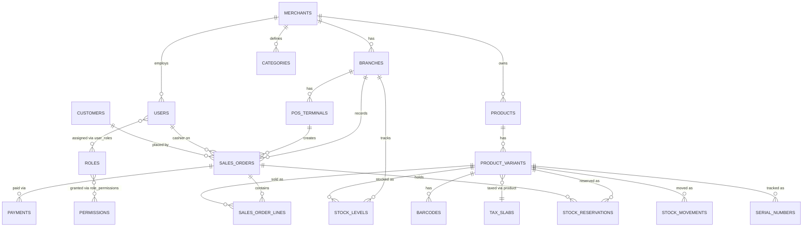

# Phase 0 / Phase 1 — Technical Design: Schema & API Contracts

**Companion file:** `phase0_1_database_schema.sql` (full DDL — tested against a live PostgreSQL 16 instance, including the row-level-security policies, before being handed to you). In this repo, that DDL is `migrations/001_schema.sql` — the two are identical.

---

## 1. Entity Relationship Overview



---

## 2. Key Design Decisions

### 2.1 Multi-tenancy: shared DB + Postgres RLS
Every tenant-scoped table carries `merchant_id`, and Postgres Row-Level Security enforces isolation at the database layer — not just in application code. The Go core sets the tenant context as the *first* statement of every transaction, immediately after validating the JWT — via `set_config()`, not `SET LOCAL ... = $1` directly, because Postgres's `SET` command doesn't accept bind parameters over the extended query protocol (the driver would either reject it or you'd be tempted to string-concatenate the tenant ID in, which is an injection risk for a value that ultimately comes from a JWT claim):

```sql
SELECT set_config('app.tenant_id', $1, true);  -- true = local to this transaction, like SET LOCAL
```

**This was verified against a live Postgres instance**, including the important failure mode: if a request handler ever forgets to set `app.tenant_id`, every RLS-protected query on that connection **errors out** rather than silently returning all tenants' data. That's a deliberate fail-closed property. The Go implementation (`internal/db/db.go`) makes this structurally impossible to skip: a single `DB.WithTenant(ctx, tenantID, fn)` wrapper is the only sanctioned way any handler touches a tenant-scoped table, and a request with no tenant context gets an error, never a row — confirmed with a cross-tenant negative test during implementation, not just asserted.

**A related gap found while implementing the login handler:** the original schema had no way to resolve *which* tenant a login belongs to before querying for the user, since `users.email` is only unique per-merchant, not globally. Fixed by adding `merchants.code` (a short, human-typeable tenant key) — login now resolves the merchant by code first, then runs the user lookup inside that tenant's `WithTenant` context. This is reflected in the current `migrations/001_schema.sql`.

### 2.2 Money as `NUMERIC`, never `FLOAT`
All prices/totals are `NUMERIC(14,2)` — floating point has no place anywhere near GST calculations or ledger entries; rounding drift there is a compliance and trust problem, not a cosmetic one.

### 2.3 Stock reservation: `stock_levels` (aggregate) + `stock_reservations` (individual holds) + `stock_movements` (append-only ledger)
Three tables, not one, because they answer different questions:
- `stock_levels` — "how much is available right now" (the fast read path for the POS scan-to-cart flow)
- `stock_reservations` — "what's currently held in someone's cart," with a hard `expires_at` (15 minutes per the FRD) that a background sweeper job releases
- `stock_movements` — the immutable audit trail of every change, which `stock_levels` is really just a materialized, `version`-guarded cache of

The `version` column on `stock_levels` is your optimistic-locking token: a reservation attempt reads the current version, and the `UPDATE` includes `WHERE version = $read_version`, retrying on conflict rather than blocking. Under real concurrent-cart load this scales far better than row locks.

### 2.4 Sales order lifecycle: `cart → finalized → voided/refunded`
A `sales_orders` row is created the moment a cashier starts a transaction (status `cart`), not just at checkout. This matters for two things in your FRD: bill modification (pre-finalization edits are just updates to a `cart`-status order) and offline resilience (if the POS goes offline mid-sale, the cart already exists locally and syncs once connectivity returns).

### 2.5 Idempotency is designed in from the start, not bolted on
`sales_orders.idempotency_key` (client-generated, unique per merchant) exists specifically because the POS is offline-first: a device might retry a checkout call after a dropped connection without knowing whether the first attempt actually landed. The server treats a duplicate idempotency key as "already done" and returns the original result rather than double-charging or double-decrementing stock. `device_created_at` vs `synced_at` are kept separate so you can always tell the true order of events on the device versus when the server actually heard about it — essential for correct conflict resolution during sync.

### 2.6 Variants over a rigid size/color schema
`product_variants.attribute_combo` is JSONB (`{"Size":"M","Color":"Red"}`) rather than fixed `size`/`color` columns, because your BRS's whole premise is configurable masters across industries — jewelry needs purity/weight, electronics needs wattage/warranty period, sports needs size/color. The `attributes`/`attribute_values` tables define what's configurable per merchant; `attribute_combo` stores the actual combination per SKU. This is the concrete mechanism behind "configuration, not industry-specific code."

---

## 3. API Contracts (Phase 0/1 scope)

**Conventions:**
- Base path: `/api/v1`
- Auth: `Authorization: Bearer <jwt>` on every endpoint except `/auth/login` and `/auth/pin-login`. The JWT carries `merchant_id`, `branch_id` (nullable), `user_id`, and `roles` as claims.
- Error shape (consistent across all endpoints):
```json
{ "error": { "code": "STOCK_UNAVAILABLE", "message": "Requested quantity exceeds available stock", "details": {} } }
```
- All monetary fields are strings in JSON (e.g., `"149.00"`), not floats — mirrors the DB's `NUMERIC` choice and avoids client-side floating-point rounding.

**Error code reference (every code actually in use as of this build — kept in sync with the code, not aspirational):**

| Code | HTTP status | Where | Meaning |
|---|---|---|---|
| `INVALID_REQUEST` | 400 | any handler | Body didn't parse, or a required field was missing/invalid |
| `MISSING_TOKEN` | 401 | any protected endpoint | No `Authorization: Bearer` header present |
| `INVALID_TOKEN` | 401 | any protected endpoint | Token present but invalid, malformed, or expired |
| `INVALID_CREDENTIALS` | 401 | `/auth/login` | Merchant code, email, or password didn't match (never says which, deliberately) |
| `ACCOUNT_INACTIVE` | 403 | `/auth/login` | User row exists but `status != 'active'` |
| `ACCOUNT_LOCKED` | 403 | `/auth/login` | `locked_until` is in the future (lockout *checking* is live; lockout *triggering* on repeated failures is not yet wired — see §4/roadmap) |
| `PRODUCT_NOT_FOUND` | 404 | `GET /products/barcode/{code}` | No barcode row matches |
| `NOT_FOUND` | 404 | sales endpoints, `/dev/set-password` | Order, line, or (merchant_code, email) pair doesn't resolve |
| `ORDER_NOT_EDITABLE` | 409 | add-line, delete-line, discounts, checkout | Order isn't in `cart` status anymore (already finalized/voided) |
| `STOCK_UNAVAILABLE` | 409 | add-line, checkout | Requested quantity exceeds what's available, or stock changed since the item was added (surfaced, never silently oversold) |
| `PAYMENT_MISMATCH` | 400 | checkout | Sum of `payments[].amount` doesn't cover `grand_total` |
| `DISCOUNT_NOT_AUTHORIZED` | 403 | `POST /sales/orders/{id}/discounts` | Requested discount % exceeds what the presented `authorized_by`/`authorized_pin` permits for their role tier |
| `DEVICE_MISMATCH` | 403 | `POST /auth/pin-login` | Terminal is already device-bound and the presented `device_fingerprint` doesn't match |
| `TERMINAL_UNAVAILABLE` | 403 | `POST /auth/pin-login` | `pos_terminals.status != 'active'` |
| `FORBIDDEN` | 403 | `POST /inventory/adjustments` | Caller's role isn't Branch Manager or Merchant Admin |
| `NEGATIVE_MARGIN` | 409 | `PATCH /pricing/variants/{id}` | New price sells below cost and `override` wasn't set |
| `SEARCH_UNAVAILABLE` | 503 | `GET /products/search`, `POST /search/reindex` | OpenSearch isn't configured (`OPENSEARCH_URL` unset) or is unreachable — every other endpoint keeps working regardless (see §3.7) |
| `BARCODE_EXISTS` | 409 | `POST /products/variants/{id}/barcodes` | The supplied `code` is already assigned to a different variant (`barcodes` table's `UNIQUE (merchant_id, code)`) |
| `NO_BARCODE` | 409 | `GET /products/variants/{id}/label` | The variant has no barcode assigned yet — assign one first |
| `COUPON_CODE_EXISTS` | 409 | `POST /coupons` | The supplied `code` is already in use (`coupons` table's `UNIQUE (merchant_id, code)`) |
| `COUPON_NOT_FOUND` | 404 | `POST /sales/orders/{id}/coupons` | No active coupon with this code |
| `COUPON_NOT_VALID` | 409 | `POST /sales/orders/{id}/coupons` | Outside the coupon's validity window, branch restriction, or channel restriction |
| `COUPON_MIN_PURCHASE_NOT_MET` | 409 | `POST /sales/orders/{id}/coupons` | Order subtotal is below the coupon's `min_purchase_amount` |
| `COUPON_LIMIT_REACHED` | 409 | `POST /sales/orders/{id}/coupons` | Coupon's total or per-customer usage limit is exhausted |
| `COUPON_ALREADY_APPLIED` | 409 | `POST /sales/orders/{id}/coupons` | This order already has a coupon (`coupon_redemptions.sales_order_id` is `UNIQUE`) — one coupon per order |
| `INSUFFICIENT_LOYALTY_POINTS` | 409 | `POST /sales/orders/{id}/loyalty/redeem` | Customer's available (rolling-expiry-aware) point balance is less than the requested redemption |
| `INTERNAL_ERROR` | 500 | any handler | Unexpected failure (DB error, etc.) — message is intentionally generic; check server logs for detail |

### 3.1 Auth

| Method & Path | Purpose |
|---|---|
| `POST /auth/login` | `{ merchant_code, email, password }` → `{ access_token, refresh_token, expires_at, expires_in, user_id, roles }` — **as actually shipped**, flatter than originally sketched (`user_id`/`roles` fields rather than a nested `user` object; kept flat to avoid a client-breaking reshape once real clients existed). `expires_in` (seconds) reflects the role-tiered TTL below, not a fixed value. |
| `POST /auth/pin-login` | `{ pos_terminal_id, employee_code, pin, device_fingerprint }` → same token shape. Device binding: if the terminal already has a `device_fingerprint` on file, the request's must match (`403 DEVICE_MISMATCH`); if unbound, the first successful PIN login binds it (only on success, never on a failed attempt). |
| `POST /auth/refresh` | `{ refresh_token }` → new token shape (same as login). Rotates the refresh token on every use — the old one is revoked, a new one issued — so a stolen-and-reused token is detectable (its next refresh attempt fails, already revoked). |
| `POST /auth/logout` | `{ refresh_token }`, authenticated — revokes the presented refresh token. Requires the token's owning user to match the caller's access-token claims (defense in depth beyond the refresh token itself). |

**Session timeout tiers** (`internal/authn/session_tiers.go`), per `pos_frd_complete.md`'s "Timeout (Recommended)": role name (case-insensitive) → access-token TTL — `POS User` 15 min, `Branch Manager` 30 min, `Merchant Admin` 60 min, unrecognized role 15 min (the safe default, never the longer 24h ceiling `TokenIssuer.maxAccessTTL` still allows as an operator-configured hard cap). A user with multiple roles gets the longest matching tier. This replaces the flat 24h token every login used to issue regardless of role — found during the Phase 1 gap analysis (the FRD's tiering was never wired up).

### 3.2 Catalog

| Method & Path | Purpose |
|---|---|
| `GET /products?category_id=&brand_id=&q=&page=&limit=` | Paginated catalog browse (admin/back-office use; POS uses barcode/search below) |
| `GET /products/{id}` | Full product + variants |
| `GET /products/barcode/{code}` | **The POS scan endpoint.** Resolves a scanned barcode straight to `{ product, variant, current_price, tax }` in one call — this is the ≤6-second flow's first hop, so it's a single indexed lookup, not a join-heavy query. |
| `POST /products` | Create product + initial variant(s) (admin) |
| `PATCH /products/{id}` | Update product/variant fields |

### 3.3 Inventory

| Method & Path | Purpose |
|---|---|
| `GET /inventory?branch_id=&variant_id=` | `{ on_hand, reserved, available }` — **built** (`internal/inventory/handlers.go`) |
| `POST /inventory/reservations` | **Not built as a standalone endpoint.** `POST /sales/orders/{id}/lines` reserves stock as part of adding a cart line (see §3.4) — that's the only reservation path Phase 1 actually needed. A standalone reservation endpoint (for a use case outside the cart flow) is still open if one turns out to be needed. |
| `DELETE /inventory/reservations/{id}` | **Not built as a standalone endpoint** — same reasoning; `DELETE /sales/orders/{id}/lines/{line_id}` (§3.4) releases a line's reservation as part of removing it from the cart. |
| `POST /inventory/adjustments` | `{ variant_id, branch_id, quantity_delta, reason }` — **built.** Writes a `stock_movements` row and an `audit_logs` row (before/after `on_hand`). Authorization: `authn.RequirePermission("inventory.adjust")` at the router level — the general permission-code mechanism, not a role-name check (see §6.5). |

### 3.4 Sales (the core POS transaction flow)

| Method & Path | Purpose |
|---|---|
| `POST /sales/orders` | Opens a new cart. Body: `{ branch_id, pos_terminal_id, idempotency_key }` → `{ order_id, status: "cart" }` |
| `POST /sales/orders/{id}/lines` | `{ variant_id, quantity }` — adds a line, **automatically creates a stock reservation** in the same call |
| `PATCH /sales/orders/{id}/lines/{line_id}` | `{ quantity }` — **built** (`internal/sales/update_line.go`). Adjusts the stock reservation by the delta rather than release-and-re-reserve. Resets `discount_amount` to 0 on the edited line — a discount applied before the edit was computed against the pre-edit subtotal, so re-apply `POST .../discounts` after changing quantity if needed. |
| `DELETE /sales/orders/{id}/lines/{line_id}` | Remove a line, releases its reservation — **built.** Matches the active reservation by (order, variant, quantity) since there's no direct FK from a line to its reservation — a known simplification if the same variant is ever added as two separate lines in one cart (see the handler's doc comment). |
| `POST /sales/orders/{id}/customer` | `{ customer_id }` or inline `{ name, phone, email }` — **built** (`internal/sales/customer.go`). Not restricted to `cart`-status orders — attaching a customer touches no totals or stock. |
| `POST /sales/orders/{id}/discounts` | `{ type: "manual"|"coupon", value, authorized_by, authorized_pin, reason }` — **built** (`internal/sales/discounts.go`). Enforces the FRD's tiers server-side: 0-5% no approval, 5-15% needs a Branch Manager's PIN, 15-25% a Merchant Admin's PIN. The FRD specifies OTP for the top tier; there's no notification channel yet to deliver one (Phase 3 territory), so PIN verification is used for both approval tiers as a documented, equivalent-strength substitute. Discount is distributed proportionally across existing lines and applied **pre-tax**: each line's tax is recomputed on its post-discount taxable value (re-joining `product_variants`/`tax_slabs` per line), matching GST treatment. |
| `POST /sales/orders/{id}/checkout` | `{ payments: [{method, amount}] }` — **the critical transaction, built.** Validates payment total ≥ grand total, converts reservations to a confirmed `stock_movements` sale entry, decrements `stock_levels`, sets `status = finalized`. Idempotent **by order status, not a request-level `idempotency_key`**: a `cart`-status order accepts checkout once; a `finalized` order returns its existing result on replay rather than reprocessing. (The `idempotency_key` shown in earlier drafts of this contract is what `POST /sales/orders` uses to dedupe the *open-cart* call, not checkout itself — checkout doesn't need its own key because the order's status transition already makes it safe to retry.) |
| `GET /sales/orders/{id}` | Full order detail — **closed.** `loadOrder()` now joins `sales_order_lines` + `product_variants` (name/sku) into the response's `lines` array, alongside the existing order-level aggregates. The Flutter client no longer tracks cart lines locally per-device as a result. |
| `GET /sales/orders/{id}/receipt` | Print-ready receipt payload — **built** (`internal/sales/receipt.go`): merchant/branch/cashier/customer info, lines, totals, captured payments. The actual ESC/POS printer driver consuming this payload is separate, hardware-dependent work and is still open. |
| `POST /sales/orders/{id}/void` | `{ reason }` — **built** (`internal/sales/void.go`). Only a `finalized` order can be voided; reverses stock (`on_hand` back up per line) and records a `stock_movements` row tagged `reference_type='void'`. Gated by `authn.RequirePermission("sales.void")`. |

### 3.5 Sync (offline-first — the piece that makes the FRD's core promise real)

| Method & Path | Purpose |
|---|---|
| `POST /sync/push` | Batch upload from a POS device that was offline: an array of orders/payments created locally, each carrying its own `idempotency_key` and `device_created_at`. Server processes each independently; a duplicate `idempotency_key` is a no-op, not an error — devices should always be able to retry a batch safely. |
| `GET /sync/pull?since=<timestamp>&branch_id=` | Incremental catalog, price, and stock-level changes for the device's local cache, so a POS that's been offline for hours can catch up without re-downloading the whole catalog |

**Both built** (`internal/sync/handlers.go`, `internal/sync/pull.go`) and verified live: idempotent replay of the same batch returns the original `order_id` with `status: "duplicate"` rather than reprocessing; an oversell (20 units pushed against 8 `on_hand`) is accepted, drives `on_hand` negative, and writes a `NEGATIVE_STOCK` `audit_logs` entry rather than being rejected; a batch with one good and one malformed order processes the good one independently (each order runs in its own transaction) and reports the bad one's error without losing the good one. `since` omitted on a pull returns a full snapshot (a fresh device's first sync); a future `since` correctly returns empty deltas.

**Why `/sync/push` takes a fully-formed order, not the same CreateOrder/AddLine/Checkout calls the online flow uses:** those calls each need a live connection (AddLine reserves stock immediately) — a genuinely offline device can't make them at all. So a locally-built sale is assembled entirely client-side (from a cached catalog snapshot) and pushed as one already-decided unit once connectivity returns, with the same idempotency-key contract as everything else in this codebase.
**Conflict rule for Phase 1:** last-writer-wins on `stock_levels` isn't safe (two offline devices could both think 1 unit is available). Instead, `/sync/push` re-runs the same reservation check server-side that `/inventory/reservations` would: if a synced sale would oversell, it's accepted (the sale already physically happened at the register) but flags `stock_levels.on_hand` negative and raises a `NEGATIVE_STOCK` alert for manual reconciliation — never silently reject a sale that already happened in the real world.

### 3.6 Dev-only tooling (not part of the product API surface — see §5.3)

| Method & Path | Purpose |
|---|---|
| `POST /dev/hash-password` | `{ password }` → `{ hash }`. Pure bcrypt computation, no DB access. Only registered when `DEV_AUTH_TOOLS_ENABLED=true`. |
| `POST /dev/set-password` | `{ merchant_code, email, new_password }` → `{ status, user_id, email }`. Sets one user's password directly. Only registered when `DEV_AUTH_TOOLS_ENABLED=true` — **must never be true outside a local/dev environment** (see §5.3 for why). |

### 3.7 Product Search (added in Phase 2 — the one sub-area that's new infrastructure, not new endpoints on the existing pattern)

| Method & Path | Purpose |
|---|---|
| `GET /products/search?q=&category_id=&brand_id=&min_price=&max_price=&page=&limit=` | OpenSearch-backed free-text search: fuzzy `multi_match` across name/SKU/HSN/category/brand, always filtered to the caller's `merchant_id` (see below), same filters `GET /products` (§3.2) already has. This is the ≤100ms-target endpoint the FRD names; `GET /products` stays the plain-Postgres exact/`ILIKE` browse view Pricing's screen uses. |
| `POST /search/reindex` | Rebuilds the caller's tenant's slice of the OpenSearch index from Postgres in one bulk call. Gated by `search.reindex` (Merchant Admin only, `migrations/010_search.sql`) since it's a bulk operation. |

Implementation (`internal/search/`) is a small hand-rolled REST client over OpenSearch's JSON API (`net/http`, no SDK dependency — see `tech_stack_decision.md` §3.1's as-built note). OpenSearch is a derived, rebuildable read model: Postgres stays the system of record, and a document is a denormalized snapshot of one `product_variants` row (its parent product's name/HSN, category/brand names inlined, since OpenSearch has no join). Document `_id` is the variant ID, so re-indexing one variant is a plain overwrite.

**Tenant isolation has no RLS equivalent here** — OpenSearch enforces nothing on its own. The entire boundary is `internal/search.Params.TenantID`, sourced only from `authn.FromContext(ctx)` claims and applied as a hard `term` filter on every query the client builds; there is no code path that lets a request parameter influence which tenant's documents a search can return. Verified live by writing a document under a different `merchant_id` straight into the index (bypassing the API entirely) and confirming a real tenant's search never surfaced it.

**Sync model, given there's still no general product/variant CRUD** (`POST/PATCH /products` in §3.2 remain unbuilt): `PATCH /pricing/variants/{id}` and a bulk-price-update's applied items are the only product-mutating endpoints that exist today, so each reindexes its one affected variant after its Postgres write commits — best-effort, logged-not-fatal, never rolling back or failing the price change itself. `POST /search/reindex` is the full-catalog catch-up path underneath that, and the only sync mechanism at all until real product CRUD exists.

**Degrades gracefully by design:** `OPENSEARCH_URL` unset, or OpenSearch unreachable, makes `internal/search.Client.Enabled()` false — `EnsureIndex` at startup logs a warning instead of failing boot, and both search endpoints answer `503 SEARCH_UNAVAILABLE` instead of panicking or hanging. Verified live by stopping the `opensearch` container mid-session: both search endpoints degraded to 503 immediately while every unrelated endpoint kept working.

### 3.8 Barcode & Label Generation, printer integration (closed a Phase 1 "still open" item)

| Method & Path | Purpose |
|---|---|
| `POST /products/variants/{id}/barcodes` | `{code?, symbology?}` — the FRD's "Hybrid (Recommended): use supplier barcode if exists, else auto-generate" (`pos_frd_complete.md` §12). Pass `code` for a real supplier barcode (any of this schema's symbologies); omit it to auto-generate a sequential EAN-13 in GS1's reserved in-store-use prefix range (20-29), which can never collide with a real, globally-assigned EAN-13. |
| `GET /products/variants/{id}/label?template=standard\|compact` | Renders that variant's primary barcode as an ESC/POS print job (`Content-Type: application/vnd.escpos-raw`) — Phase 1's roadmap scope narrowed the FRD's four label templates down to these two (`standard` 50×30mm: name/barcode/MRP/SKU; `compact` 40×20mm: name/barcode/MRP). `409 NO_BARCODE` if the variant has no barcode assigned yet. |
| `GET /sales/orders/{id}/receipt/print` | The printer-ready rendering of `GET /sales/orders/{id}/receipt`'s payload (§3.4) — same underlying data (`loadReceiptData`, shared by both), so the two can never drift apart. |

Implementation is `internal/printing` — a real ESC/POS command-set driver (`Builder`), not a stub: init/align/bold/double-size/barcode/cut, chosen as the *one* printer integration Phase 1's roadmap scoped this to ("pick whichever brand you'll actually pilot with — Zebra or a generic ESC/POS printer"), since a single ESC/POS thermal printer commonly serves both the receipt and label role on a small retail counter. `internal/catalog`'s EAN-13 generator (`computeEAN13CheckDigit`) is checked against GS1's own published worked examples, not just internally-consistent arithmetic.

**Verification, and its one real limit:** there is no printer hardware or emulator in this environment — the same constraint that limited offline sync (`erp-pos-flutter`) to `sqflite_common_ffi` rather than an on-device test. The equivalent here: `internal/printing.Decode` parses generated byte streams back into structured commands, so `internal/printing`'s tests assert the *actual bytes a real printer would receive* (barcode symbology byte, barcode data, and every text run) are correct, not just that the code runs. Live-verified beyond the unit tests: a real finalized sales order's receipt was printed and hex-dumped — content, ESC/POS init/cut framing, and command bytes all confirmed correct by hand; a label for the seed variant was fetched in both templates and hex-dumped, confirming the exact `GS k` barcode command (symbology byte `0x43` = EAN-13, correct length byte, correct 13-digit code) a real printer would decode; barcode assignment was verified for all four paths (auto-generate, supplier-provided, invalid EAN-13 check digit rejected, duplicate code rejected with `409 BARCODE_EXISTS`). **On-device verification against real printer hardware remains open** — do that before trusting this in front of a real cashier, exactly the same caveat already on file for offline sync.

### 3.9 Reports (added during the Phase 1 hardening pass — not in this doc's original scope)

| Method & Path | Purpose |
|---|---|
| `GET /reports/daily-sales?branch_id=&date=` | Order count + subtotal/discount/tax/grand totals for finalized orders on that branch/date, plus a per-payment-method breakdown. |
| `GET /reports/stock-summary?branch_id=` | `on_hand`/`reserved`/`available` per variant for a branch, joined with product name/sku. |
| `GET /reports/eod-cash?branch_id=&date=` | Cash-method payment total + count for finalized orders on that branch/date — the roadmap's "EOD cash reconciliation." |

Follows the same conventions as everything else (`WithTenant`, `{"error":{...}}` shape, `NUMERIC` as string). Not in §3's original contract table since "Basic reports" was scoped at the roadmap level, not endpoint-by-endpoint, before this pass.

### 3.10 Customer Management (Phase 3, sub-area 1 — see `phased_roadmap.md`)

| Method & Path | Purpose |
|---|---|
| `POST /customers` | `{name, phone, email, customer_type?, address?, date_of_birth?, anniversary?, company_name?, gstin?}` — full CRM registration. `name`/`phone`/`email` are mandatory (`pos_frd_complete.md` §6); `customer_type` defaults to `b2c`, and `b2b` additionally requires `gstin`. Distinct from `POST /sales/orders/{id}/customer` (§3.4), which stays a lenient walk-in-creation shortcut (name/phone/email only, no validation) — unchanged by this sub-area. |
| `GET /customers?q=&customer_type=&segment=&page=&limit=` | Search/list with auto-computed segmentation. `q` matches name/phone/email (`ILIKE`). `segment` filters on the exact values the segmentation rule below produces. |
| `GET /customers/{id}` | Full profile + segment + up to 20 most recent finalized orders (order number, branch name, date, total) — no branch filter, since a customer profile and their purchase history are merchant-wide, not branch-scoped (`pos_frd_complete.md` §6's "Multi-location: Profile accessible at all branches, Purchase history consolidated" — already true of this schema; `branch_name` on each history row makes that visible rather than just assumed). |
| `PATCH /customers/{id}` | Partial update, same b2b-requires-gstin rule re-checked against the post-update state. |

**Auto-segmentation** (`internal/customers.segmentedCustomersCTE` — the one definition both `ListCustomers` and `GetCustomer` select from, so the two can't drift apart) is computed on read from real `sales_orders` history, never stored: `new` (zero finalized orders ever), `dormant` (last finalized order more than 6 months ago — takes precedence over vip/regular, since a customer stops being "vip" by disengaging even if their lifetime spend says otherwise), `vip` (lifetime spend > ₹100,000 OR more than 50 transactions), `regular` (10-50 transactions), else `new`. Matches `pos_frd_complete.md` §6's thresholds exactly.

**Deferred**, matching the roadmap's own scoping for this sub-area (see `migrations/011_customers.sql`'s header comment): credit facility/B2B payment terms (bundled with Phase 4's accounting depth), loyalty points earn/redeem and customer-level discounts (Promotions & Loyalty — this same phase's next sub-area).

Verified live: a brand-new customer correctly showed `new`; a customer given 12 synthetic finalized orders showed `regular` with the correct summed `total_spend`; a customer given one ₹150,000 order showed `vip`; a customer whose only order was backdated 8 months showed `dormant`; a B2B registration without a `gstin` was rejected, then accepted once one was supplied; `q`/`customer_type`/`segment` filters and pagination all confirmed against the live data above; `PATCH` correctly left unspecified fields untouched and re-validated the b2b/gstin rule on type changes.

### 3.11 Promotions & Loyalty (Phase 3, sub-area 2 — see `phased_roadmap.md`)

Every discount hierarchy layer below (`pos_frd_complete.md` §5: promotional, coupon, customer-level, loyalty redemption, manual) applies through one shared function, `sales.ApplyDiscountLayer` (`internal/sales/discount_layer.go`) — it distributes a resolved rupee amount proportionally across a set of lines' *current remaining* taxable value (not their original price) and adds it to `discount_amount`, so calling it more than once on the same order stacks layers instead of one silently overwriting another. This is a behavior change from Phase 1: `POST /sales/orders/{id}/discounts` (manual, hierarchy item 6) used to overwrite `discount_amount` outright, which was correct when it was the only discount source — now that promotions/coupons/loyalty can legitimately apply first, it had to become additive. A cart with only ever one manual discount call behaves identically to before (0 existing + share = share).

Scope notes (see `migrations/012_promotions_loyalty.sql`'s header comment for the full reasoning): "Bundles" (FRD's kit pricing) is not a promotion type — Phase 1's composite-product model (`product_components`) already covers it. Hierarchy item 1 ("base discounts") is folded into item 2 (promotional discounts) — this codebase has no separate standing-discount concept. Coupon payment-method restriction is deferred (payment method isn't known until checkout, after discounts already apply). "Time-based" promotions are a restriction (`days_of_week`/`time_start`/`time_end`) layered on any promo_type, not a separate one.

| Method & Path | Purpose |
|---|---|
| `POST /promotions` | `{name, promo_type, application_level?, product_id?, category_id?, target_segment?, config, stacking?, starts_at?, ends_at?, days_of_week?, time_start?, time_end?}` — gated by `promotions.manage`. `promo_type` is `percent`\|`fixed`\|`bogo`\|`volume`\|`min_value`; `application_level` (`order` default \|`product`\|`category`) determines which cart lines a promotion can match — `bogo`/`volume` require `product` or `category` (they're inherently scoped to a specific item). `target_segment` (`vip`\|`regular`\|`new`\|`dormant`) is how a promotion becomes hierarchy item 4's "customer-level discount" — it only matches an order whose customer (`internal/customers.FetchSegment`) is currently in that segment. `config`'s shape depends on `promo_type` — see the migration's column comment for the exact JSON per type. `stacking` (`exclusive` default \|`stackable`) governs `POST /sales/orders/{id}/promotions/apply`'s behavior below. |
| `GET /promotions?active=&promo_type=` | Open to any authenticated user (reads aren't the business risk, writes are — same as `GET /branches`). |
| `PATCH /promotions/{id}` | Gated by `promotions.manage`. No `DELETE` — deactivate via `active:false`, since past `sales_order_discounts.promotion_id` rows may still reference it. |
| `POST /coupons` | `{code, promo_type, value, min_purchase_amount?, usage_limit_total?, usage_limit_per_customer?, valid_from?, valid_until?, channels?, branch_id?}` — gated by `promotions.manage`. `promo_type` is `percent`\|`fixed` only (a coupon is always order-wide, unlike promotions). `409 COUPON_CODE_EXISTS` on a duplicate code. |
| `GET /coupons?active=` | Open to any authenticated user. |
| `PATCH /coupons/{id}` | Gated by `promotions.manage`; `active`/`valid_until` only — same no-`DELETE` reasoning as promotions. |
| `POST /sales/orders/{id}/promotions/apply` | Evaluates every active, in-window promotion against the cart's *current* state and applies them per `stacking`: if any eligible promotion is `exclusive`, only the single largest-discount one applies (every other eligible promotion, including stackable ones, is skipped for this call); otherwise every eligible `stackable` promotion applies, each computed against what the previous one left behind. Explicit, POS-triggered — not automatic on `AddLine` — matching this codebase's existing preference for explicit calls over implicit magic (the same reasoning `POST /sales/orders/{id}/discounts` already followed). Safe to call more than once on the same cart: an already-matched promotion whose lines have no taxable value left simply stops being eligible. |
| `POST /sales/orders/{id}/coupons` `{code}` | Validates every constraint `pos_frd_complete.md` §5's "Coupon Constraints" names except payment-method (see scope note above): validity window, min purchase, total/per-customer usage caps, branch, and channel (every order through this API is POS-channel, so a coupon scoped to only online/mobile is correctly never applicable here). One coupon per order (`409 COUPON_ALREADY_APPLIED` on a second attempt) — the FRD's hierarchy has exactly one "coupon codes" slot. |
| `GET /loyalty/config` | Open to any authenticated user (a cashier needs to quote the redeem rate). `earn_rupees_per_point` (default 100 — "₹100 = 1 point"), `redeem_points_per_rupee` (default 10 — "100 points = ₹10"), `expiry_months` (default 12), all per `pos_frd_complete.md` §5's stated defaults. |
| `PATCH /loyalty/config` | Gated by `loyalty.manage`. |
| `GET /customers/{id}/loyalty` | Available points (rolling-expiry-aware — see below) plus the raw ledger (last 50 entries) for audit/display. |
| `POST /sales/orders/{id}/loyalty/redeem` `{points}` | Hierarchy item 5. Applies through `ApplyDiscountLayer` like every other layer. `409 INSUFFICIENT_LOYALTY_POINTS` if `points` exceeds the customer's current available balance. Requires a customer already attached to the order (`400` otherwise). |

**Loyalty expiry is "rolling,"** per the FRD: a customer's *whole* balance lapses together if they go `expiry_months` without a new ledger entry (earn or redeem) — not a per-batch FIFO expiry. `internal/loyalty.AvailableBalance` computes this on read, every time, from `loyalty_ledger`'s own timestamps (no `expires_at` column, no sweeper) — the same "compute it, don't cache and risk staleness" choice already made for Customers' `segment` and Pricing's `margin_pct`.

**Earning happens automatically at checkout finalize** (`internal/sales.Handler.Checkout`, via the `LoyaltyEarner` interface `internal/loyalty.Handler` implements — see `internal/sales/handlers.go`'s doc comment for why that's an injected interface rather than a direct import: `internal/loyalty` already has to import `internal/sales` for `ApplyDiscountLayer`, so a direct `sales -> loyalty` import would cycle; router.go wires the concrete `*loyalty.Handler` in, the same field-injection shape `pricing.Handler.Search` already uses). Skipped — not an error, a checkout must never fail over loyalty bookkeeping — when the order has no customer, the merchant has no `loyalty_config` row, the earn rate resolves to zero points, or **the FRD's "cannot earn and redeem in same transaction" applies**: `EarnForOrder` checks for an existing `type='loyalty'` row in `sales_order_discounts` for that order and no-ops if found.

Verified live end to end (seeded merchant, a real cart against the seed cricket bat, ₹2299 → ₹2712.82 with GST): a category-scoped 10% `exclusive` promotion auto-applied via `POST .../promotions/apply` (₹229.90 off); a flat-₹100 coupon then stacked on top (`discount_total` correctly became ₹329.90, not a reset to ₹100); a second coupon attempt on the same order correctly got `409 COUPON_ALREADY_APPLIED`; a manual 5% discount then stacked again on top of both (`discount_total` → ₹444.85, matching hand computation); checkout finalized at the resulting `grand_total`; the customer correctly earned `floor(grand_total / 100) = 21` points; a second order redeeming those 21 points correctly discounted ₹2.10 and checked out; a `GET .../loyalty` call afterward correctly showed `0` available points (confirming the redeeming order's checkout did *not* also earn); a `bogo` promotion (`buy 2 get 1 free`) against 3 units of the same product correctly discounted exactly one unit's price; and a coupon with a ₹100,000 minimum purchase correctly rejected a small order with `409 COUPON_MIN_PURCHASE_NOT_MET`. `promotions.manage` confirmed denying a POS User with `403 FORBIDDEN`.

---

## 4. What Phase 0 concretely delivers against this design

1. Run `migrations/001_schema.sql` against your local Postgres (already verified to execute cleanly, RLS included).
2. Go core: a thin `db` package implementing the `WithTenant(ctx, tenantID, fn)` wrapper described in §2.1, a real `/auth/login` handler, and one real business endpoint — `GET /products/barcode/{code}` — since it's simple, exercises the full tenant/RLS path, and is genuinely useful in Phase 1.
3. Flutter app: login screen → barcode scan screen hitting those two real endpoints.
4. This gives you an honest walking skeleton: real auth, real tenant isolation, real data — just one thin vertical slice, before building out the rest of §3.

**Status: built — including the full cart → checkout flow.** The Go service described above (`erp-core-go`) exists, with its own README covering exactly what was and wasn't possible to verify in the network-restricted sandbox it was originally built in (short version: every SQL statement it runs — auth, barcode lookup, and the entire `sales` package's create-order/add-line/checkout/get-order flow — was verified against a live, seeded, RLS-enabled Postgres instance, including the optimistic-locking stock-reservation retry logic and the idempotent-checkout replay path; the Go code itself was type-checked with `go build`/`go vet` against faithful local stubs of its four dependencies, since the real module proxy was blocked by that sandbox's network policy). **Now that this repo has moved to a machine with normal network access, `go mod tidy && go build ./... && go vet ./... && go test ./...` should be run for real as the first thing — that's the one verification step the original sandbox genuinely could not do.** Several real bugs were caught and fixed during the original build: a missing `context` import, `NUMERIC`-to-`string` scans that needed explicit `::text` casts, and a potential panic slicing a malformed `branch_id`.

Not yet built: `DELETE` on a cart line, manual/authorized discounts, the reservation-expiry sweeper, and the `/sync/push`/`/sync/pull` endpoints — the API contracts for these are already specified in §3 above, ready to implement against the same `WithTenant`/optimistic-locking patterns. See `phased_roadmap.md`'s Phase 1 status for the full open list, in dependency order.

## 5. Two real bugs found during the user's own first login attempt (post-Phase-0 hardening)

Both were caught from the user's own testing against the running service, not from sandbox verification — which is exactly why "verify before proceeding" is the right instinct to keep going forward in Claude Code too. Both are fixed and verified.

**5.1 CORS blocked every browser-based login (Flutter web) before it reached the server.** The router had no CORS middleware, so a browser's preflight `OPTIONS /api/v1/auth/login` fell through to chi's default `405 Method Not Allowed`. It is a browser-only mechanism (same-origin policy), so it never would have affected a native Android/iOS/desktop build, only `flutter run -d chrome`. Fixed with `internal/httpserver/cors.go`, wired first in the router. Verified with a real, dependency-free test (`internal/httpserver/cors_test.go`) that first reproduces the exact 405 against a bare `net/http` mux, then confirms the fix turns the preflight into `204` with correct headers while a real `POST` still reaches the handler. `Access-Control-Allow-Origin: *` is intentionally permissive for local dev only — safe here because this API is Bearer-token, not cookie, authenticated — and should be tightened to real origins before any non-local deployment.

**5.2 There is no working "default password."** `migrations/002_seed.sql`'s `password_hash` for `ravi@acme-sports.test` was always a placeholder string, not a real bcrypt hash of any password. Generating a real hash originally required a working bcrypt implementation the sandbox couldn't obtain through any legitimate channel — superseded by §5.3 below, which is the actual fix to use now.

**5.3 Follow-up: a public, no-auth password-generation/-setting API, added on request, gated behind a flag.** Built as two endpoints (`internal/authn/dev_handlers.go`, contract in §3.6): `POST /dev/hash-password` (stateless — hashes a string you already know, touches no account) and `POST /dev/set-password` (resolves `merchant_code` → tenant, then updates that user's `password_hash` inside the same `WithTenant`/RLS-scoped transaction every other write in this codebase uses).

`set-password` with no auth is a real account-takeover primitive once this has real tenants online — anyone who can reach it and guess a `merchant_code`+`email` can silently take over that account. Both endpoints are compiled in but only *registered* when the service starts with `DEV_AUTH_TOOLS_ENABLED=true`; if that flag is unset or `false`, the routes don't exist at all (a plain `404`, not "exists but refuses"). The shipped `docker-compose.yml` sets it `true`, since that file is your local environment by definition — **it must stay `false`/unset in any config that isn't your own machine.** The real fix for "users forgot their password" once this has real merchants — an emailed, single-use, time-limited reset token — is a Phase 1+ item, not replaced by this.

Verified against a live, seeded Postgres instance (`erp_dev`) by hand-replaying the exact statement sequence `SetPasswordHandler` runs in `psql`: confirmed the update persists and is readable back inside the right tenant context; confirmed an unknown email returns zero rows (maps to the handler's `404 NOT_FOUND`, not an error); and — the important negative case — confirmed that setting the *wrong* tenant context before the same `UPDATE ... WHERE email = ...` against a real, existing email still returns zero rows, i.e. RLS scopes this endpoint's write even if merchant-resolution were ever bypassed by a future bug. The whole module (including the two new handlers) built, `go vet`-ed, and passed `go test ./...` clean against the local dependency stubs — the real build is the first thing to confirm now that this has moved to a machine with normal network access.

---

## 6. Phase 1 hardening pass — what closed, and one finding more serious than anything it was looking for

Triggered by a gap analysis comparing this repo, `erp-pos-flutter`, and the docs against each other. `go build`/`go vet`/`go test` and `flutter analyze`/`flutter test` all ran clean against real dependencies for the first time (previous verification, described above, was necessarily stub-based or manual-SQL-replay). Every item below was also exercised live against this repo's own `docker-compose.yml` stack, not just compiled.

### 6.1 The critical finding: the API was connecting to Postgres as a superuser, which silently disabled every RLS policy in the system

`docker-compose.yml`'s `postgres` service sets `POSTGRES_USER=app_user`; the official `postgres` Docker image grants that env-var-created role `SUPERUSER`. The `api` service then connected to Postgres **as that same `app_user`**. Postgres superusers (and any role with `BYPASSRLS`) unconditionally bypass row-level security — no `CREATE POLICY`, no `FORCE ROW LEVEL SECURITY` changes that. Confirmed directly against the running stack:

```sql
SELECT rolsuper, rolbypassrls FROM pg_roles WHERE rolname = 'app_user';  -- t, t

-- with app.tenant_id set to a tenant that owns no rows at all:
SELECT count(*) FROM sales_orders;  -- returned every tenant's rows, not 0
```

This means the RLS "fail-closed" property §2.1 above documents as verified — and that `CLAUDE.md` calls a non-negotiable, verified guarantee — had never actually been enforced by the database for any request served through this docker-compose stack, for any table, since Phase 0. Nothing about `db.WithTenant`, `set_config`, or any policy definition was wrong; the role the entire story assumed was subject to RLS never was. This was not caught earlier because the original §2.1/§5.3 verification narrative ran its negative tests through the same superuser role — a negative test that can't fail regardless of whether RLS works is not really testing RLS.

**Fixed** in `migrations/004_least_privilege_app_role.sql`: a dedicated `erp_app` role (`NOSUPERUSER NOBYPASSRLS`, and — just as important — not the owner of any table, since non-owners are unconditionally subject to RLS the moment it's enabled, table owners are not) with `SELECT/INSERT/UPDATE/DELETE` granted explicitly, plus `ALTER DEFAULT PRIVILEGES` so future migrations' tables/sequences stay usable by it automatically. `docker-compose.yml`'s `api` service and `internal/config/config.go`'s default `DATABASE_DSN` now both point at `erp_app`, not `app_user` — `app_user` remains only the schema-owning role migrations run as. Re-verified the exact same negative test as `erp_app` post-fix: `sales_orders`, `sales_order_lines`, `payments`, `sales_order_discounts`, and `users` all correctly returned 0 rows for a tenant that owns none, while the correct tenant's data still resolved normally end-to-end through the running API.

**If this repo is ever deployed against a managed Postgres (RDS, Cloud SQL, etc.), the same check needs to be re-run there**: confirm whatever role the service authenticates as is not the provider's default master/admin role, which often carries superuser-equivalent privileges for the same reason `app_user` did here.

### 6.2 A second, smaller latent bug found while building on top of this: `audit_logs` could never actually be written to

`audit_logs` (§ SECTION 5 of `001_schema.sql`) is `PARTITION BY RANGE (created_at)` but the original migration only left a *commented-out example* of creating a partition — no partition, including a default, was ever actually created. Every `INSERT INTO audit_logs` was therefore guaranteed to fail with `no partition of relation "audit_logs" found for row`, from the moment the table was created. This went unnoticed through Phase 0/1 because nothing ever wrote to `audit_logs` until this hardening pass's `POST /inventory/adjustments` handler tried to. Fixed in the same migration: a `DEFAULT` partition (so writes never fail even if a monthly-partition job falls behind) plus an explicit current-month partition. Future months still need the scheduled-job/`pg_partman` automation the original comment already called for — this fix makes writes correct now, it doesn't add that automation.

### 6.2b A third bug, found immediately after shipping 6.1/6.2: a migration-ordering mistake that broke fresh installs

Migration 003 originally added `users.employee_code` via `ALTER TABLE`. The seed data in `002_seed.sql` was updated in the same pass to insert rows using that column. On the volume this was developed and tested against, 003 had already been applied by hand before the seed data was touched, so the mistake was invisible there. On a genuinely fresh volume, `docker-entrypoint-initdb.d` runs every file in this directory strictly in filename order — `001`, then `002_seed.sql`, then `003_hardening.sql` — so `002`'s `INSERT INTO users` referencing `employee_code` ran *before* `003` had a chance to add that column, failed immediately, and silently aborted the rest of that seed script (everything after `users` in that file — products, variants, stock — never ran either). Surfaced as `docker compose down -v && up` leaving `users` (and everything seeded after it) empty, discovered while diagnosing an unrelated `erp_app` role-missing report from the same fresh-install path.

**Fixed:** `employee_code` now lives directly in `001_schema.sql`'s `CREATE TABLE users`, not a later migration — see `003_hardening.sql`'s header note for the standing rule this sets: a column a seed row needs belongs in `001_schema.sql`, never a later-numbered migration, however related it seems. Re-verified with the same `down -v && up -d --build` flow: `erp_app` created correctly, `employee_code` populated for all three seed users, and a full login → barcode-scan round trip succeeded against the freshly-initialized stack.

### 6.3 Closed this pass

- **RLS extended** to `sales_order_lines` and `payments` (previously enforced only by application-level joins through `sales_orders` — see the note that used to be at the bottom of `001_schema.sql`), plus the new `sales_order_discounts` table. `pos_terminals` lost its RLS policy on purpose, for the same bootstrap reason `merchants` never had one — see `migrations/003_hardening.sql`'s header comment.
- **Failed-login lockout** now actually triggers (`internal/authn/lockout.go`) — the gap flagged by the `NOTE:` comment that used to be in `handlers.go`.
- **Session timeout tiers** (§3.1) replace the flat 24h token.
- **`/auth/refresh`, `/auth/logout`, `/auth/pin-login`** (§3.1) — refresh-token issuance/rotation/revocation, and PIN quick-login with device binding.
- **`DELETE /sales/orders/{id}/lines/{line_id}`, `POST /sales/orders/{id}/discounts`** (§3.4).
- **`GET /sales/orders/{id}` full line detail** (§3.4) — the gap this doc used to describe under "not yet true to this doc" is closed; the Flutter client's `CartLineDisplay` local-tracking workaround was removed accordingly.
- **The 15-minute reservation-expiry sweeper** (`internal/sales/sweeper.go`) — verified live: forced a reservation's `expires_at` into the past, confirmed the sweeper (ticking every 1 minute from `main.go`) released it and marked it `expired` within one tick.
- **`GET /inventory`, `POST /inventory/adjustments`** (§3.3) — the latter gated on `Branch Manager`/`Merchant Admin` as an interim role-name check at the time; see §6.5 for the follow-up that replaced it.
- **Basic reports** (§3.9).
- **`internal/authn/roles.go`'s `HasRole`** — the one shared, case-insensitive role check other packages (discount authorization) use, instead of each re-implementing its own.

### 6.4 Still open

- **Barcode & label generation, real printer integration** — `GET .../receipt` (§6.5) gives a printer pipeline something to consume; the ESC/POS driver itself is separate, hardware-dependent work.
- **Standalone `POST/DELETE /inventory/reservations`** — `POST .../lines` and `DELETE .../lines/{line_id}` cover the only reservation path Phase 1 actually needed (see §3.3); a standalone endpoint remains unbuilt.
- **Password-reuse history, real forgot-password flow** — noted in the original gap analysis, not picked up yet.

### 6.5 A second hardening pass: the rest of Phase 1's smaller open items

Closed, and verified the same way as §6.1-6.3 (live against this repo's own `docker-compose.yml`, not just `go build`):

- **General permission-code enforcement** (`migrations/005_permissions.sql`, `internal/authn/permissions.go`) — `authn.RequirePermission(db, code)` is now the general router-level gate (same shape as `RequireAuth`), replacing the role-name checks `AdjustStock` used as an interim measure. `POST /inventory/adjustments` requires `inventory.adjust`; the new `POST /sales/orders/{id}/void` requires `sales.void`. Both permissions are granted to `Branch Manager`/`Merchant Admin`, not `POS User`. Verified live: a POS User gets `403 FORBIDDEN` on both, a Branch Manager succeeds on both.
- **`PATCH /sales/orders/{id}/lines/{line_id}`** (§3.4) — quantity edit, reservation adjusted by the delta.
- **`POST /sales/orders/{id}/customer`** (§3.4).
- **`GET /sales/orders/{id}/receipt`** (§3.4).
- **`POST /sales/orders/{id}/void`** (§3.4) — verified live: voiding a finalized 5-unit sale put `on_hand` back up by 5 and flipped status to `voided`.
- **Discount pre-tax GST treatment** (§3.4) — `POST .../discounts` now recomputes each line's tax on its post-discount taxable value instead of reusing the pre-discount `tax_amount`. Verified live against a hand-computed example: ₹11,495 subtotal, 10% discount → ₹1,149.50 discount, taxable ₹10,345.50, tax @18% = ₹1,862.19, grand total ₹12,207.69 — server response matched exactly.
- **PIN-login UI in the Flutter app** (`login_screen.dart`, `state/device_id.dart`) — a password/PIN mode toggle; the device fingerprint is generated once and persisted via `shared_preferences` (a new dependency) so it survives app restarts, since a fingerprint that changed every launch would fail the server's device-binding check on the very next login.

### 6.6 Offline sync — the last Phase 1 item, closed after a decision on local storage

The Flutter local store uses **sqflite** (raw SQL), not `drift`/Hive/Isar — the same "hand-written SQL over ORM/codegen" preference this project already applied to the Go side (`docs/tech_stack_decision.md`'s as-built note deferring `sqlc`). `lib/local/local_db.dart` (schema: `catalog`, `stock_cache`, `pending_orders`/`pending_order_lines`/`pending_payments`, `sync_meta`) and `lib/local/offline_store.dart` (the read/write API `AppSession` calls) implement it.

**Design point worth restating:** `AppSession` never switches modes mid-sale. A network failure at any point (barcode lookup, add-line, checkout) flips `offlineMode = true` and — for add-line — discards whatever order was being built online and restarts the sale entirely in the local store, rather than trying to reconcile a sale that's partly confirmed server-side and partly not. A network failure *during checkout specifically* is treated as ambiguous (the server may have processed it right before the connection dropped) and surfaced to the cashier instead of silently retried as a new local sale, to avoid a double-sale risk. `currentOrder` (an `OrderSummary`) is the same type regardless of which store backs it, so `pos_screen.dart` needed no changes beyond a sync-status indicator — it doesn't know or care whether the order it's rendering is server- or locally-backed.

**Verification:** no Android/iOS device or emulator was available in this environment to click through the UI live (`flutter devices` shows only Windows desktop and browsers; `flutter emulators` finds no Android AVD; sqflite has no web implementation and Windows Developer Mode isn't enabled here to build the desktop target with plugins) — that gap is real and worth closing before shipping, not papered over. What *was* verified: `flutter analyze`/`test` clean, and a real runtime test (`test/offline_store_test.dart`, using `sqflite_common_ffi` to run actual SQLite via FFI on desktop rather than a device) exercising the full local flow — cache a catalog entry, add two lines, remove one, checkout, confirm the resulting `listUnsynced()` payload shape matches what `POST /sync/push` expects, confirm `markSynced` clears it from the pending queue. The server side of the same flow (`/sync/push`/`/sync/pull`) was verified live end-to-end (§3.5 above).
