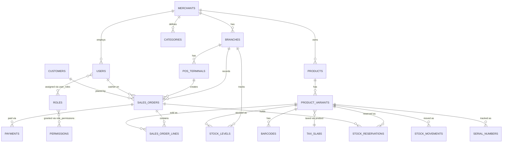

# Phase 0 / Phase 1 — Technical Design: Schema & API Contracts

**Companion file:** `phase0_1_database_schema.sql` (full DDL — tested against a live PostgreSQL 16 instance, including the row-level-security policies, before being handed to you). In this repo, that DDL is `migrations/001_schema.sql` — the two are identical.

---

## 1. Entity Relationship Overview



---

## 2. Key Design Decisions

### 2.1 Multi-tenancy: shared DB + Postgres RLS
Every tenant-scoped table carries `merchant_id`, and Postgres Row-Level Security enforces isolation at the database layer — not just in application code. The Go core sets the tenant context as the *first* statement of every transaction, immediately after validating the JWT — via `set_config()`, not `SET LOCAL ... = $1` directly, because Postgres's `SET` command doesn't accept bind parameters over the extended query protocol (the driver would either reject it or you'd be tempted to string-concatenate the tenant ID in, which is an injection risk for a value that ultimately comes from a JWT claim):

```sql
SELECT set_config('app.tenant_id', $1, true);  -- true = local to this transaction, like SET LOCAL
```

**This was verified against a live Postgres instance**, including the important failure mode: if a request handler ever forgets to set `app.tenant_id`, every RLS-protected query on that connection **errors out** rather than silently returning all tenants' data. That's a deliberate fail-closed property. The Go implementation (`internal/db/db.go`) makes this structurally impossible to skip: a single `DB.WithTenant(ctx, tenantID, fn)` wrapper is the only sanctioned way any handler touches a tenant-scoped table, and a request with no tenant context gets an error, never a row — confirmed with a cross-tenant negative test during implementation, not just asserted.

**A related gap found while implementing the login handler:** the original schema had no way to resolve *which* tenant a login belongs to before querying for the user, since `users.email` is only unique per-merchant, not globally. Fixed by adding `merchants.code` (a short, human-typeable tenant key) — login now resolves the merchant by code first, then runs the user lookup inside that tenant's `WithTenant` context. This is reflected in the current `migrations/001_schema.sql`.

### 2.2 Money as `NUMERIC`, never `FLOAT`
All prices/totals are `NUMERIC(14,2)` — floating point has no place anywhere near GST calculations or ledger entries; rounding drift there is a compliance and trust problem, not a cosmetic one.

### 2.3 Stock reservation: `stock_levels` (aggregate) + `stock_reservations` (individual holds) + `stock_movements` (append-only ledger)
Three tables, not one, because they answer different questions:
- `stock_levels` — "how much is available right now" (the fast read path for the POS scan-to-cart flow)
- `stock_reservations` — "what's currently held in someone's cart," with a hard `expires_at` (15 minutes per the FRD) that a background sweeper job releases
- `stock_movements` — the immutable audit trail of every change, which `stock_levels` is really just a materialized, `version`-guarded cache of

The `version` column on `stock_levels` is your optimistic-locking token: a reservation attempt reads the current version, and the `UPDATE` includes `WHERE version = $read_version`, retrying on conflict rather than blocking. Under real concurrent-cart load this scales far better than row locks.

### 2.4 Sales order lifecycle: `cart → finalized → voided/refunded`
A `sales_orders` row is created the moment a cashier starts a transaction (status `cart`), not just at checkout. This matters for two things in your FRD: bill modification (pre-finalization edits are just updates to a `cart`-status order) and offline resilience (if the POS goes offline mid-sale, the cart already exists locally and syncs once connectivity returns).

### 2.5 Idempotency is designed in from the start, not bolted on
`sales_orders.idempotency_key` (client-generated, unique per merchant) exists specifically because the POS is offline-first: a device might retry a checkout call after a dropped connection without knowing whether the first attempt actually landed. The server treats a duplicate idempotency key as "already done" and returns the original result rather than double-charging or double-decrementing stock. `device_created_at` vs `synced_at` are kept separate so you can always tell the true order of events on the device versus when the server actually heard about it — essential for correct conflict resolution during sync.

### 2.6 Variants over a rigid size/color schema
`product_variants.attribute_combo` is JSONB (`{"Size":"M","Color":"Red"}`) rather than fixed `size`/`color` columns, because your BRS's whole premise is configurable masters across industries — jewelry needs purity/weight, electronics needs wattage/warranty period, sports needs size/color. The `attributes`/`attribute_values` tables define what's configurable per merchant; `attribute_combo` stores the actual combination per SKU. This is the concrete mechanism behind "configuration, not industry-specific code."

---

## 3. API Contracts (Phase 0/1 scope)

**Conventions:**
- Base path: `/api/v1`
- Auth: `Authorization: Bearer <jwt>` on every endpoint except `/auth/login` and `/auth/pin-login`. The JWT carries `merchant_id`, `branch_id` (nullable), `user_id`, and `roles` as claims.
- Error shape (consistent across all endpoints):
```json
{ "error": { "code": "STOCK_UNAVAILABLE", "message": "Requested quantity exceeds available stock", "details": {} } }
```
- All monetary fields are strings in JSON (e.g., `"149.00"`), not floats — mirrors the DB's `NUMERIC` choice and avoids client-side floating-point rounding.

### 3.1 Auth

| Method & Path | Purpose |
|---|---|
| `POST /auth/login` | `{ merchant_code, email, password }` → `{ access_token, refresh_token, expires_in, user }` |
| `POST /auth/pin-login` | `{ pos_terminal_id, employee_code, pin }` → same token shape. Enforces device binding (terminal's `device_fingerprint` must match). |
| `POST /auth/refresh` | `{ refresh_token }` → new `access_token` |
| `POST /auth/logout` | Revokes the presented refresh token |

### 3.2 Catalog

| Method & Path | Purpose |
|---|---|
| `GET /products?category_id=&brand_id=&q=&page=&limit=` | Paginated catalog browse (admin/back-office use; POS uses barcode/search below) |
| `GET /products/{id}` | Full product + variants |
| `GET /products/barcode/{code}` | **The POS scan endpoint.** Resolves a scanned barcode straight to `{ product, variant, current_price, tax }` in one call — this is the ≤6-second flow's first hop, so it's a single indexed lookup, not a join-heavy query. |
| `POST /products` | Create product + initial variant(s) (admin) |
| `PATCH /products/{id}` | Update product/variant fields |

### 3.3 Inventory

| Method & Path | Purpose |
|---|---|
| `GET /inventory?branch_id=&variant_id=` | `{ on_hand, reserved, available }` |
| `POST /inventory/reservations` | `{ variant_id, branch_id, quantity, sales_order_id }` → creates a 15-min hold, returns `{ reservation_id, expires_at }`. Returns `409 STOCK_UNAVAILABLE` if `available < quantity`. |
| `DELETE /inventory/reservations/{id}` | Releases a hold early (cart item removed) |
| `POST /inventory/adjustments` | `{ variant_id, branch_id, quantity_delta, reason }` — manual stock correction, writes a `stock_movements` row, requires `inventory.adjust` permission |

### 3.4 Sales (the core POS transaction flow)

| Method & Path | Purpose |
|---|---|
| `POST /sales/orders` | Opens a new cart. Body: `{ branch_id, pos_terminal_id, idempotency_key }` → `{ order_id, status: "cart" }` |
| `POST /sales/orders/{id}/lines` | `{ variant_id, quantity }` — adds a line, **automatically creates a stock reservation** in the same call |
| `PATCH /sales/orders/{id}/lines/{line_id}` | Update quantity/discount on a line (pre-finalization edit) |
| `DELETE /sales/orders/{id}/lines/{line_id}` | Remove a line, releases its reservation |
| `POST /sales/orders/{id}/customer` | Attach `{ customer_id }` or inline walk-in details |
| `POST /sales/orders/{id}/discounts` | `{ type: "manual"|"coupon", value, authorized_by, reason }` — enforces the FRD's tiered authorization (0-5% POS user, 5-15% manager PIN, etc.) server-side, never trusting the client |
| `POST /sales/orders/{id}/checkout` | `{ payments: [{method, amount}], idempotency_key }` — **the critical transaction.** Validates payment total = grand total, converts reservations to a confirmed `stock_movements` sale entry, decrements `stock_levels`, sets `status = finalized`. Idempotent: replaying the same `idempotency_key` returns the original result, never double-processes. |
| `GET /sales/orders/{id}` | Full order detail — **not yet true to this doc**: the shipped `loadOrder()` in `internal/sales/handlers.go` returns only order-level aggregates (status, subtotal, tax_total, grand_total), not the joined `sales_order_lines`. Found while building the Flutter client, which currently compensates by tracking added lines locally per-device — fine for a single terminal, not for a second device reloading someone else's cart. Close by joining `sales_order_lines` (+ `product_variants` for name/sku) into `loadOrder`, or adding a dedicated `GET /sales/orders/{id}/lines`. |
| `GET /sales/orders/{id}/receipt` | Print-ready receipt payload |
| `POST /sales/orders/{id}/void` | Reverses a finalized order; requires manager authorization + `reason` |

### 3.5 Sync (offline-first — the piece that makes the FRD's core promise real)

| Method & Path | Purpose |
|---|---|
| `POST /sync/push` | Batch upload from a POS device that was offline: an array of orders/payments created locally, each carrying its own `idempotency_key` and `device_created_at`. Server processes each independently; a duplicate `idempotency_key` is a no-op, not an error — devices should always be able to retry a batch safely. |
| `GET /sync/pull?since=<timestamp>&branch_id=` | Incremental catalog, price, and stock-level changes for the device's local cache, so a POS that's been offline for hours can catch up without re-downloading the whole catalog |

**Conflict rule for Phase 1:** last-writer-wins on `stock_levels` isn't safe (two offline devices could both think 1 unit is available). Instead, `/sync/push` re-runs the same reservation check server-side that `/inventory/reservations` would: if a synced sale would oversell, it's accepted (the sale already physically happened at the register) but flags `stock_levels.on_hand` negative and raises a `NEGATIVE_STOCK` alert for manual reconciliation — never silently reject a sale that already happened in the real world.

### 3.6 Dev-only tooling (not part of the product API surface — see §5.3)

| Method & Path | Purpose |
|---|---|
| `POST /dev/hash-password` | `{ password }` → `{ hash }`. Pure bcrypt computation, no DB access. Only registered when `DEV_AUTH_TOOLS_ENABLED=true`. |
| `POST /dev/set-password` | `{ merchant_code, email, new_password }` → `{ status, user_id, email }`. Sets one user's password directly. Only registered when `DEV_AUTH_TOOLS_ENABLED=true` — **must never be true outside a local/dev environment** (see §5.3 for why). |

---

## 4. What Phase 0 concretely delivers against this design

1. Run `migrations/001_schema.sql` against your local Postgres (already verified to execute cleanly, RLS included).
2. Go core: a thin `db` package implementing the `WithTenant(ctx, tenantID, fn)` wrapper described in §2.1, a real `/auth/login` handler, and one real business endpoint — `GET /products/barcode/{code}` — since it's simple, exercises the full tenant/RLS path, and is genuinely useful in Phase 1.
3. Flutter app: login screen → barcode scan screen hitting those two real endpoints.
4. This gives you an honest walking skeleton: real auth, real tenant isolation, real data — just one thin vertical slice, before building out the rest of §3.

**Status: built — including the full cart → checkout flow.** The Go service described above (`erp-core-go`) exists, with its own README covering exactly what was and wasn't possible to verify in the network-restricted sandbox it was originally built in (short version: every SQL statement it runs — auth, barcode lookup, and the entire `sales` package's create-order/add-line/checkout/get-order flow — was verified against a live, seeded, RLS-enabled Postgres instance, including the optimistic-locking stock-reservation retry logic and the idempotent-checkout replay path; the Go code itself was type-checked with `go build`/`go vet` against faithful local stubs of its four dependencies, since the real module proxy was blocked by that sandbox's network policy). **Now that this repo has moved to a machine with normal network access, `go mod tidy && go build ./... && go vet ./... && go test ./...` should be run for real as the first thing — that's the one verification step the original sandbox genuinely could not do.** Several real bugs were caught and fixed during the original build: a missing `context` import, `NUMERIC`-to-`string` scans that needed explicit `::text` casts, and a potential panic slicing a malformed `branch_id`.

Not yet built: `DELETE` on a cart line, manual/authorized discounts, the reservation-expiry sweeper, and the `/sync/push`/`/sync/pull` endpoints — the API contracts for these are already specified in §3 above, ready to implement against the same `WithTenant`/optimistic-locking patterns. See `phased_roadmap.md`'s Phase 1 status for the full open list, in dependency order.

## 5. Two real bugs found during the user's own first login attempt (post-Phase-0 hardening)

Both were caught from the user's own testing against the running service, not from sandbox verification — which is exactly why "verify before proceeding" is the right instinct to keep going forward in Claude Code too. Both are fixed and verified.

**5.1 CORS blocked every browser-based login (Flutter web) before it reached the server.** The router had no CORS middleware, so a browser's preflight `OPTIONS /api/v1/auth/login` fell through to chi's default `405 Method Not Allowed`. It is a browser-only mechanism (same-origin policy), so it never would have affected a native Android/iOS/desktop build, only `flutter run -d chrome`. Fixed with `internal/httpserver/cors.go`, wired first in the router. Verified with a real, dependency-free test (`internal/httpserver/cors_test.go`) that first reproduces the exact 405 against a bare `net/http` mux, then confirms the fix turns the preflight into `204` with correct headers while a real `POST` still reaches the handler. `Access-Control-Allow-Origin: *` is intentionally permissive for local dev only — safe here because this API is Bearer-token, not cookie, authenticated — and should be tightened to real origins before any non-local deployment.

**5.2 There is no working "default password."** `migrations/002_seed.sql`'s `password_hash` for `ravi@acme-sports.test` was always a placeholder string, not a real bcrypt hash of any password. Generating a real hash originally required a working bcrypt implementation the sandbox couldn't obtain through any legitimate channel — superseded by §5.3 below, which is the actual fix to use now.

**5.3 Follow-up: a public, no-auth password-generation/-setting API, added on request, gated behind a flag.** Built as two endpoints (`internal/authn/dev_handlers.go`, contract in §3.6): `POST /dev/hash-password` (stateless — hashes a string you already know, touches no account) and `POST /dev/set-password` (resolves `merchant_code` → tenant, then updates that user's `password_hash` inside the same `WithTenant`/RLS-scoped transaction every other write in this codebase uses).

`set-password` with no auth is a real account-takeover primitive once this has real tenants online — anyone who can reach it and guess a `merchant_code`+`email` can silently take over that account. Both endpoints are compiled in but only *registered* when the service starts with `DEV_AUTH_TOOLS_ENABLED=true`; if that flag is unset or `false`, the routes don't exist at all (a plain `404`, not "exists but refuses"). The shipped `docker-compose.yml` sets it `true`, since that file is your local environment by definition — **it must stay `false`/unset in any config that isn't your own machine.** The real fix for "users forgot their password" once this has real merchants — an emailed, single-use, time-limited reset token — is a Phase 1+ item, not replaced by this.

Verified against a live, seeded Postgres instance (`erp_dev`) by hand-replaying the exact statement sequence `SetPasswordHandler` runs in `psql`: confirmed the update persists and is readable back inside the right tenant context; confirmed an unknown email returns zero rows (maps to the handler's `404 NOT_FOUND`, not an error); and — the important negative case — confirmed that setting the *wrong* tenant context before the same `UPDATE ... WHERE email = ...` against a real, existing email still returns zero rows, i.e. RLS scopes this endpoint's write even if merchant-resolution were ever bypassed by a future bug. The whole module (including the two new handlers) built, `go vet`-ed, and passed `go test ./...` clean against the local dependency stubs — the real build is the first thing to confirm now that this has moved to a machine with normal network access.
