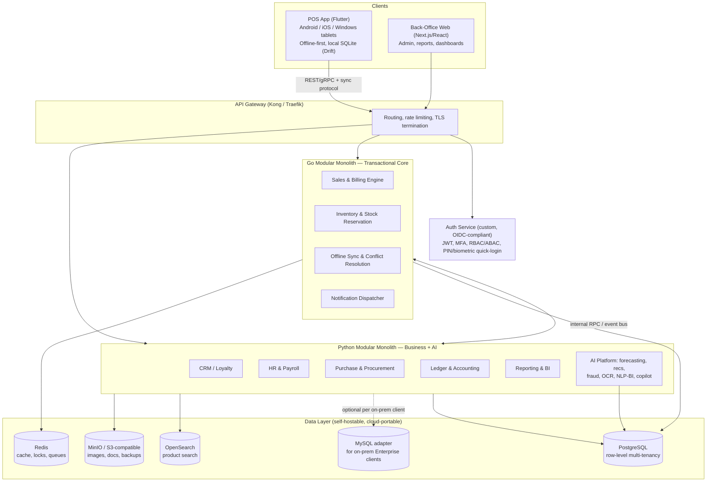

# Universal Retail & Wholesale ERP — Finalized Technology Stack

**Version:** 1.0 | **Date:** September 14, 2026 | **Status:** Approved for build start
**Prepared for:** Divakar | **Basis:** BRS (High-Level) + POS FRD v1.0

---

## 1. Guiding Principles

Every choice below was made against four constraints that came out of our discussion, in priority order:

1. **Local-first, cloud-portable.** Everything must run on a single developer machine today (Docker Compose) and move to any cloud (AWS/Azure/GCP or self-managed Kubernetes) later with zero rewrite — so no provider-proprietary managed services in the core design.
2. **Speed without sacrificing the hard parts.** A modular monolith beats premature microservices for a small team; but the transactional core still needs Go's concurrency to hit 10,000 transactions/hour and ≤100ms search.
3. **AI is a first-class module, not an afterthought.** The AI Platform (forecasting, recommendations, fraud detection, OCR, NLP-BI, copilot) gets a language and data layer suited to it from day one.
4. **Open standards over vendor lock-in.** OIDC/OAuth2.1 everywhere, SQL portability for the relational core, S3-compatible storage — so today's custom/self-hosted pieces can be swapped for managed equivalents later without touching business logic.

---

## 2. High-Level Architecture

---

## 3. Backend: Two Languages, Clear Boundaries

### 3.1 Go — Transactional / Performance Core
**Why:** Goroutine concurrency comfortably handles the 10,000 txn/hour peak and sub-100ms search-adjacent lookups; small memory footprint per container; compiles to a single binary that's trivial to containerize for the Kubernetes path.

**Owns:**
- Sales & Billing engine (cart → tax → payment → receipt, the ≤6-second flow)
- Inventory & stock reservation (optimistic locking, 15-minute soft holds, inter-branch transfer state machine)
- Offline sync & conflict resolution engine for POS devices
- Notification dispatch at volume (fan-out to Email/SMS/WhatsApp/Push providers)

**Stack:** Go 1.23+, `chi` or `Fiber` for HTTP, `gRPC` for internal service calls, `GORM` or `sqlc` for the Postgres/MySQL-portable data layer, `Asynq` (Redis-backed) for background jobs, `testify` + `httptest` for testing.

### 3.2 Python — Business Modules + AI Platform
**Why:** Fastest iteration for business-rule-heavy modules (GST slabs, payroll statutory rules, promotion hierarchies), and the natural home for every AI capability in your BRS.

**Owns:**
- CRM & Loyalty, HR & Payroll, Purchase & Procurement, Ledger & Accounting, Reporting/BI, Service & Warranty, Workflow & Approvals
- **AI Platform:** demand forecasting (scikit-learn/XGBoost/Prophet), dynamic pricing, recommendation engine, fraud detection, NLP-BI ("ask a question, get a chart"), AI Copilot/chatbot (LLM API or self-hosted via Ollama, with LangChain/LlamaIndex for orchestration), OCR (PaddleOCR/Tesseract), and embeddings/RAG via **pgvector** (a Postgres extension — avoids standing up a separate vector database)

**Stack:** Python 3.12+, FastAPI, SQLAlchemy 2.0 (async, supports Postgres + MySQL dialects), Celery or Dramatiq + Redis for background/scheduled jobs, `pytest` for testing.

### 3.3 Why not the alternatives you raised
- **PHP Laravel:** dropped from the core. Excellent for CRUD monoliths, but not the right fit for event-driven microservices, offline sync engines, or the AI stack — and adding it as a third runtime here buys nothing the Go/Python split doesn't already cover.
- **Go-only or Python-only:** rejected because each has a real weak spot for this specific product — Go for business-rule iteration speed, Python for raw transactional throughput.

### 3.4 Internal communication
Go and Python monoliths talk over internal gRPC (or REST+JSON if the team prefers simplicity early on) for synchronous calls (e.g., Sales engine asking Accounting to check credit limit), and a lightweight event mechanism for async facts (e.g., "sale completed" triggering loyalty points, commission accrual, low-stock check). See §6.

---

## 4. Frontend

| Surface | Technology | Rationale |
|---|---|---|
| **POS terminal app** | **Flutter** (Android, iOS, Windows) | One codebase across every POS form factor in your FRD; strong offline storage (Drift/SQLite); mature plugin ecosystem for barcode scanners, ESC/POS & ZPL printers, cash drawers, weighing scales. |
| **Back-office web** (admin, reports, dashboards, catalog/pricing management) | **Next.js + React + TypeScript**, Tailwind CSS, shadcn/ui | Matches the stack your own BRD already named; server-side rendering for fast dashboard loads; huge hiring pool in India. |
| **Shared design system** | A single component library (Figma → shadcn/ui tokens) used by the web app; Flutter gets its own theme mirrored from the same design tokens. | Keeps visual consistency without forcing one UI framework across two very different runtimes. |

---

## 5. Data Layer

| Component | Choice | Notes |
|---|---|---|
| **Primary database** | **PostgreSQL 16+** | System of record for everything transactional: sales, inventory, accounting, HR, CRM. Chosen for JSONB (flexible attributes/variants), partitioning (audit logs, transaction history), extensions (pgvector, pg_partman), and native Row-Level Security. |
| **Multi-tenancy model** | **Shared database, row-level tenancy** (`tenant_id` on every table + Postgres RLS policies) | Cheapest to operate at scale, easiest cross-tenant admin/reporting. Reserve a dedicated database as an Enterprise-tier exception, not the default. |
| **Secondary SQL adapter** | **MySQL**, via SQLAlchemy (Python) / GORM (Go) dialect support | For Enterprise on-prem customers who already run MySQL. Postgres remains the default you build and test against daily; MySQL compatibility is verified in CI but isn't where new features are designed first. **MongoDB is intentionally excluded from the transactional core** — document stores don't give the ACID guarantees double-entry accounting and stock reservation need. If you later want MongoDB for genuinely document-shaped data (rich product content, audit/event archives), that's a good future addition — but as purposeful polyglot persistence, not a generic "any DB" swap. |
| **Cache / locks / queues** | **Redis 7+** | Stock-reservation locks, session cache, rate limiting, Asynq/Celery job queues. |
| **Search** | **OpenSearch** | Matches your FRD's "OpenSearch-powered" search spec exactly; Apache-2.0 licensed (no Elastic license risk), self-hostable, drives the ≤100ms product search / ≤50ms autocomplete targets. |
| **Object storage** | **MinIO** locally (S3-compatible API) → swap to AWS S3 / Azure Blob / GCS at deploy time with a config change | Product images, labels, invoices/e-invoices, backups, exported reports. |

---

## 6. Messaging & Async Processing

Full Kafka from day one is unnecessary weight for a modular monolith running on a laptop. Sequenced approach:

- **Now (monolith phase):** Redis-backed job queues (Asynq in Go, Celery/Dramatiq in Python) + a transactional outbox pattern in Postgres for reliable "event happened" records (e.g., sale completed → loyalty, commission, low-stock check all read from the same outbox).
- **Later (microservices phase):** Introduce **Kafka** (or RabbitMQ if the team prefers simpler ops) as the backbone once specific modules are peeled out and need independent scaling or multiple consumers. The outbox pattern used now makes this migration additive, not a rewrite.

---

## 7. Authentication & Authorization

**Now:** Custom-built auth microservice (Go or Python — recommend Go, colocated with the performance-sensitive session/token-validation path), covering:
- OAuth 2.1 / OIDC-shaped token issuance (even though self-built, it *speaks* the standard protocol)
- JWT access + refresh tokens, tenant-aware claims (`tenant_id`, `branch_id`, `role`)
- PIN (4–6 digit) and biometric quick-login for POS, device binding, "remember device" (30-day trust)
- RBAC (feature/action/data-level permissions per your FRD §18) with room to add ABAC rules later
- Session timeouts and password policies exactly as specified in the FRD (15/30/60-min tiers, 90-day expiry, 5-attempt lockout, etc.)

**Critical design constraint so this stays swappable:** every other service must talk to auth **only** via standard OIDC endpoints/JWT validation — never call internal auth-service functions directly. That's what lets you drop in **Keycloak** or a managed IdP (Auth0/Cognito) later as a like-for-like replacement instead of a rewrite, exactly as you asked to keep open.

> **User's explicit instruction (kept as a firm constraint):** "I agree your flagged point effort and risk but i need all this in my control in my service so keep this as same." — custom-built auth stays custom-built, not swapped for Keycloak/a managed IdP, despite the higher solo-builder effort/risk. The OIDC-standard interface boundary above is what keeps that swap *possible* later, without forcing it now.

---

## 8. Infrastructure & DevOps

| Layer | Now (local) | Later (cloud, any provider) |
|---|---|---|
| Orchestration | Docker Compose | Kubernetes (EKS/AKS/GKE or self-managed) via Helm charts |
| Infra-as-code | — | Terraform, written with provider-agnostic modules where feasible |
| CI/CD | GitHub Actions (build, test, lint on every PR) | Same pipeline adds deploy stages per environment |
| Observability | OpenTelemetry SDKs in both Go and Python services from day one → local Prometheus + Grafana + Loki | Same stack, or swapped for a managed equivalent (CloudWatch, Azure Monitor, Cloud Operations) — OTel makes this a config change |
| Secrets | `.env` + Docker secrets locally | Cloud KMS / Vault when you move |

Keeping OpenTelemetry, Postgres, Redis, OpenSearch, and MinIO in the stack from the start — all self-hostable and available as managed equivalents on every major cloud — is exactly what makes the "local now, any cloud later" requirement real rather than aspirational.

---

## 9. Testing & QA Strategy (mapped to your FRD's QA expectations)

- **Unit tests:** `testify` (Go), `pytest` (Python) — target 80%+ coverage on the transactional core and all tax/payroll/accounting calculation logic specifically (these are the modules where a silent bug costs real money).
- **Contract tests:** Pact (or a lightweight OpenAPI-schema check) between Go ↔ Python internal APIs, and between backend ↔ POS/web clients, so the eventual microservices split doesn't break integrations silently.
- **Integration tests:** Dockerized Postgres/Redis/OpenSearch spun up in CI for realistic tests (Testcontainers).
- **Load testing:** k6 or Locust scripted against the Sales & Billing flow specifically, run before each major release, to continuously validate the 10,000 txn/hour and ≤6-second targets rather than discovering issues after launch.
- **E2E:** Playwright for the back-office web app; Flutter's built-in `integration_test` for the POS app, including simulated offline/online transitions.
- **Security:** dependency scanning (Trivy/Snyk) in CI, and a periodic auth-flow penetration review given it's custom-built.

---

## 10. Repository Structure (proposed)

Four repos keeps each team's release cadence independent without the coordination overhead of a single giant monorepo:

- `erp-core-go` — Go modular monolith (sales, inventory, sync, notifications)
- `erp-business-py` — Python modular monolith (CRM, HR, Purchase, Accounting, Reporting, AI Platform)
- `erp-web-admin` — Next.js back-office
- `erp-pos-flutter` — Flutter POS client

Each Go/Python monolith is internally organized by module (e.g., `internal/inventory/`, `internal/sales/`) with clear package boundaries — the discipline that makes "split into a microservice later" a matter of extracting a folder, not untangling a codebase.

---

## 11. Monolith → Microservices: Migration Triggers

Rather than a fixed date, split a module out when **any** of these hit:
1. It needs to scale independently of the rest (e.g., Sales engine during a flash sale while Reporting stays idle).
2. It needs a different deployment cadence (e.g., AI models redeployed daily while core ERP releases monthly).
3. It becomes a bottleneck for other teams' velocity (two teams stepping on the same monolith constantly).
4. You onboard your first Enterprise client who needs a dedicated/isolated deployment of a specific module.

---

## 12. Summary Decision Table

| Decision | Choice | Status |
|---|---|---|
| Backend languages | Go (core) + Python (business + AI) | Confirmed |
| Build sequencing | Modular monolith first, split later | Confirmed |
| POS client | Flutter | Confirmed |
| Web admin | Next.js / React / TypeScript | Recommended (BRD-aligned) |
| Primary database | PostgreSQL | Confirmed |
| Multi-tenancy | Shared DB, row-level (RLS) | Confirmed |
| Secondary DB adapter | MySQL (SQL-dialect portable), MongoDB excluded from core | Confirmed |
| Cache/queue | Redis | Recommended |
| Search | OpenSearch | Confirmed (FRD-specified) |
| Object storage | MinIO → S3-compatible | Recommended |
| Messaging | Outbox + Redis queues now, Kafka/RabbitMQ at microservices split | Recommended |
| Auth | Custom-built now, OIDC-standard interface for future Keycloak/Auth0/Cognito swap | Confirmed |
| Deployment | Docker Compose now → Kubernetes (any cloud) later | Confirmed |
| Cloud provider | Undecided — deferred until deployment phase | Open |

---

## 13. Open Items Before Development Starts

These weren't tech-stack questions, so they weren't asked yet, but they'll shape the build plan directly:

1. **Team size and role split** — how many Go, Python, Flutter, and frontend developers, and whether the same people cover multiple layers. This determines realistic sprint velocity against 40+ modules.
2. **MVP module scope and sequencing** — building all 40+ modules before any launch isn't realistic; a phased roadmap (e.g., Sales+Inventory+GST+basic Accounting first, then CRM/Loyalty, then HR/Payroll, then AI Platform) needs to be defined next.
3. **Timeline/budget target** — affects how aggressively to phase the AI Platform and lower-priority modules (Service & Warranty, Ecommerce/Omnichannel) versus the core retail loop.

I'd suggest tackling the MVP module roadmap next, since the stack above is now stable enough to build against.
